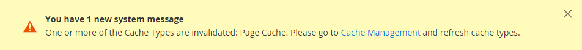

# Site, store, and view scope

Every Adobe Commerce and Magento Open Source installation has a [hierarchy](../stores-purchase/stores.md) of websites, stores, and store views. The term _scope_ determines where in the hierarchy a database entity — such as a product, attribute, or category — content element, or configuration setting applies. Websites, stores, and store views have one-to-many parent/child relationships. A single installation can have multiple websites, and each website can have multiple stores and store views.

>[!NOTE]
>
>To learn more, see [Multiple websites or stores ](https://experienceleague.adobe.com/docs/commerce-operations/configuration-guide/multi-sites/ms-overview.html) in the [!DNL Commerce] developer documentation.

## Websites

Installations begin with a single [website](../stores-purchase/stores.md#add-websites), which is called _Main Website_ by default. You can also set up multiple websites for a single installation, each with its own IP address and domain.

## Stores

A single website can have multiple [stores](../stores-purchase/stores.md#add-stores), each with its own main menu. The stores share the product catalog, but can have a different selection of products and design. All stores under the same website share the Admin and checkout.

## Store views

Each store that is available to customers is presented according to a specific _[view](../stores-purchase/store-views.md)_. Initially, a store has a single default view. Additional store views can be added to support different languages, or for other purposes. Customers can use the language chooser in the header to change the store view.

When working with websites, stores, and store views, keep the following in mind:

- Commerce instances have a cascading model: global → website → store → store view.
- Every website has a minimum of one default store and store view.
- Each store view can have a different base URL.
- The primary function of a website is top-level feature configuration.
- The primary function of a store is root category configuration.
- The primary function of a store view is translation information and currency symbol configuration.

## Scope settings

If your Adobe Commerce or Magento Open Source installation has a hierarchy of websites, stores, or views, you can set the context, or _scope_ of a configuration setting. The context of many database entities can also be assigned a specific scope to determine how it is used in the store hierarchy. To learn more, see [Product scope](../catalog/introduction.md#product-scope) and [Price scope](../catalog/catalog-price-scope.md).

Some configuration settings such as postal code, have a global scope because the same value is used throughout the system. The [website](../stores-purchase/stores.md#add-websites) scope applies to any stores below that level in the hierarchy, including all stores and their views. Any item with the scope of [store view](../stores-purchase/store-views.md) can be set differently for each store view, which is typically used to support multiple languages. To override the default values of configuration settings, see [Set the scope](../configuration-reference/scope-change.md#set-the-scope).

Unless the store is running in [single store mode](#single-store-mode), the scope of each configuration setting appears in small text below the field label. If your installation includes multiple websites, stores, or views, choose the [store view](../stores-purchase/store-views.md) where the settings apply before making any changes.

{width="550"}

|Scope|Description|
|--- |--- |
|[!UICONTROL Global]|System-wide settings and resources that are available throughout the installation.|
|[!UICONTROL Website]|Settings and resources that are limited to the current website. Each website has a default store.|
|[!UICONTROL Store]|Settings and resources that are limited to the current store. Each store has a default root category (main menu) and default store view.|
|[!UICONTROL Store View]|Setting and resources that are limited to the current store view.|

{style="table-layout:auto"}

## Single store mode

If your Commerce installation has only a single store and store view, you can simplify the display by turning off all store view options and scope indicators. Single store mode is overridden if you [add more store views](../stores-purchase/store-views.md) later.

{width="550"}

1. On the _Admin_ sidebar, go to **[!UICONTROL Stores]** > _[!UICONTROL Settings]_ > **[!UICONTROL Configuration]**.

1. Under **[!UICONTROL General]**, scroll down to the bottom of the page and expand the **[!UICONTROL Single-Store Mode]** section.

1. Set **[!UICONTROL Enable Single-Store Mode]** to `Yes`.

   {width="400"}

1. Click **[!UICONTROL Save Config]**.

1. When prompted to refresh the cache, do the following:

    - Click the **[!UICONTROL Cache Management]** link in the system message at the top of the page.

      {width="600" zoomable="yes"}

    - Select the **[!UICONTROL Page Cache]** checkbox.

    - With **[!UICONTROL Actions]** set to `Refresh`, click **[!UICONTROL Submit]**
