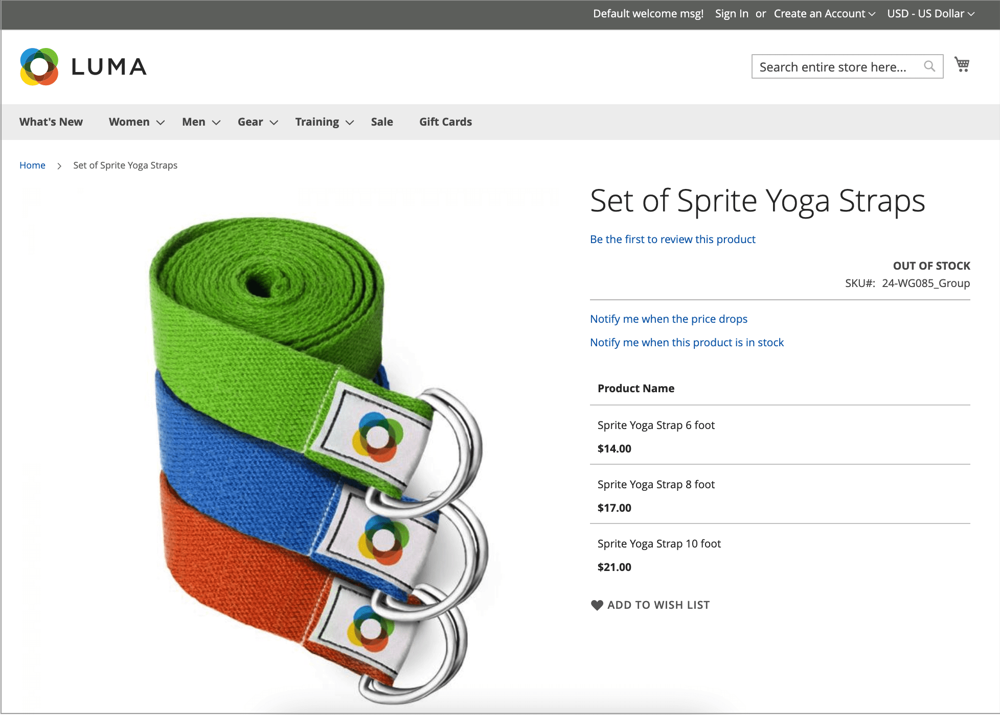
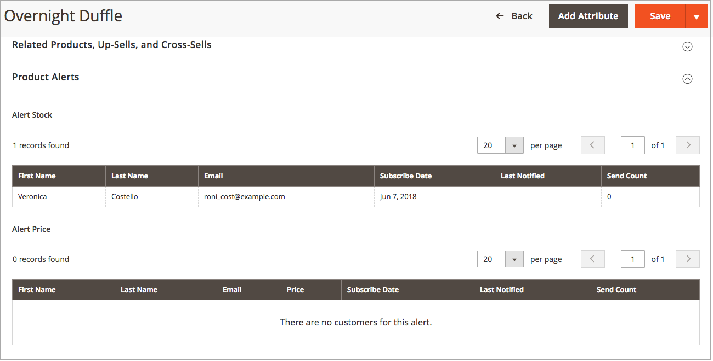
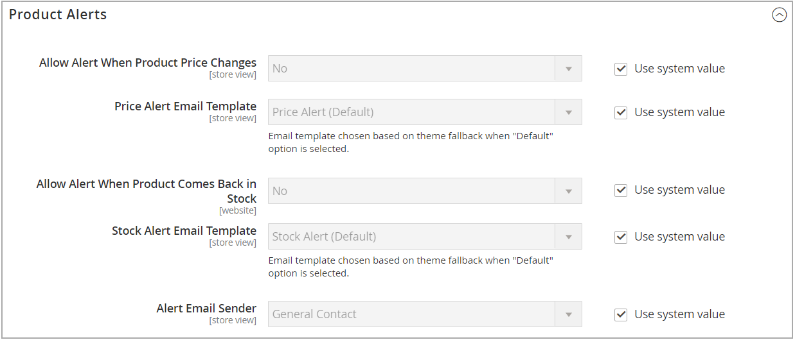
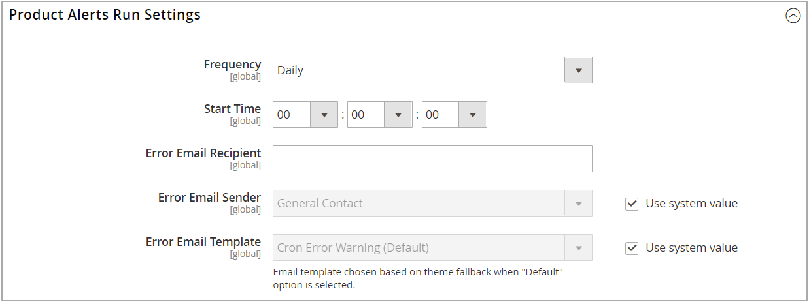

# Product Alerts

Customers can subscribe to two types of alerts by email - price change alerts and in-stock alerts. For each type of alert, you can determine if customers are able to subscribe, select the email template that is used, and identify the sender of the email.

## Price change alerts

When price change alerts are enabled, a _Notify me when the price drops_ link appears on every product page. Customers can click the link to subscribe to alerts related to the product. Guests are prompted to open an account with your store. Whenever the price changes or the product goes on special, everyone who has subscribed to the alert receives an email alert.

## In-Stock alerts

The in-stock alert creates a link called _Notify me when this product is in stock_ for every product that is out of stock. Customers can click the link to subscribe to the alert. When the product is back in stock, customers receive an email notification that the product is available. Products with alerts have a _Product Alerts_ tab in the Product Information panel that lists the customers who have subscribed to an alert.

## Set up product alerts

1. On the _Admin_ sidebar, go to **[!UICONTROL Stores]** > _[!UICONTROL Settings]_ > **[!UICONTROL Configuration]**.

1. In the left panel, expand **[!UICONTROL Catalog]** and choose **[!UICONTROL Catalog]** underneath.

1. Click to expand the _[!UICONTROL Product Alerts]_ section and do the following:

    

    - To offer price change alerts to your customers, set **[!UICONTROL Allow Alert When Product Price Changes]** to `Yes`.

    - Set **[!UICONTROL Price Alert Email Template]** to the template that you want to use for the price alert notifications.

    - To offer alerts when out-of-stock products become available again, set **[!UICONTROL Allow Alert When Product Comes Back in Stock]** to `Yes`.

      >[!NOTE]
      >
      >The _Notify me when this product is in stock_ message appears only when **[!UICONTROL Display Out of Stock Products]** is set to `Yes` (in the Configuration at [!UICONTROL Catalog] > [!UICONTROL Inventory]).

    - Set **[!UICONTROL Stock Alert Email Template]** to the template that you want to use for product stock alerts.

    - Set **[!UICONTROL Alert Email Sender]** to the [store contact](../getting-started/store-details.md#store-email-addresses){target="_blank"} that you want to appear as the sender of the email alert. Learn more about [store email addresses](https://docs.magento.com/user-guide/configuration/general/store-email-addresses.html){target="_blank"} in the core user guide.

1. When complete, click **[!UICONTROL Save Config]**.

## Configure product alerts email templates

Next, configure, add, or modify the email template for your price alert. You may want to edit your price alert configurations after creating additional templates.

For more detailed information about using email messaging, see [Message Templates](https://docs.magento.com/user-guide/marketing/email-template-message.html){target="_blank"} in the core user guide.

1. On the _Admin_ sidebar, go to **[!UICONTROL Marketing]** > _[!UICONTROL Communications]_ > **[!UICONTROL Email Templates]**.

1. Click **[!UICONTROL Add New Template]**.

1. Under _Load default template_, choose the **[!UICONTROL Template]** that you want to customize.

   You might choose the alert template included with your theme. Or you can select the `Price Alert` or `Stock Alert` templates under _[!UICONTROL Magento_PriceAlert]_.

1. Click **[!UICONTROL Load Template]**.

1. Enter a **[!UICONTROL Template Name]**.

   You can select this name in the _Price Alerts_ configuration.

1. Read through the existing content and make changes as needed for the following:

   | Field | Description |
   | ----- | ----- |
   | [!UICONTROL Template Subject] | This text is displayed in the subject line of an email. |
   | [!UICONTROL Template Content] | This text is displayed in the full content of the sent email. |

1. To add generated information from [!DNL Commerce] data, use the **[!UICONTROL Insert Variable]** option to use a list of available variables.

1. Click **[!UICONTROL Save Template]**.

## Product Alert Run Settings

These settings allow you to select how often [!DNL Commerce] checks for changes that require alerts to be sent. You can also select the recipient, sender, and template for emails that are sent if the sending of alerts fails.

1. On the _Admin_ sidebar, go to **[!UICONTROL Stores]** > _[!UICONTROL Settings]_ > **[!UICONTROL Configuration]**.

1. In the left panel, expand **[!UICONTROL Catalog]** and choose **[!UICONTROL Catalog]** underneath.

1. Expand  the **[!UICONTROL Product Alerts Run Settings]** section.

1. To determine how often product alerts are sent, set **[!UICONTROL Frequency]** to one of the following:

   - `Daily`
   - `Weekly`
   - `Monthly`

1. To determine the time of day product alerts are sent, set **[!UICONTROL Start Time]** to the hour, minute, and second.

   >[!NOTE]
   >
   >Product alerts are sent by the "product_alert" consumer.

1. For **[!UICONTROL Error Email Recipient]**, enter the email of the person to be contacted if an error occurs.

1. For the **[!UICONTROL Error Email Sender]**, select the store identity that appears as the sender of the error notification.

1. Set **[!UICONTROL Error Email Template]** to the transactional email template to be used for the error notification.

1. When complete, click **[!UICONTROL Save Config]**.
