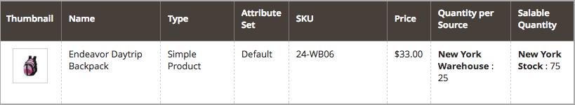
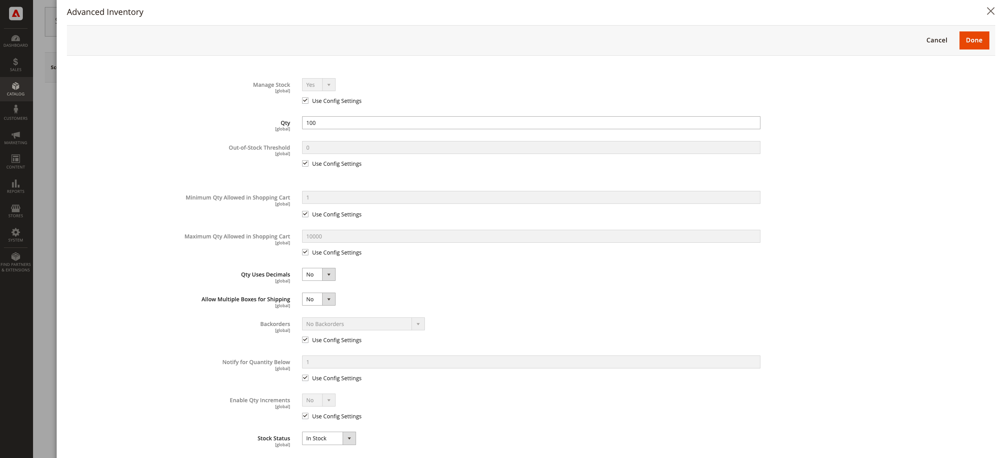

# Configure [!DNL Inventory Management] backorders

Backorders allow your store to continue selling products after the quantity reaches zero or is effectively out of stock. When a customer order is a backorder, the funds are authorized and captured immediately, the processing status of the order does not change, and the shipping remains on-hold until stock is available.

Depending on your store and sales, you may want to enable or disable backorders at the following levels:

- **[!UICONTROL Global]** - All products in your catalog at the site level

- **[!UICONTROL Product]** - Specific products overriding settings for site, source, and stock

## Understand backorder settings

It is highly recommended that you configure specific thresholds and settings to best support backorders.

### Out-of-Stock threshold

Use a negative value for this threshold to set the maximum quantity of products that can be backordered before the product is truly considered out of stock. This amount adds to the salable quantity. The value set at the product level overrides any value set at the global level.

The formula for the Salable Quantity is `(Quantity - (Out-of-Stock Threshold))`.

The following is an example:

- Quantity: 25
- Notify for Quantity Below: 10
- Only X left Threshold: 5
- Out of Stock Threshold: -50

The Salable Quantity for this product is `75 (25 - (-50))`.

{width="600" zoomable="yes"}

{width="600" zoomable="yes"}

When customers purchase the available 25 products, new orders enter as backorders. As the product's Salable Quantity reduces to 5 (70 items have been sold), the _Product_ page displays a message `Only 5 left` on the storefront. When the Salable Quantity reaches `0`, the product is displayed as `Out of Stock` in the storefront.

>[!NOTE]
>
>When a customer places an order using _[!UICONTROL backorder qty]_, [!DNL Inventory Management] automatically subtracts the quantity from the salable quantity. If an order is not shipped and is canceled, the quantity returns to the aggregated virtual salable quantity. The **_canceled order quantity is not assigned to any of the sources_**, but is returned to the total number of products available for sale (_[!UICONTROL Salable Quantity]_ column  on the products grid).

<!--### Notify for Quantity Below JIRA MDVA-8099 MDVA-33783

The _Notify for Quantity Below_ configuration option is configurable at the global, source, and product levels. When it is enabled, the system sends an email notification when the product quantity reaches a level at or below the configured value. For this example, a notification is triggered when the product has a quantity of 10 or less. When backorders are enabled, _Notify for Quantity Below_ is determined by the Salable Quantity (`Salable Quantity = Quantity - (Out-of-Stock Threshold)`). -->

### Stock status

Products must be set to `In Stock` status when enabling backorders. You can set this value from the _Product_ page. For multi-source merchants, you must have at least one source marked as `In Stock`. Access and set the status through the _Product_ page and assigned _Sources_ grid.

## Configure backorders globally

These steps enable backorders for all products at the site level.

1. On the _Admin_ sidebar, go to **[!UICONTROL Stores]** > _[!UICONTROL Settings]_ > **[!UICONTROL Configuration]**.

1. Set **[!UICONTROL Store View]** to `Default Config`.

1. In the left panel, expand **[!UICONTROL Catalog]** and choose **[!UICONTROL Inventory]**.

1. Expand  **[!UICONTROL Product Stock Options]**.

1. For **[!UICONTROL Backorders]**, deselect the **[!UICONTROL Use system value]** checkbox and select an option:

    | Option | Description |
    | -- | -- |
    | `No Backorders` | To not accept backorders when product is out of stock. |
    | `Allow Qty Below 0` | To accept backorders when the quantity falls below zero. |
    | `Allow Qty Below 0 and Notify Customer` | To accept backorders when the quantity falls below zero and notify the customer that the order can still be placed. |

1. For **[!UICONTROL Out-of-Stock Threshold]**, deselect the **[!UICONTROL Use system value]** checkbox and enter a different amount.

    | Value | Description |
    | -- | -- |
    | Positive amount | With Backorders disabled, enter a positive value. |
    | Zero | With Backorders enabled, entering `0` allows for infinite backorders. |
    | Negative amount | With Backorders enabled, entering a negative value is recommended. The amount is added to the Salable Quantity. For example, enter `-50` to allow orders up to this amount. |

1. Click **[!UICONTROL Save Config]**.

## Configure backorders for a product

Product level configurations override global configurations. You may want to configure backorders at the product level to override the settings at the global store or source level. For example, your store may globally support backorders. With product settings, you can disable backorders or change the Out-of-Stock threshold without affecting other products and sources.

1. On the _Admin_ sidebar, go to **[!UICONTROL Catalog]** > **[!UICONTROL Products]**.

1. Open a product in **[!UICONTROL Edit]** mode and scroll down the page to the _[!UICONTROL Sources]_ area.

   For products configured without [!DNL Inventory Management], the tab does not appear. The `Advanced Inventory` button is displayed under the _[!UICONTROL Quantity]_ field.

1. Click **[!UICONTROL Advanced Inventory]**.

   This action displays a page of product-specific configurations. Any setting listed as `global` displays the current global setting for the store.

1. For **[!UICONTROL Backorders]**, deselect the **[!UICONTROL Use Config Setting]** checkbox and select an option:

    | Option | Description |
    | -- | -- |
    | `No Backorders` | To not accept backorders when product is out of stock. |
    | `Allow Qty Below 0` | To accept backorders when the quantity falls below zero. |
    | `Allow Qty Below 0 and Notify Customer` | To accept backorders when the quantity falls below zero and to notify the customer that the order can still be placed. |

1. For **[!UICONTROL Out-of-Stock Threshold]**, deselect the **[!UICONTROL Use Config Setting]** checkbox and enter an amount:

    | Value | Description |
    | -- | -- |
    | Positive amount | With Backorders disabled, enter a positive value. |
    | Zero | With Backorders enabled, entering `0` allows for infinite backorders. |
    | Negative amount | With Backorders enabled, entering a negative value is recommended. The amount is added to the Salable Quantity. For example, enter `-50` to allow orders up to that amount. |

    {width="600" zoomable="yes"}

1. Click **[!UICONTROL Done]**, and then **[!UICONTROL Save]**.
