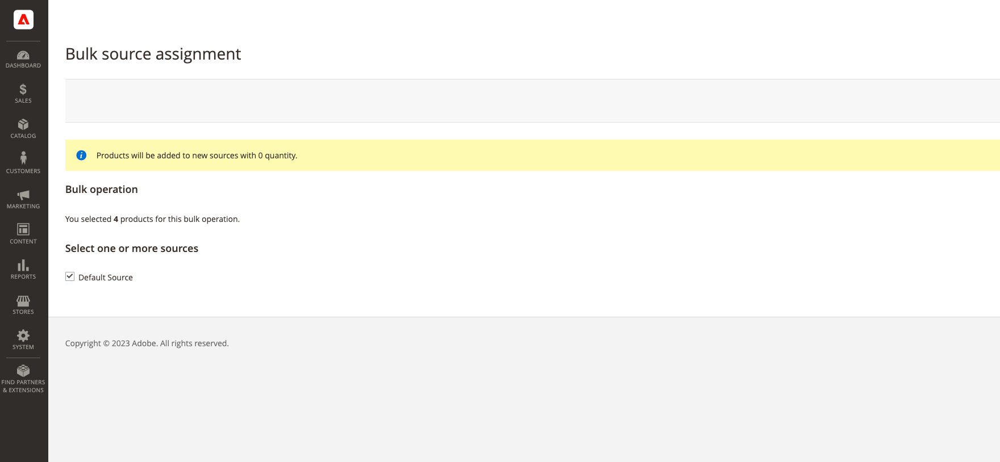
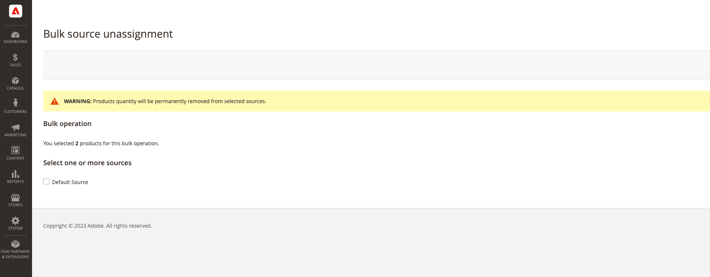

# Bulk source assignment and unassignment

Use the _Assign Sources_ tool to add one or more sources to your products. The tool helps when creating and assigning custom sources to your Default Stock or custom stocks and preparing new locations and inventory.

After adding new custom sources, you can add [inventory quantities per product](quantities-assign-per-product.md) or for multiple products through the Admin or using the [import feature](inventory-import-export.md).

## Assign sources and quantities

1. On the _Admin_ sidebar, go to **[!UICONTROL Catalog]** > **[!UICONTROL Products]**.

1. Select the products for which you want to modify the sources.

   Browse or search to find the products and select those checkboxes.

1. Click the **[!UICONTROL Actions]** menu at the top and choose **[!UICONTROL Assign Inventory Source]**.

1. Click **[!UICONTROL OK]** in the confirmation dialog.

1. For all sources that you want to add to the products, select the checkboxes.

1. Click **[!UICONTROL Assign Sources]**.  

    {width="600" zoomable="yes"}

The sources are added to the products with an inventory quantity of 0. You can add [inventory quantities](quantities-assign-per-product.md) per source.

## Unassign sources and quantities

When unassigning a source from a product, you are indicating that the product is no longer stocked at that location. This process completely clears all inventory data for source currently assigned to the product. If you want to move the existing inventory to a new location, consider using the _Transfer inventory_ option.

{{$include /help/_includes/unassign-source.md}}

It is highly recommended to complete all orders and shipments for those products before removing the source.

1. On the _Admin_ sidebar, go to **[!UICONTROL Catalog]** > **[!UICONTROL Products]**.

1. Select the products for which you want to modify sources.

   Browse or search to find the products and select those checkboxes.

1. Click the **[!UICONTROL Actions]** menu at the top and choose **[!UICONTROL Unassign Inventory Source]**.

1. Click **[!UICONTROL OK]** in the confirmation dialog.

1. Select the source that you want to remove from the products.

   The page displays an alert that unassigning removes all specific source and quantity data from the product.

1. Click **[!UICONTROL Unassign Sources]**.

   {width="600" zoomable="yes"}

<!-- Last updated from includes: 2022-08-30 15:36:09 -->
