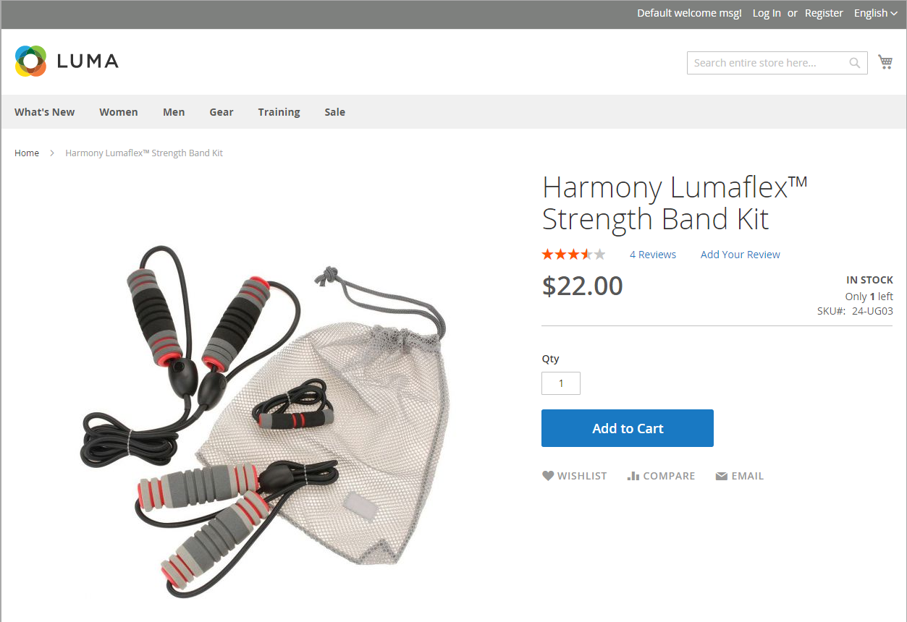

# Configure Inventory Management

The [!DNL Inventory Management] module supports inventory configuration settings at the product and global level and also provides additional settings that affect source availability, storefront products, and order shipment. The configuration settings apply to: 

- The whole catalog: Go to **[!UICONTROL Stores]** > _[!UICONTROL Settings]_ > **[!UICONTROL Configuration]**. Then, expand **[!UICONTROL Catalog]** in the left panel and select **[!UICONTROL Inventory]**.

- Specific products: Go to **[!UICONTROL Catalog]** > **[!UICONTROL Products]**. Then, open the product in edit mode and click **[!UICONTROL Advanced Inventory]** in the _[!UICONTROL Sources]_ section.

Your catalog can be configured to display inventory data in your storefront, manage active shopping carts, and more. Display the availability of each item as _In Stock_ or _Out of Stock_ and the available inventory when stock is low.

The out of stock threshold indicates when a product should be reordered, subtracts from the Salable Quantity for a stock, and can be set to support enabled or disabled backorders. Allow backorders for your store, setting a maximum quantity of orders for all or specific products.

Another way you can use the stock availability threshold is to manage products that are in high demand. If you want to capture new customers, rather than sell to high-quantity buyers, you can set a maximum quantity to prevent a single buyer from taking out your entire inventory.

## Configuration options

[!DNL Commerce] stores and products support the following configurations for managing products, inventory, notifications and more. [!DNL Commerce] provides additional configuration settings for bulk actions and the Distance Priority algorithm.

|Option|Description|
|--|--|
| [!UICONTROL Manage Stock] | Enables [!DNL Commerce] to manage all inventory. Set if inventory control is used for this product or all products in [!DNL Commerce]. Displays more options when set to `Yes`. |
| [!UICONTROL Only X left Threshold] | Sets a quantity to notify when a specific amount is left available for purchase. This amount is tracked at the stock level. |
| [!UICONTROL Out-of-Stock Threshold] | Your Safety Stock, Quantity to trigger an Out of Stock notification and to mitigate the risk of stockouts. This value affects backorders. Options: **[!UICONTROL No Backorders]**: Does not accept backorders when product is out of stock. **[!UICONTROL Allow Qty Below 0]**: Accepts backorders when the quantity falls below zero. **[!UICONTROL Allow Qty Below 0 and Notify Customer]**: Accepts backorders when the quantity falls below zero, but notifies customers that orders can still be placed.   **[!UICONTROL Backorders disabled]**: Entering a positive value over 0, such as 5 or 25, is recommended.  **[!UICONTROL Backorders enabled]**: Enter a negative threshold for the maximum quantity of allowed backorders, such as -5 or -25. A value of 0 acts as infinite stock. A positive value is ignored and treated as 0.|
| [!UICONTROL Minimum Qty Allowed in Shopping Cart] | Sets the minimum quantity of the product that can be purchased in a single order. |
| [!UICONTROL Maximum Qty Allowed in Shopping Cart] | Sets the maximum quantity of the product that can be purchased in a single order. |
| [!UICONTROL Qty Uses Decimals] | Allows decimal amounts, instead of whole numbers, for the quantity of a product. This setting is helpful for products sold by weight, volume, or length. Specified on the level of Source, calculated on the Stock level based on assigned Sources. |
| [!UICONTROL Allow Multiple Boxes for Shipping] | Determines if parts of a product can be shipped separately. This option is visible when **[!UICONTROL Qty Uses Decimals]** = `Yes`. |
| [!UICONTROL Backorders] | Indicates if Backorders are allowed. Specified on the level of Source, calculated on the Stock level based on assigned Sources. If enabled to allow backorders, setting a negative value for the Out-of-Stock Threshold (see [Configuring Backorders](backorders.md)) is recommended. Options: **[!UICONTROL No Backorders]**: Does not accept backorders when product is out of stock. **[!UICONTROL Allow Qty Below 0]**: Accepts backorders when the quantity falls below zero. **[!UICONTROL Allow Qty Below 0 and Notify Customer]**: Accepts backorders when the quantity falls below zero, but notifies customers that orders can still be placed.|
| [!UICONTROL Notify for Quantity Below] | Sets the quantity that triggers a Quantity Below notification, warning of low stock. This amount is deducted from the Salable Quantity, not from the inventory Quantity. |
| [!UICONTROL Enable Qty Increments] | Determines if the product can be sold in quantity increments. If enabled, enter the quantity of products that must be purchased in an incremental step. |
| [!UICONTROL Automatically Return Credit Memo Item to Stock] | [!DNL Inventory Management] does not use this value. When you complete a return or a credit memo, the product quantity is automatically returned to the affected source quantity. See [Configuring Product Options](product-options.md). |

## Configuration fall back and inheritance

Configurations override or apply in the following path of inheritance: Product _[!UICONTROL Sources]_ section overrides Product _[!UICONTROL Advanced Options]_ overrides global _[!UICONTROL Inventory]_ store configuration.

When [!DNL Commerce] checks for custom settings to apply, it follows this order:

1. Checks for custom settings at the Product level in the _[!UICONTROL Sources]_ section. A few settings are available.

1. Checks the Product _[!UICONTROL Advanced Inventory]_ settings.

1. If `Use Config Settings` is selected for the product settings, it checks for a value from the global _Inventory_ store configuration page.

For example, you could configure backorders differently across your store with a configuration similar to the following:

- _Globally:_ Enable backorders for the store, set Out-of-Stock Threshold to `-50`

- _Product:_ Disable backorders for a specific product, set Out-of-Stock Threshold to `10`
