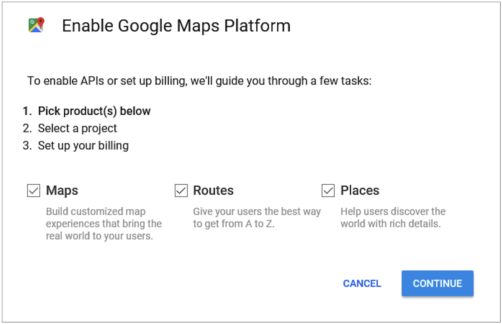
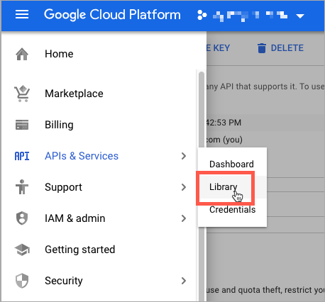
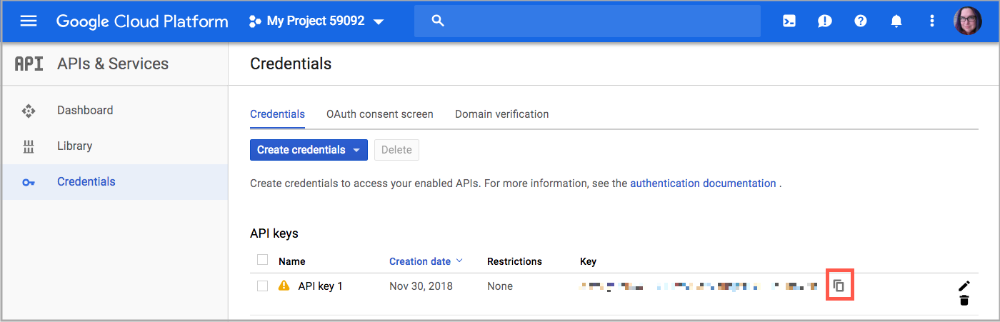
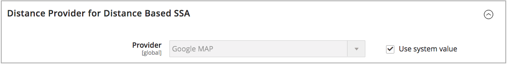
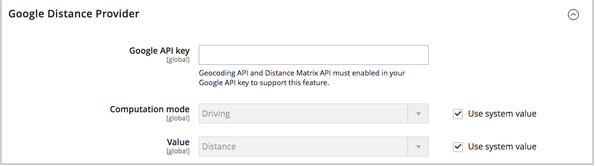
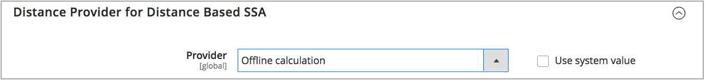

# Configure the Distance Priority Algorithm

The Distance Priority Algorithm compares the location of the shipping destination address with source locations to determine the closest source to fulfill shipments. The distance may be determined by physical distance or time spent traveling from one location to another, using database data or driving, walking, or bicycling directions. Use this [Source Selection Algorithm](selection-reservations.md) to recommend the closest source to shipping destination addresses.

>[!NOTE]
>
>If you are using the Distance Priority Algorithm, entering the full street address and GPS coordinates for your [sources](sources-add.md) is recommended.

You have two options for calculating the distance and time to find the closest source for shipment fulfillment:

- **Google MAP** - Uses [Google Maps Platform][1] services to calculate the distance and time between the shipping destination address and source locations. This option uses the source's Latitude and Longitude (GPS coordinates) and may use the street address depending on the computation mode. A Google API key is required with [Geocoding API][2] and [Distance Matrix API][3] enabled, and you may incur charges through Google.

- **Offline Calculation** - Calculates the distance using downloaded and imported geocode data using zip/post codes and GPS coordinates to determine the closest source to the shipping destination address. To configure this option, you may require developer assistance to initially download and import geocodes using command-line instructions.

>[!NOTE]
>
>For multi-store website with several countries, configure the [default tax destination](../stores-purchase/tax-class.md#default-tax-destination){target="_blank"} for each country.

## Use Google Maps

You do not need a Google account to get started. The process includes Google account and project creation, if needed. This option requires a billing account and payment method added to your Google account to complete configurations and use the algorithm.
However, Google MAP distance-based algorithm is recommended as more advanced and precise in comparison to Offline Calculation.

### Step 1: Create the Google API key

The key is from the [Google Maps Platform][1] and should have [Geocoding API][2] and [Distance Matrix API][3] enabled. For details, see [Configuring Distance Priority Algorithm](distance-priority-algorithm.md).

1. Visit [Google Maps Platform][1] and click **[!UICONTROL Get Started]**.

1. To enable the platform, select **[!UICONTROL Maps, Routes, and Places]** and click **[!UICONTROL Continue]**.

    

1. Sign in with a Google account or create an account.

1. Set up a project:

   - Select a project or enter a new project name.

   - To accept the terms, select `Yes`.

   - Click **[!UICONTROL Next]**.

1. Enter a billing account or create one. You can skip and add a billing account later.

    A billing account is required to use this service.

1. To open and configure your Google Cloud Platform options, click **[!UICONTROL Console]**.

   - Open your project.

   - Expand the menu and click **[!UICONTROL APIs & Services]** > **[!UICONTROL Library]**.

      

   - Search for [Geocoding API][2] and [Distance Matrix API][3]. Select and enable each service.

1. Expand the menu, click **[!UICONTROL APIs & Services]** > **[!UICONTROL Credentials]**, and copy the Google API Key.

    

### Step 2: Configure the Google MAP Provider

1. On the _Admin_ sidebar, go to **[!UICONTROL Stores]** > _[!UICONTROL Settings]_ > **[!UICONTROL Configuration]**.

1. In the left panel, expand **[!UICONTROL Catalog]** and choose **[!UICONTROL Inventory]**.

1. Expand  the _[!UICONTROL Distance Provider for Distance Based SSA]_ section and set **[!UICONTROL Provider]** to `Google MAP`.

    

1. Expand  the _[!UICONTROL Google Distance Provider]_ section and configure the settings:

   - For **[!UICONTROL Google API Key]**, enter the key copied from your Google account.

   - For **[!UICONTROL Computation mode]**, select a configuration.

      >[!NOTE]
      >
      >When using this algorithm for shipping, if routes and data do not return for the selected Computation mode (driving, bicycling, or walking) for a shipment, the SSA defaults to using the Source Priority. Setting the [priority for sources per stock](stocks-prioritize-sources.md) is recommended.

      | Option | Description |
      | ----- | ----- |
      | `Driving` | (Default) Requests standard driving directions using the road network. |
      | `Walking` | Requests walking directions using pedestrian paths and sidewalks (where available). |
      | `Bicycling` | Requests bicycling directions using bicycle paths and preferred streets (where available). The [Distance Matrix Service][4] is only available in the US and some Canadian cities. |

   - For **[!UICONTROL Value]**, select a value type:

      | Option | Description |
      | ----- | ----- |
      | `Distance` | (Default) Returns the distance between points in metrics (kilometers and meters) or imperial (miles and feet). |
      | `Time to Destination` | Returns the time required to travel from the source locations to the shipping address in hours and minutes. |

    

1. When complete, click **[!UICONTROL Save Config]**.

## Use offline calculation

Offline calculations use country codes to determine the distance between the shipping destination and source addresses. This option may require developer assistance to configure. Use an [!DNL Inventory Management] CLI command to download and import data from [geonames.org][5].

>[!NOTE]
>
>Imported geocodes from [geonames.org][5] have limitations for some countries, such as Canada and Ireland. Refer to [GeoNames Postal Code files][6] for more information.

### Step 1: Download and import geocodes

Complete command-line configuration to download and import geocodes countries to ship to and have source locations in. This step may require developer assistance for help with command-line tasks. Refer to [Import geocodes](cli.md#import-geocodes).

Complete these commands anytime you want to add more geocodes.

### Step 2: Set the calculation

1. On the _Admin_ sidebar, go to **[!UICONTROL Stores]** > _[!UICONTROL Settings]_ > **[!UICONTROL Configuration]**.

1. In the left panel, expand **[!UICONTROL Catalog]** and choose **[!UICONTROL Inventory]**.

1. Expand  the _[!UICONTROL Distance Provider for Distance Based SSA]_ section.

1. Deselect the **[!UICONTROL Use system value]** checkbox and set **[!UICONTROL Provider]** to `Offline Calculation`.

    

1. When complete, click **[!UICONTROL Save Config]**.

[1]: https://cloud.google.com/maps-platform/
[2]: https://developers.google.com/maps/documentation/geocoding/start
[3]: https://developers.google.com/maps/documentation/distance-matrix/start
[4]: https://developers.google.com/maps/documentation/javascript/distancematrix#travel_modes
[5]: https://www.geonames.org/
[6]: https://download.geonames.org/export/zip/readme.txt
