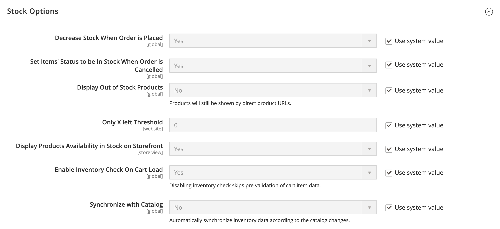
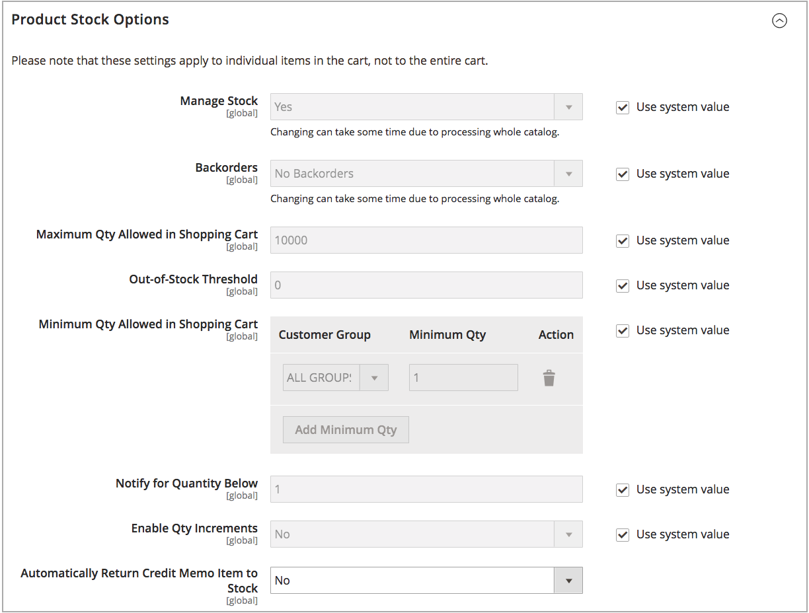
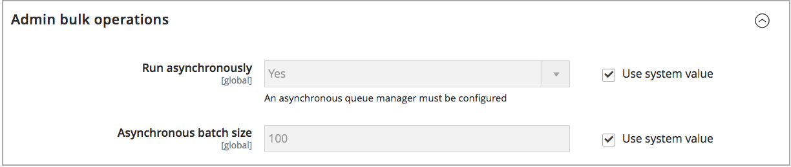

# Configure Global Options

Configure the default configuration options for product and stock for your websites. Some of these settings can be overridden per product through [Configuring Product Options](product-options.md). To configure Distance Priority settings, see [Configuring Distance Priority Algorithm](distance-priority-algorithm.md).

## Configure product and stock options globally

1. On the _Admin_ sidebar, go to **[!UICONTROL Stores]** > _[!UICONTROL Settings]_ > **[!UICONTROL Configuration]**.

1. In the left panel, expand **[!UICONTROL Catalog]** and choose **[!UICONTROL Inventory]**.

1. Expand  the **[!UICONTROL Stock Options]** section and set the options:

   

    - To adjust the quantity on hand when an order is placed, set **[!UICONTROL Decrease Stock When Order is Placed]** to `Yes`.

    - To return items to stock if an order is canceled, **[!UICONTROL Set Items’ Status to be in Stock When Order in Cancelled]** to `Yes`.

    - To continue to display products in the catalog that are no longer in stock, set **[!UICONTROL Display Out of Stock Products]** to `Yes`.

    - If [price alerts](alert-setup.md) are enabled, customers can sign up to be notified when the product is back in stock.

    - To set the start for displaying the last remaining inventory amount on the product page, enter an amount for **[!UICONTROL Only X left Threshold]**.

      The message begins to appear when the quantity in stock reaches the threshold. For example, if set to `3`, the message “Only 3 left” appears when the quantity in stock reaches three. The message adjusts to reflect the quantity in stock, until the quantity reaches zero.

    - To display an “In Stock” or “Out of Stock” message on the product page, set **[!UICONTROL Display Products Availability In Stock on Storefront]** to `Yes`.

    - To check inventory when loading a product in the cart, set **[!UICONTROL Enable Inventory Check On Cart Load]** to `Yes`. With this option disabled, the inventory check is skipped. Disabling this option speeds up checkout, especially if there are many items in shopping cart. However, if you skip pre-validation, customers could see "out of stock" errors later in the checkout process.

    - To keep consistency between inventory and catalog, set **[!UICONTROL Synchronize with Catalog]** to `Yes`. With this option enabled, inventory data is adjusted according to the catalog changes (such as product removed, product SKU changed, and product type changed).

1. Expand  the **[!UICONTROL Product Stock Options]** section and set the options:

    - To activate [inventory control](enable.md) for your catalog, set **[!UICONTROL Manage Stock]** to `Yes`.

      

    - Set **[!UICONTROL Backorders]** to one of the following:

       | Option| Description |
       | ----- | ----- |
       | `No Backorders` | To not accept [backorders](backorders.md) when product is out of stock. |
       | `Allow Qty Below 0` | To accept backorders when the quantity falls below zero. |
       | `Allow Qty Below 0 and Notify Customer` | To accept backorders when the quantity falls below zero, and notify the customer that the order can still be placed. |

    - Enter the **[!UICONTROL Maximum Qty Allowed in Shopping Cart]**.

    - Enter an amount for the **[!UICONTROL Out-of-Stock Threshold]**:

       | Value | Description |
       | ----- |-----|
       | Positive amount | With Backorders disabled, enter a positive amount. |
       | Zero | With Backorders enabled, entering `0` allows for infinite backorders. |
       | Negative amount | With Backorders enabled, entering a negative amount is recommended. The amount is added to the Salable Quantity. For example, enter `-50` to allow orders up to this amount. |

    - Enter the **[!UICONTROL Minimum Qty Allowed in Shopping Cart]** for selected group and amounts.

    - For **[!UICONTROL Notify for Quantity Below]**, enter the stock level that triggers notification that the item is out of stock.

    - To activate quantity increments for the product, set **[!UICONTROL Enable Qty Increments]** to `Yes`. Then, for **[!UICONTROL Qty Increments]**, enter the number of the items that must be purchased to meet the requirement.

      For example, an item that is sold in increments of six can be purchased in quantities of 6, 12, 18, and so on.

    - For [!DNL Inventory Management], **[!UICONTROL Automatically Return Credit Memo Item to Stock]** is set to `No`. When submitting a credit memo, you enter and select to return stock to sources.

1. Expand  the **[!UICONTROL Admin bulk operations]** section and set the options:

   

    - Set **[!UICONTROL Run asynchronously]** to run bulk operations asynchronously for mass product actions

      These operations include bulk [assigning and unassigning sources](bulk-assignment.md), and [transferring inventory to source](inventory-transfer.md). It collects bulk actions up to the Asynchronous batch size, then runs those actions. This option is disabled by default. Reviewing your performance with bulk actions before enabling is recommended.

      >[!NOTE]
      >
      >To configure and support _asynchronous queue managers_, you must issue a command using the command line. This step may require developer assistance. See [Start message queue consumers](https://devdocs.magento.com/guides/v2.4/config-guide/cli/config-cli-subcommands-queue.html){target="_blank"} in the developer documentation.

    - If enabled, set the **[!UICONTROL Asynchronous batch size]**. The default batch size is 100. When bulk processes reach this amount, the system triggers it.

1. When complete, click **[!UICONTROL Save Config]**.
