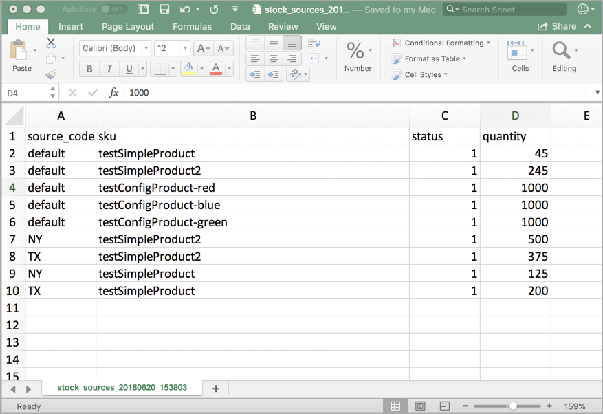
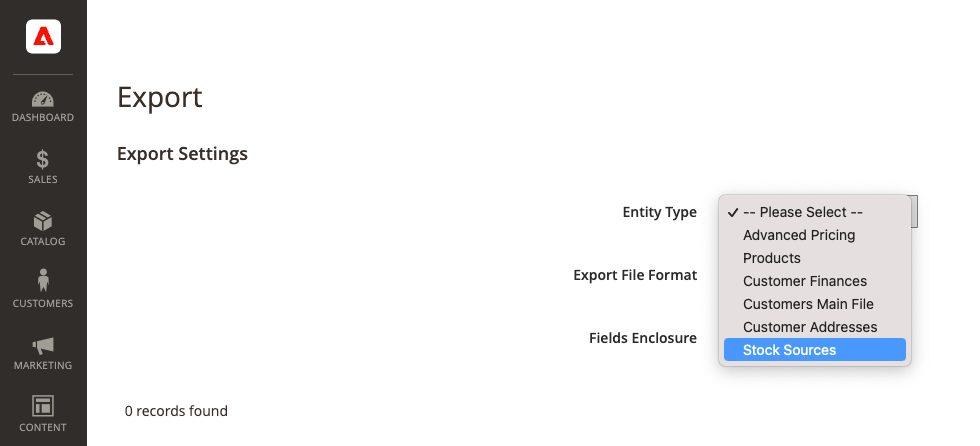
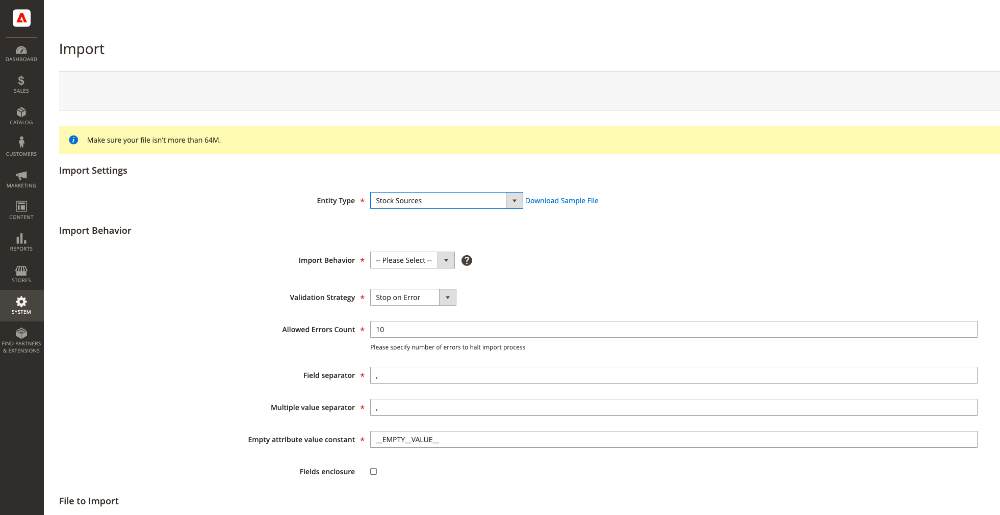

# Import and Export Inventory

For catalogs with many products, use the native import and export features with expanded [!DNL Inventory Management] options to update sources and quantities by SKU. With these options, you can add new sources and update inventory quantities for all or a specific source. For example, you can export products for a source in Germany without affecting product information for sources in France, England, or the US.

- [!DNL Commerce] automatically assigns the Default Source to your products when upgrading [!DNL Commerce] or importing new products. If you import products with a custom source assigned, the Default Source is still added with a quantity of 0. To update sources and quantities, use these import instructions.

- Single-source merchants use import to update only product quantities. All existing and added products are assigned to the Default Source.

- Multi-source merchants use import to add multiple sources and quantities per row per SKU.

To import updates, first export a CSV file for a specific or all sources. Edit the CSV file and add a row per SKU for each source and quantity. You need the source's code when adding a source and adding quantities of stock. You cannot add or update stocks using import-export features.

## CSV file content

The export-import file includes the following information according to source:

- `source_code` - The code for sources in [!DNL Commerce]. There is a row for each source and SKU.
- `sku` - The SKU for the product in [!DNL Commerce]. The SKU must match a product in your store to properly update [!DNL Inventory Management] data.
- `status` - 0 for Out of Stock. 1 for In Stock. This value must be 1 to purchase stock from this source.
- `quantity` - The total amount of inventory available for this SKU and source.

Use a CSV file to quickly update multiple products and assigned sources to update and correct any inaccuracies in inventory records rather than one at a time through the application interface. For a base file, export first and update as needed.

{width="600" zoomable="yes"}

## Export product data for all sources

1. On the _Admin_ sidebar, go to **[!UICONTROL System]** > _[!UICONTROL Data Transfer]_ > **[!UICONTROL Export]**.

1. For **[!UICONTROL Entity Type]**, choose `Stock Sources`.

   The export only extracts data for products with a SKU.

1. Click **[!UICONTROL Continue]**.

   The file generates and downloads to open and edit.

After updating inventory amounts and product data, import the file back into [!DNL Commerce].

{width="350" zoomable="yes"}

## Export product data for a specific source

1. On the _Admin_ sidebar, go to **[!UICONTROL System]** > _[!UICONTROL Data Transfer]_ > **[!UICONTROL Export]**.

1. For **[!UICONTROL Entity Type]**, choose `Stock Sources`.

   The export only extracts data for products with a SKU.

1. Use the **[!UICONTROL Entity Attributes]** to filter the exported products for a specific source.

   For `source_code`, enter the code for the source in the filter field.

1. Click **[!UICONTROL Continue]**.

   The file generates and downloads to open and edit.

After updating inventory amounts and product data, import the file back into [!DNL Commerce].

## Import product data

1. On the _Admin_ sidebar, go to **[!UICONTROL System]** > _[!UICONTROL Data Transfer]_ > **[!UICONTROL Import]**.

1. For **[!UICONTROL Entity Type]**, choose `Stock Sources`.

   The export only extracts data for products with a SKU.

1. Select configurations for the **[!UICONTROL Import Behavior]**.

1. Select the .csv file to import.

1. Click **[!UICONTROL Check Data]** and complete the import.

{width="600" zoomable="yes"}
