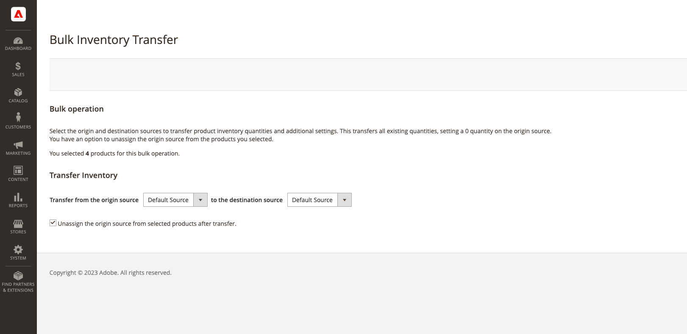

# Transfer Inventory to Source

Depending on the business needs and status of location, multi-source merchants often transfer product inventory from one source location to another. For example, you may be closing a warehouse location or no longer shipping specific products from a location, moving all operations for those products to a new location.

This option allows you to select one or more products, the origin source to transfer inventory, and the destination source to receive quantities:

- Inventory quantities, Source Item Status (In Stock/Out of Stock), and the Notify Quantity for the selected source are moved per product.

- If a product does not have that source, it is skipped.

- All product inventory for the source is moved. You cannot transfer a partial quantity.

>[!NOTE]
>
>If the origin and destination sources are in different stocks, it affects the aggregated Salable Quantity and reservations for in-progress orders.

You can also unassign the source when transferring inventory quantities.

{{$include /help/_includes/unassign-source.md}}

1. On the _Admin_ sidebar, go to **[!UICONTROL Catalog]** > **[!UICONTROL Products]**.

1. Select the products for which you want to modify sources.

   Browse or search to find products and select checkboxes for transfer.

1. Click the **[!UICONTROL Actions]** menu at the top and choose **[!UICONTROL Transfer Inventory to Source]**.

1. Click **[!UICONTROL OK]** in the confirmation dialog.

1. To transfer products to a new destination, select the origin (_[!UICONTROL from]_) source.

1. to transfer products to a new destination, select the destination (_[!UICONTROL to]_) source.

1. To remove the source from the products, select the optional checkbox **[!UICONTROL Unassign from origin source after transfer]**.

    

1. Click **[!UICONTROL Inventory Transfer]**.

   All product quantities are deducted from the origin source and added to the destination source. The Quantity and Salable Quantity automatically update.
