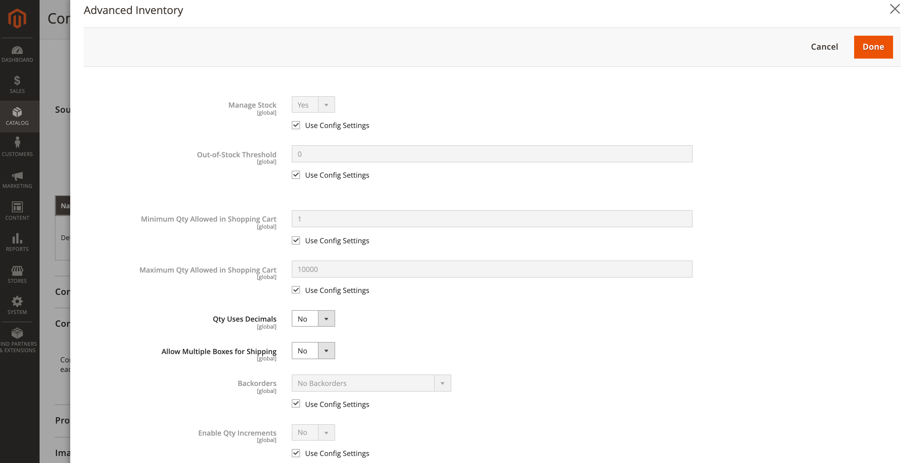

# Configure Product Options

These configurations apply only to the edited product, overriding all configurations at the global website level. Modify these settings when editing a product, through the _[!UICONTROL Sources]_ section and _[!UICONTROL Advanced Inventory]_ page.

- Configure product options by source
- Configure product options for advanced inventory

## Product options by source

Configure the quantities and additional settings per [added source](sources-add.md) for the product.

1. On the _Admin_ sidebar, go to **[!UICONTROL Catalog]** > **[!UICONTROL Products]**.

1. Open a product in edit mode.

1. Expand  the **[!UICONTROL Sources]** section and configure product settings for each source:

   - Enter a **[!UICONTROL Qty]** (quantity) amount.

   - Set the **[!UICONTROL Source Item Status]** as `In Stock` or `Out of Stock`.

   - To modify the Notify for Quantity Below per source, clear or select the **[!UICONTROL Notify Quantity Use Default]** checkbox.

      If cleared, enter the stock level amount that triggers the item's out of stock notice. The amount entered is subtracted from the item's Salable Quantity at the stock level.

      `Select to use Default` - [!DNL Commerce] checks the product Advanced Inventory options for configuration settings.
      `Clear to Modify` - Enter a value for the Notify Quantity, overriding Advanced Inventory and Store configuration settings.

   

1. When complete, click **[!UICONTROL Done]**, then **[!UICONTROL Save]**.

### Field descriptions

|Field|Scope|Description|
|--|--|--|
| [!UICONTROL Source Code] | Global | The unique code for a [source](sources-manage.md). |
| [!UICONTROL Name] | Global | The unique name for a source. |
| [!UICONTROL Status] | Global | Product is enabled or disabled in the catalog. |
| [!UICONTROL Source Item Status] | Global | Determines the current availability of the product. Options: **[!UICONTROL In Stock]** - Makes the product available for purchase. **[!UICONTROL Out of Stock]** - Unless Backorders are activated, prevents the product from being available for purchase and removes the listing from the catalog. |
| [!UICONTROL Qty] | Global | On-hand stock amounts for each source or location. |
| [!UICONTROL Notify Quantity] | Global | An amount for the _[!UICONTROL Notify for Quantity Below]_ for this specific source if _[!UICONTROL Notify Quantity Use Default]_ is not selected. |
| [!UICONTROL Notify Quantity Use Default] | Global | Indicates to use the default setting for _[!UICONTROL Notify for Quantity Below]_ in the product _[!UICONTROL Advanced Inventory]_ or global setting in the store configuration. |

## Advanced product options

1. On the _Admin_ sidebar, go to **[!UICONTROL Catalog]** > **[!UICONTROL Products]**.

1. Open a product in edit mode.

1. Expand  the **[!UICONTROL Sources]** section and click **[!UICONTROL Advanced Inventory]**.

1. To enable [inventory control](enable.md) for your catalog, set **[!UICONTROL Manage Stock]** to `Yes`.

   >[!NOTE]
   >
   >[!UICONTROL Manage Stock] settings in child products override a configurable product.

   

1. Enter an amount for the **[!UICONTROL Out-of-Stock Threshold]**:

   | Value | Description |
   | ----- | ----- |
   | Positive amount | With _[!UICONTROL Backorders]_ disabled, enter a positive value. |
   | Zero | With _[!UICONTROL Backorders]_ enabled, entering `0` allows for infinite backorders. |
   | Negative amount | With _[!UICONTROL Backorders]_ enabled, entering a negative value is recommended. The amount is added to the Salable Quantity. For example, enter `-50` to allow orders up to this amount. |

1. Enter the **[!UICONTROL Minimum Qty Allowed in Shopping Cart]**.

1. Enter the **[!UICONTROL Maximum Qty Allowed in Shopping Cart]**.

1. Set **[!UICONTROL Qty uses Decimals]** to `Yes` if customers can use a decimal value rather than a whole number when entering the quantity ordered.

1. Set **[!UICONTROL Allow Multiple Boxes for Shipping]** to `Yes` if the product can be sold separately, in many boxes.

1. Set **[!UICONTROL Backorders]** to one of the following:

   | Option | Description |
   | ----- | ----- |
   | `No Backorders` | To not accept backorders when product is out of stock. |
   | `Allow Qty Below 0` | To accept backorders when the quantity falls below zero. |
   | `Allow Qty Below 0 and Notify Customer` | To accept backorders when the quantity falls below zero, and notify the customer that the order can still be placed. |

   For more information, see [Configuring Backorders](backorders.md).

1. To activate quantity increments for the product, set **[!UICONTROL Enable Qty Increments]** to `Yes` and enter the number of the items that must be purchased to meet the requirement in the **[!UICONTROL Qty Increments]** field.

   For example, an item that is sold in increments of six can be purchased in quantities of 6, 12, 18, and so on.

1. When complete, click **[!UICONTROL Done]** and then **[!UICONTROL Save]**.

### Field descriptions

|Field|Scope|Description|
|--|--|--|
| [!UICONTROL Manage Stock] | Global | Determines if inventory control is used to manage this product in your catalog. Set to enable or disable all [!DNL Inventory Management] features. When you complete a return or a credit memo, the product quantity is automatically returned to the affected source quantity. You may want to disable if using a third-party, ERP system. |
| [!UICONTROL Out-of-Stock Threshold] | Global | Determines the stock level at which a product is considered to be out of stock. Options: **[!UICONTROL Positive amount]** - With Backorders disabled, enter a positive amount. **[!UICONTROL Zero]** - With Backorders enabled, entering zero allows for infinite backorders. **[!UICONTROL Negative amount]** - With Backorders enabled, entering a negative amount is recommended. The amount is added to the Salable Quantity. For example, enter `-50` to allow orders up to this amount. |
| [!UICONTROL Minimum Qty Allowed in Shopping Cart] | Global | Determines the minimum number of the product that can be purchased in a single order. |
| [!UICONTROL Maximum Qty Allowed in Shopping Cart] | Global | Determines the maximum number of the product that can be purchased in a single order. |
| [!UICONTROL Qty Uses Decimals] | Global | Determines if customers can use a decimal value rather than a whole number when entering the quantity ordered. Options: **[!UICONTROL Yes]** - Permits values to be entered as decimals, rather than whole numbers. Decimals are suitable for products sold by weight, volume, or length. **[!UICONTROL No]** - Requires quantity values to be entered as whole numbers. |
| [!UICONTROL Allow Multiple Boxes for Shipping] | Global | Determines if parts of the product can be shipped separately. |
| [!UICONTROL Backorders] | Global | Determines how  backorders are managed. Backorders do not change the processing status of the order. Funds are still authorized or captured immediately when the order is placed, regardless of whether the product is in stock. Products are shipped as they become available. When enabled, it is recommended that you enter a negative amount for the Out-of-Stock Threshold. Options: **[!UICONTROL No Backorders]** -  Does not accept backorders when product is out of stock. **[!UICONTROL Allow Qty Below 0]** - Accepts backorders when the quantity falls below zero. **[!UICONTROL Allow Qty Below 0 and Notify Customer]** - Accepts backorders when the quantity falls below zero, but notifies customers that orders can still be placed. |
| [!UICONTROL Enable Qty Increments] | Global | Determines if the product can be sold in quantity increments. |

>[!NOTE]
>
>Simple product configuration overrides configurable product configurations for a specific product.
