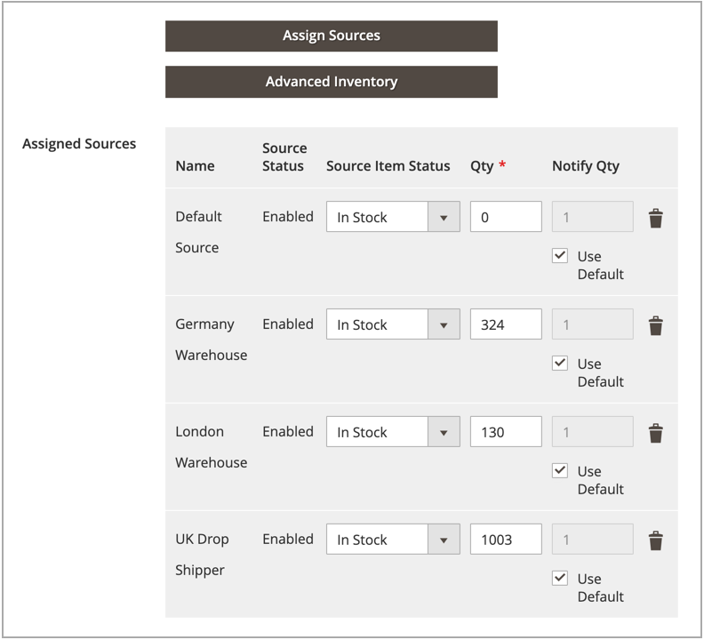

# Assign quantities per product

After adding [sources](sources-assign-per-product.md), update the inventory quantities for your product. These values track the on-hand, available stock amounts.

To hide a source's inventory from shipments without removing the source, set _[!UICONTROL Source Item Status]_ to `Out of Stock`. The SSA and shipment options only access sources listed as `In Stock` with available inventory quantity.

All updated quantities and sources display in the product grid.

## Update quantities

1. On the _Admin_ sidebar, go to **[!UICONTROL Catalog]** > **[!UICONTROL Products]**.

1. Locate and open a product in edit mode.

1. Expand  the **[!UICONTROL Sources]** section.

1. Set **[!UICONTROL Source Item Status]** to `In Stock`.

1. to update the quantity for on-hand stock, enter an amount for **[!UICONTROL Qty]**.

1. To set a notification for inventory quantities, do one of the following:

   - Custom Notify Quantity - Deselect the **[!UICONTROL Use Default]** checkbox and enter an amount in **[!UICONTROL Notify Qty]**.
   - Default Notify Quantity - Select the **[!UICONTROL Use Default]** checkbox. [!DNL Commerce] checks and uses the setting in _[!UICONTROL Advanced Inventory]_ or global store configuration.

   {width="350" zoomable="yes"}

1. Do one of the following to save:

   - Click **[!UICONTROL Save]**.

   - On the **[!UICONTROL Save]** () menu, choose **[!UICONTROL Save & Close]**.

The Product Grid updates with a list of all sources and related quantities. For products with more than five assigned sources, hover over the _[!UICONTROL Quantity per Source]_ column to see the full list.

{width="600" zoomable="yes"}
