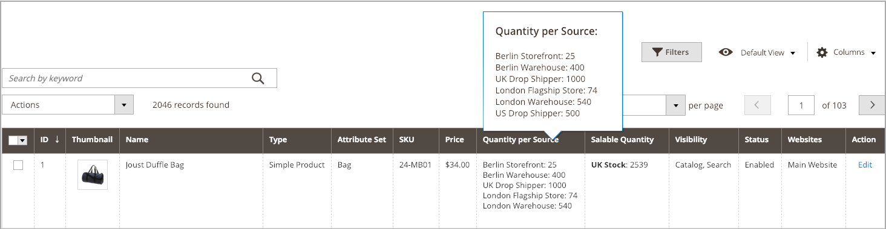

# Manage Inventory Quantities

The following information details how to assign sources and quantities for new products or change existing products.

When creating products, assign sources and quantities during product creation. See [Create a product](../catalog/product-create.md) for full instructions. These pages includes single- and multi-source information for sources and quantities per source.

When first accessing an upgraded [!DNL Commerce] with [!DNL Inventory Management], all products and quantities are assigned to the Default Source. When importing new products via .csv file, they are also assigned to the Default Source.

Single- and multi-source merchants can update sources, inventory quantities, and thresholds per product or in bulk.

- Single-source merchants can update product quantities for the Default Source. This quantity is the total number of products available for sale.

- Multi-source merchants can assign multiple sources and quantities per product for each location (warehouses, stores, drop shippers, and so on). It is recommended that you have sources added before setting product inventory amounts.

When adding sources and quantities to your products, you can view the amounts through the Product Grid. If you have a high number of sources, hover over the _[!UICONTROL Quantity per Source]_ to see the full, scrollable list of sources with current quantities.

{width="600" zoomable="yes"}

You have the following options to assign inventory to products:

- [Assigning Sources per Product](sources-assign-per-product.md) - Assign sources manually per product in your catalog.

- [Assigning Quantities per Product](quantities-assign-per-product.md) - Add on-hand inventory amounts to your products per source. This information is specific for multi-source merchants.

- [Bulk Assigning and Unassigning Sources](bulk-assignment.md) - Assign sources to selected products as a mass action. Use the [Transfer Inventory to Source](inventory-transfer.md) option if you want to transfer inventory and remove the source.

- [Transferring Inventory to Source](inventory-transfer.md) - Mass transfer all inventory from one origin source to a destination source.

- [Importing and Exporting Quantities](inventory-import-export.md) - Use import and export features to update multiple product SKUs with sources and inventory quantities.
