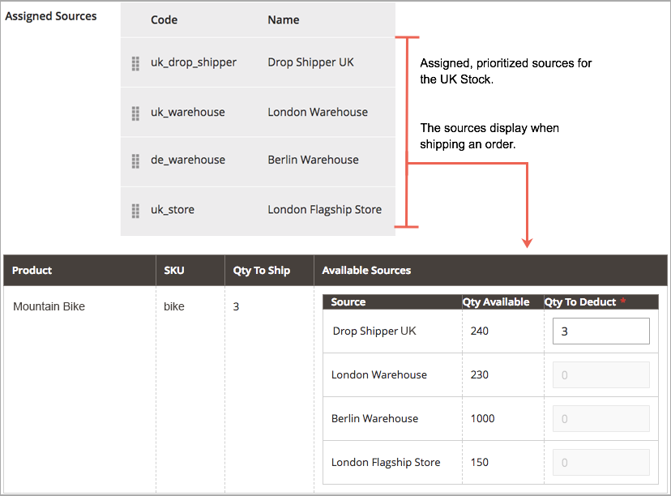
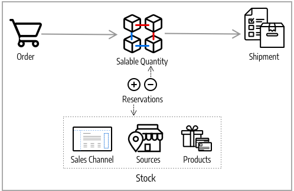
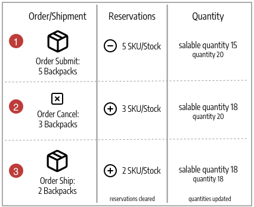

# Source Algorithms and Reservations

The heart of [!DNL Inventory Management] tracks every available product virtually and on-hand in your warehouses and stores. The Source Selection Algorithm and Reservations systems run in the background, keeping your salable quantities updated, checkout free of collisions, and shipment options recommended.

>[!NOTE]
>
>Refer to the [developer documentation](https://developer.adobe.com/commerce/php/development/framework/inventory-management/) for information about working with the [!DNL Inventory Management] system programmatically.

## Source Selection Algorithm

The Source Selection Algorithm (SSA) analyzes and determines the best match for sources and shipping using the priority order of sources configured in a stock. During order shipment, the algorithm provides a recommended list of sources, available quantities, and amounts to deduct according to the selected algorithm. [!DNL Inventory Management] provides a Priority algorithm and supports extensions for new options.

With multiple source locations, global customers, and carriers with various shipping options and fees, knowing your actual available inventory and finding the best shipment option can be difficult. SSA does the work for you from tracking inventory salable quantities across all sources to calculating and making recommendations for shipments.

**Track Inventory** - Using stocks and sources, the SSA checks the sales channel of incoming product requests and determines available inventory:

- Calculates the aggregated virtual salable quantity of all assigned sources per stock: aggregates Quantity - Out-of-Stock Threshold per source
- Subtracts the Out-of-Stock Threshold amount from salable quantity to protect against overselling
- Reserves inventory quantities on order submission, deducting from in-stock inventory at order processing and shipment
- Supports backorders with enhanced options for negative thresholds

**Manage Shipments** - The algorithm helps when you process and ship orders. You can run the algorithm to get recommendations on the best sources for shipping the product or override the selections to:

- Ship partial shipments, sending only a few products from specific locations and completing the full order later
- Ship the entire order from one source
- Break the shipments across multiple sources in different amounts, keeping a balanced stock across all warehouses and stores

SSA is extensible for third-party support and custom algorithms for recommending cost-effective shipments.

>[!NOTE]
>
>SSA functions differently for Virtual and Downloadable products, which may not incur shipping costs. In these cases, the system runs the algorithm implicitly when it creates invoices, and always uses the suggested results. You cannot adjust these results for Virtual and Downloadable products.

### Source Priority Algorithm

Custom stocks include an assigned list of sources to sell and ship available product inventory through your storefront. The Source Priority Algorithm uses the order of assigned sources in the stock to recommend product deductions per source when invoicing and shipping the order.

When run, the algorithm:

- Works through the configured order of sources at the stock level starting at the top
- Recommends a quantity to ship and source per product based on the order in the list, available quantity, and quantity ordered
- Continues down the list until the order shipment is filled
- Skips disabled sources if found in the list

To configure, assign and order sources to a custom stock. See [Prioritizing Sources for a Stock](stocks-prioritize-sources.md).

The following example details the mapped sources in order, available quantity, and recommended source and amount to deduct and ship. The top source is a Drop Shipper in the United Kingdom with an available quantity of 240.



### Distance Priority Algorithm

The Distance Priority Algorithm compares the location of the shipping destination address with source locations to determine the closest source to fulfill shipments. The distance may be determined by physical distance or time spent traveling from one location to another, using imported database locations or Google directions (driving, walking, or bicycling).

You have two options for calculating the distance and time to find the closest source for shipment fulfillment:

- **Google MAP** - Uses [Google Maps Platform][1] services to calculate the distance and time between the shipping destination address and source locations (address and GPS coordinates). This option uses the source's Latitude and Longitude. A Google API key is required with [Geocoding API][2] and [Distance Matrix API][3] enabled. This option requires a Google billing plan and may incur charges through Google.

- **Offline Calculation** - Calculates the distance using downloaded and imported geocode data to determine the closest source to the shipping destination address. This option uses the country codes of the shipping address and source. To configure this option, you may require developer assistance to initially download and import geocodes using a command line.

To configure, select configurations and complete additional steps such as the Google API key or downloading shipping data. See [Configure the Distance Priority Algorithm](distance-priority-algorithm.md).

### Custom algorithms

[!DNL Commerce] supports custom development and extensions to add alternative algorithms to prioritize sources. For example, you can have one priority algorithm based on geography and another based on expense of stock or a customer attribute. When the cost of stock changes, your implementation can easily change algorithms to ensure the lowest cost.

## Reservations

Instead of immediately deducting or adding product inventory quantities, reservations hold inventory amounts until orders ship or cancel. Reservations work entirely in the backend to automatically update your salable quantity at the stock level.

>[!NOTE]
>
>The reservation capability requires the `inventory.reservations.updateSalabilityStatus` message queue consumer to run continuously. To check if it is running, use the `bin/magento queue:consumers:list` command. If the message queue consumer is not listed, start it: `bin/magento queue:consumers:start inventory.reservations.updateSalabilityStatus`.

### Order reservations

Reservations place holds on inventory quantities deducted from the salable quantity when submitting an order. The reservations are at the stock level, counting against quantities until the order is invoiced and shipped, canceled, and so on. When shipping the order, you can use the SSA recommendations or manually enter quantity deductions per source. When shipped, the reservations are automatically cleared and the quantity deducted. The salable quantity recalculates for the stock with an updated quantity and any reservation amounts remaining in the system.

The following diagram helps define the process of reservations during an order and through to shipment.



A customer submits an order. [!DNL Commerce] checks the current inventory salable quantity. If enough inventory is available at the stock level, a reservation enters placing a temporary hold for the product SKU (for that stock) and recalculates the salable quantity.

After invoicing the order, you determine the product amounts to deduct and ship from your sources. The shipment is processed and sent from one or more selected sources to the customer. The quantities automatically deduct from the source inventory quantity and reservations clear. For complete details and examples, see [About Order Status and Reservations](order-status.md).

## Reservation calculations

The system creates a reservation for each product when the following events occur:

- A customer or merchant places an order.
- A customer or merchant fully or partially cancels an order.
- The merchant creates a shipment for a physical product.
- The merchant creates an invoice for a virtual or downloadable product.
- The merchant issues a credit memo.

Reservations are append-only operations, similar to a log of events. The initial reservation is assigned a negative quantity value. All subsequent reservations created while processing the order are positive values. When the order is complete, the sum of all reservations for the product is 0.

Before the system can issue a reservation in response to a new order, it determines whether there are enough salable items to fulfill the order. The following quantities factor into the calculation:

- **StockItem quantity**. The StockItem quantity is the aggregated amount of inventory from all the physical sources for the current sales channel. Consider an example where the Baltimore source has 20 units of a product, the Austin source has 25 units of the same product, and the Reno source has 10. When all of these sources are linked to Stock A, the StockItem count for this product is 55 (20 + 25 + 10). (When items are shipped, the Inventory indexer updates the quantities available at each source.)

- **Outstanding reservations**. The system totals all the initial reservations that have not been compensated. This number is always negative. If customer A has a reservation for ten items, and customer B has a reservation 5 for items, then outstanding reservations for the product total -15.

Therefore, the merchant can fulfill an incoming order as long as the customer orders less than 40 (55 + -15) units.

When you complete processing an order (Complete, Canceled, Closed), all reservations in the scope of that order should resolve to `0`. This clears all salable quantity holds.

>[!NOTE]
>
>Backorders (with Out-of-Stock Thresholds) and Notify for Quantity Below Threshold settings also affect the calculation of salable quantities, but they are outside the scope of this topic. For more information about these settings, see [Configuring [!DNL Inventory Management]](./configuration.md).

## Reservation objects

A reservation contains the following information:

| Parameter | Data type | Description |
| --- | --- | --- |
| `reservation_id` | Integer | A system-generated ID |
| `stock_id` | Integer | The ID of the stock the product is assigned to |
| `sku` | String | The SKU of the product |
| `quantity` | Float | The number of items in this reservation |
| `metadata` | String | The event type, object type, and object ID for this reservation. For example, `{"event_type":"order_placed","object_type":"order",| "object_id":"8"}` |

{style="table-layout:auto"}

The metadata `event_type` can have the following values:

- `order_placed`
- `order_canceled`
- `shipment_created`
- `creditmemo_created`
- `invoice_created`

Currently, the metadata object type must be `order`, and the object ID is the order ID.

In future releases, it might be possible to create a reservation when a customer adds an item to a shopping cart. Each item could be reserved for a fixed amount of time, such as 15 minutes, allowing the customer to reserve items while continuing to shop. When this type of reservation is enabled, the metadata could contain additional types of information.

## Reservation lifecycle

The following example shows the sequence of reservations generated for a simple order.

1. The customer makes a purchase order for 25 units of product `SKU-1`. The reservation contains the following information:

   ```text
   reservation_id = 1
   stock_id = 1
   sku = SKU-1
   quantity = -25
   event_type = order_placed
   ```

1. The customer sends an invoice for 20 items, essentially canceling 5 of the units ordered.

   ```text
   reservation_id = 2
   stock_id = 1
   sku = SKU-1
   quantity = 5
   event_type = order_canceled
   ```

1. The merchant ships the purchased 20 units.

   ```text
   reservation_id = 3
   stock_id = 1
   sku = `SKU-1`
   quantity = 20
   event_type = shipment_created
   ```

The three `quantity` values sum up to 0 (-25 + 5 + 20). The system does not modify any existing reservations.

## Removing processed reservations

The `inventory_cleanup_reservations` cron job executes SQL queries to clear the reservation database table. By default, it runs daily at midnight, but you can configure the times and frequency. The cron job runs a script that queries the database to find complete reservation sequences in which the sum of quantity values is 0. When all reservations for a given product that originated on the same day (or other configured time) have been compensated, the cron job deletes the reservations all at once.

The `inventory_reservations_cleanup` cron job is not the same as the `inventory.reservations.cleanup` message queue consumer. The consumer asynchronously deletes reservations by product SKU after a product has been removed, whereas the cron job clears the entire reservations table. The consumer is required when you enable the [**Synchronize with Catalog**](https://docs.magento.com/user-guide/configuration/catalog/inventory.html) stock option in the store configuration. See [Manage message queues](https://devdocs.magento.com/guides/v2.4/config-guide/mq/manage-message-queues.html).

Often, all initial reservations produced in a single day cannot be compensated that same day. This situation can occur when a customer places an order just before the cron job begins or makes the purchase with an offline payment method, such as a bank transfer. The compensated reservation sequences remain in the database until they are all compensated. This practice does not interfere with reservation calculations, because the total for each reservation is 0.

>[!NOTE]
>
>There are CLI commands that you can use to detect and manage reservation inconsistencies (see the [[!DNL Inventory Management] CLI Reference](cli.md)).

### Reservation updates

As changes complete in orders and product amounts, [!DNL Commerce] automatically enters reservation compensations. You do not need to enter compensations through the Admin or code to update or clear these holds. Reservations are only affected by entered reservations to put a hold on a quantity or to clear a hold amount (compensating the reservations).

Here is how they work:

- **Submitted Order** - When an order is submitted for several products, a reservation enters for that amount. For example, ordering five backpacks from a US website enters a reservation of `-5` for that SKU and stock. The salable quantity is reduced by 5.

- **Canceled Order** - When an order is canceled (all or partial), a compensation reservation enters to clear that amount. For example, canceling three backpacks enters a +3 reservation for that SKU and stock, clearing the hold. The salable quantity is increased by 3.

- **Shipped Order** - When an order ships (all or partial), a compensation reservation enters to clear that amount. For example, shipping two backpacks enters a +2 reservation for that SKU and stock, clearing the hold. The product quantity is directly reduced by 2 for the shipment. The calculated salable quantity is also updated for the reduced stock amount, but is no longer affected by the reservation.



All reservations must be cleared by compensations when orders complete fulfillment, products cancel, credit memos are issued, and so on. If compensations do not clear out reservations, you could have quantities held in stasis (not available for sale and never shipping).

>[!NOTE]
>
>If you want to review reservations, a series of command-line options are available. You can only review reservations through a command-line interface. Using CLI commands may require developer assistance. See [[!DNL Inventory Management] CLI Reference](cli.md).

If you remove all sources from a product for a stock with pending orders, you may have stuck reservations.

{{$include /help/_includes/unassign-source.md}}

[1]: https://cloud.google.com/maps-platform/
[2]: https://developers.google.com/maps/documentation/geocoding/start
[3]: https://developers.google.com/maps/documentation/distance-matrix/start
