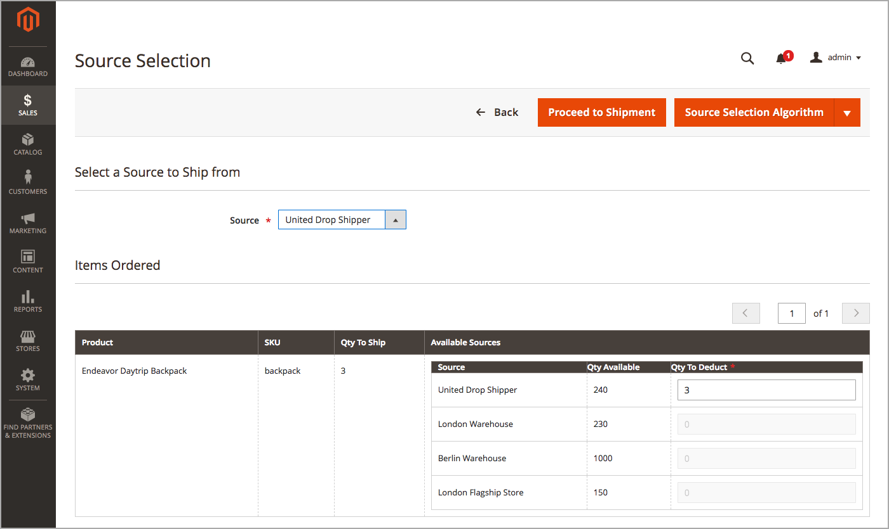
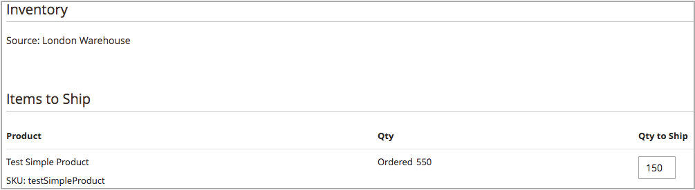

# Create Multi-Source Shipments

With [!DNL Inventory Management], send one or more shipments as you have inventory. To generate additional shipments as needed, repeat these instructions using recommended or manually entered quantities and sources. These instructions detail how multi-source merchants send shipments. Single-source merchants send shipments without these additional steps (see [Creating a Shipment](https://docs.magento.com/user-guide/sales/shipments-create.html){target="_blank"} in the core user guide).

When creating shipments, use the Source Selection Algorithm for calculated recommendations. Follow and use these recommendations or set the amounts per source, generating custom shipments. You control your outgoing inventory for each order, setting the amounts to deduct, sending one or more shipments, and delivering in stock and backorders as inventory is available. For each line item in the order, enter an amount to deduct from the source quantity.

You may want to send partial shipments to:

- Fulfill backorders as inventory arrives

- Balance inventory deductions across sources

As you enter shipments, your on-hand inventory quantities deduct entered amounts. In effect, reservations convert to actual quantity deductions.

## Create a shipment

1. On the _Admin_ sidebar, go to **[!UICONTROL Sales]** > **[!UICONTROL Orders]**.

1. Locate the order and open in view mode.

1. If the order is paid and invoiced and is ready to ship, click **[!UICONTROL Ship]**.

1. Complete the Source Selection for sending products per source:

   - To view shipping recommendations, click **[!UICONTROL Source Selection Algorithm]** and select an algorithm.

      |Algorithm|Description|
      |--|--|
      |[Source Priority](source-priority-algorithm.md)|Recommends shipments from sources according to the orders of sources assigned to the stock.|
      |[Distance Priority](distance-priority-algorithm.md)|Recommends shipments from sources closest to the shipping address based on physical distance or shortest time to deliver.|

      >[!IMPORTANT]
      >
      >When using the Distance Priority algorithm for shipping and routes and data does not return for the selected [Computation mode](distance-priority-algorithm.md) (driving, bicycling, or walking) for a shipment, the SSA defaults to the Source Priority. It is recommended that you also set the [priority for sources per stock](stocks-prioritize-sources.md).

   - For  **[!UICONTROL Select a Source to Ship from]**, select a source to send a shipment.

   - For each line item, keep the recommended amount or enter a specific amount in the **[!UICONTROL Qty to Deduct]**. This value specifies the amount that is deducted from the inventory of the selected source.

   - Click **[!UICONTROL Proceed to Shipment]**.

      

1. Review the _[!UICONTROL New Shipment]_ page and enter any additional changes as needed.

   The _[!UICONTROL Inventory]_ section displays the source, products shipping, total ordered quantity, and quantity to ship.

   

1. Click **[!UICONTROL Submit Shipment]** to complete.
