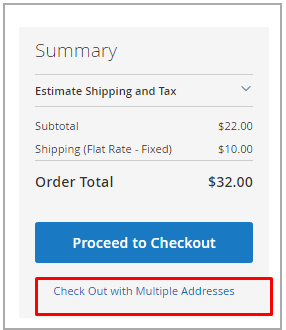
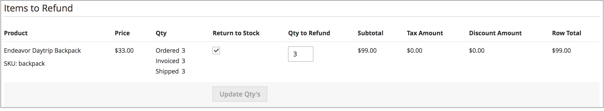

# Manage Orders and Shipments

[!DNL Inventory Management] includes additional features and options for managing inventory quantities through the shipment process. As you review and fulfill shipments, cancel orders, and issue credit memos, product salable and on-hand quantities automatically update.

This information includes specifics for [!DNL Inventory Management]. For additional information, see the [Orders](../stores-purchase/orders.md){target="_blank"} topic in the _Sales and Purchase Experience Guide_.

## Orders

[!DNL Commerce] supports single orders and multi-address orders out-of-the-box without additional configurations. As customers or staff enter orders, [!DNL Inventory Management] tracks inventory using reservations against the salable quantity, deducting from inventory quantity for invoiced and shipped products.

### Multi-address orders

For multi-address orders, a series of single orders is generated---one for each destination address entered. During checkout, customers select each set of products associated per address during checkout generates as single orders according to the destination address. Each order includes the products associated per address.

[!DNL Commerce] manages inventory for these multi-address orders exactly like single orders. It allows for Source Selection Algorithm recommendations or overrides during shipment, partial shipments, canceling orders, and refunding with stock updates.

{width="350" zoomable="yes"}

### Refunds

When entering a [credit memo](../stores-purchase/credit-memo-create.md){target="_blank"} to issue a refund, you can return the product quantity to the deducted source. The order information includes the inventory source that shipped the product. It is recommended that you award the returned product quantity through a credit memo when you receive the returned product.

{width="350" zoomable="yes"}

### Cancel unshipped orders

If an order has not been shipped and is canceled (in full or partial), [!DNL Inventory Management] automatically returns the product stock to the salable quantity. Until invoice and shipping, purchased products are reserved against the salable quantity, not deducted from the actual quantity. At the point of invoicing and shipping the order, the system converts the reservation to an inventory deduction.

Behind the scenes, [!DNL Inventory Management] automatically enters a compensation reservation removing the hold on the product quantity. The quantity returns to the aggregated virtual salable quantity.

## Shipments

With [!DNL Inventory Management] enabled, you can send partial or complete shipments from one or more sources to fulfill orders. You control your outgoing inventory for each order, setting the amounts to deduct, sending one or more shipments, and delivering in stock and backorders as inventory is available. For each line item in the order, enter an amount to deduct from the source quantity. Generate a shipment per source as you have inventory stock, until the entire order is fulfilled.

### Partial shipments

For multi-source merchants, [!DNL Commerce] generates a shipment for every source you select. The general workflow allows you to select a source, set the products quantity to deduct to fulfill the order, and proceed to shipment. When complete, create additional shipments for each source until you have fulfilled the order.

Single-source merchants may also send partial shipments to support backorders or balance inventory as orders come in for popular items.

### Recommendations and Source Selection Algorithm

The [Source Selection Algorithm](selection-reservations.md) (SSA) provides recommendations for partial and full shipments. You can access Source Selection Algorithms when creating shipment invoices for an order. Through the Ship page, run the Source Priority or Distance Priority algorithm at any time to determine the best options for matching ordered quantities and available sources. The system supports shipping a complete order from one source, and breaking the order into multiple partial shipments across multiple sources. You can access these options for immediate fulfillment and staggered shipments to send smaller amounts over time.

To complete and ship an order, it must have completed payment and be invoiced. Currently, you can rerun the SSA for recommendations and ship from one or more sources, or override the SSA recommendations with manually set sources and quantities to fulfill shipment.

- It is recommended that you rerun the SSA to review recommendations for every shipment.

- If you want to change the selections, you can override with manual source deductions.

### Shipments and reservations

As shipments generate, reservations for products clear, and product quantity is deducted. The on-hand quantity per stock updates based on the shipment details. For example, if you send shipments for ten products from two sources, the quantities for those sources deduct 10 each. The Salable Quantity automatically refreshes for associated stocks, providing customers and staff with the latest product amounts. And the reservations clear completely, no longer counting against the Salable Quantity.
