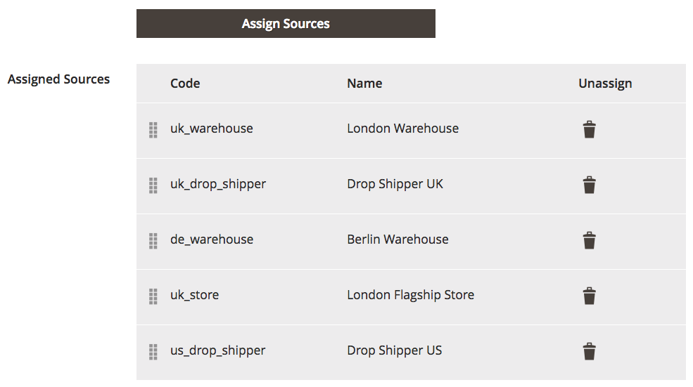

# Configure the Source Priority Algorithm

Custom stocks include an assigned list of sources to sell and ship available product inventory through your storefront. This algorithm uses the order of assigned sources in your stock to make recommendations.

When run, the algorithm:

- Works through the configured order of sources at the stock level starting at the top

- Recommends a quantity to ship and source per product based on the order in the list, available quantity, and quantity ordered

- Continues down the list until the order shipment is filled

- Skips disabled sources if found in the list

To configure, arrange those sources from top to bottom in priority for fulfilling orders. The Source Selection Algorithm (SSA) provides an algorithm Priority using this order when determining shipment and inventory deductions. See [Prioritizing Sources for a Stock](stocks-prioritize-sources.md).

## Configure the priority of sources

1. On the _Admin_ sidebar, go to **[!UICONTROL Stores]** > **[!UICONTROL Inventory]** > **[!UICONTROL Stocks]**.

1. Open a stock in edit mode and navigate to the _[!UICONTROL Sources]_ area.

1. Click **[!UICONTROL Assign Sources]**.

1. In the _[!UICONTROL Assign Sources]_ view, select the checkbox for the required source, and then click **[!UICONTROL Done]** to assign a source to the stock.

>[!NOTE]
>
>When using the [Distance Priority](distance-priority-algorithm.md) algorithm for shipping, if routes and data do not return for the selected [Computation mode](distance-priority-algorithm.md) (driving, bicycling, or walking) for a shipment, the SSA defaults to using the Source Priority.

| Icons                                        | Description                                                    |
|----------------------------------------------|----------------------------------------------------------------|
|  | Use to drag and drop sources according to priority. |
|  | Unassigning a source to a stock. |
