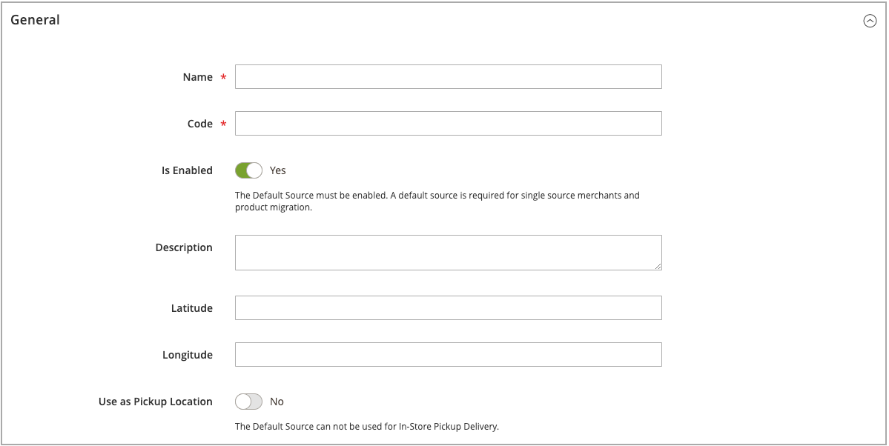
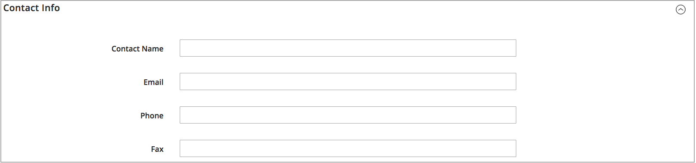
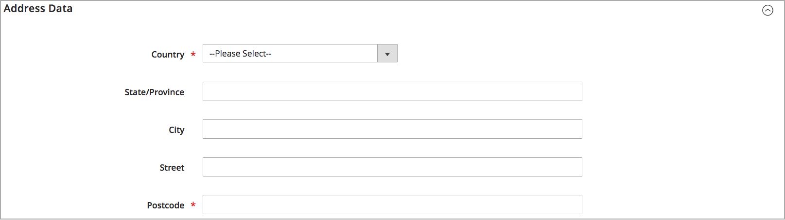
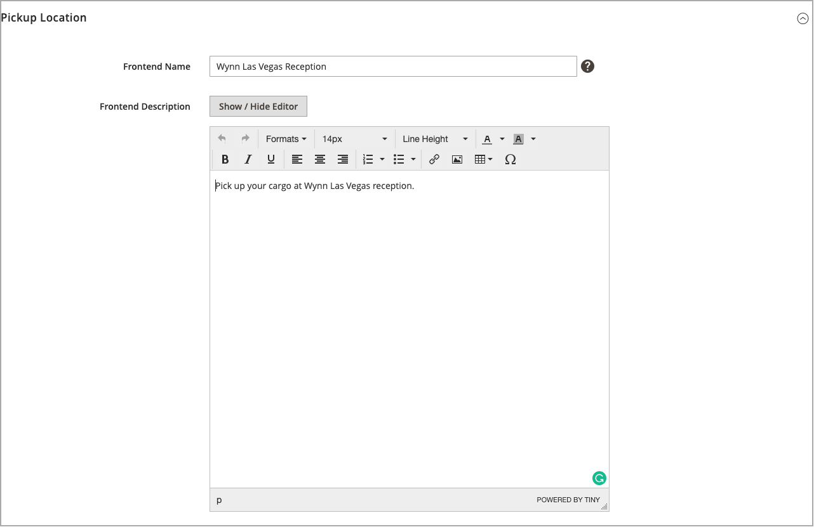

# Add a Source

Manage inventory and order fulfillment from multiple locations with custom sources. Create a source for each location such as warehouses, brick-and-mortar stores, distribution centers, and drop shippers. Assign sources and update quantities per product

If editing the Default Source, you can edit all configurations except name and code. It is recommended that single-source merchants add information matching their location.

## Add an inventory source

1. On the _Admin_ sidebar, go to **[!UICONTROL Stores]** > _[!UICONTROL Inventory]_ > **[!UICONTROL Sources]**.

1. Click **[!UICONTROL Add New Source]**.

   

1. Expand  the **[!UICONTROL General]** section and do the following:

    - To identify the inventory source, enter a unique **[!UICONTROL Name]**.

    - Enter a unique **[!UICONTROL Code]**.

      The code supports upper and lower case letters, numbers, dashes, and underscores. The code is a unique ID used when assigning to stock and exporting-importing data.

    - If this inventory source is ready to use, set **[!UICONTROL Is Enabled]** to `Yes`.

    - Enter a brief **[!UICONTROL Description]** for this location for quick reference or additional details.

    - For **[!UICONTROL Latitude]** and **[!UICONTROL Longitude]**, enter the Global Positioning System (GPS) coordinates of the facility location.

      To find the GPS coordinates with [Google Maps][1], enter the address in the search box. Right-click the marker on the map and choose **[!UICONTROL What’s here?]**. The GPS coordinates appear in the details box below the street address.

      

    - If this inventory source is a pickup location, set **[!UICONTROL Use as Pickup Location]** to `Yes`.

      The Default Source cannot be used as a pickup location for in-store pickup orders.

1. Expand  the **[!UICONTROL Contact Info]** section and do the following:

    - For **[!UICONTROL Contact Name]**, enter the full name of the primary contact at the location.

    - Enter an **[!UICONTROL Email]** address for contacting the location.

    - For **[!UICONTROL Phone]**, enter the area code and phone number.

    - For **[!UICONTROL Fax]**, enter the area code and phone number of the fax, if available.

      

1. Expand  the **[!UICONTROL Address Data]** section and do the following:

    - Choose the **[!UICONTROL Country]**.

    - For **[!UICONTROL State/Province]**, enter the standard abbreviation for the state or province.

    - Enter the **[!UICONTROL City]**.

    - Enter the physical **[!UICONTROL Street]** address.

    - For **[!UICONTROL Postcode]**, enter the ZIP or postal code.

      

1. If you set the source as a pickup location in the earlier step, expand  the **[!UICONTROL Pickup Location]** section and provide descriptive information about the location:

    - Enter the **[!UICONTROL Frontend Name]** of the pickup location.

    - Enter a **[!UICONTROL Frontend Description]** of the pickup location. Use this text box to display store hours, the location relative to other landmarks, or other useful information that helps the customer select the correct pickup location.

      

    For more information about how to configure email notifications when using a source as a pickup location, see [Sales Emails](https://docs.magento.com/user-guide/configuration/sales/sales-emails.html){target="_blank"} in the core user guide.

1. To save your work, do one of the following:

    - To save your work and continue editing, click **[!UICONTROL Save & Continue]**.

    - To save your work and return to the Manage Sources page, click the down arrow ( <!-- set width 25px --> ) and choose **[!UICONTROL Save & Close]**.

    - To save your work on the current source record and enter a new source, choose **[!UICONTROL Save & New]**.

## Button bar

|Button|Description|
|--|--|
|[!UICONTROL Back]|Returns to the Manage Sources page.|
|[!UICONTROL Reset]|Restores all fields in the form to their values at the time of the last save.|
|[!UICONTROL Save & Continue]|Saves all changes and keeps the form open for further editing. Click the down arrow for additional options: **[!UICONTROL Save & Close]** - Saves changes to the current record, closes the form, and returns to the Manage Sources page. **[!UICONTROL Save & New]** - Saves changes, closes the current record, and opens a new blank form.|

## Field descriptions

|Field|Description|
|--|--|
|**[!UICONTROL General]**| |
|[!UICONTROL Name]|(Required) A unique name that identifies the inventory source for Admin users.|
|[!UICONTROL Code]|(Required) A unique, alphanumeric code that is used by the system to identify the inventory source. Enter the code in upper or lowercase characters and/or numbers, without spaces. If necessary, a hyphen or underscore can be used instead of a space. The code cannot be edited after creating the source. It is a unique ID used when you assign sources to stocks and export and/or import product data.|
|[!UICONTROL Is Enabled]|Determines if the inventory source is available to be used. Options: Yes / No|
|[!UICONTROL Description]|A brief description of the inventory source location. Include details helpful to your Admin users.|
|[!UICONTROL Latitude]|Specifies the latitude coordinate of the inventory source for GPS. Enter the value  as a number, preceded by a plus or minus sign as needed. The degree symbol and letters are not permitted. For example: Latitude 32.7555|
|[!UICONTROL Longitude]|Specifies the longitude coordinate of the inventory source for GPS. Enter the value  as a number, preceded by a plus or minus sign as needed. The degree symbol and letters are not permitted. For example: `-97.3308`|
|**[!UICONTROL Contact Info]**| |
|[!UICONTROL Contact Name]|The name of the primary contact at the inventory source location.|
|[!UICONTROL Email]|The email of the primary contact.|
|[!UICONTROL Phone]|The area code and telephone number of the primary contact, using the format that you prefer. For example: `(123) 456-7890` or `123-456-7890`|
|[!UICONTROL Fax]|The area code and fax number of the primary contact.|
|**[!UICONTROL Address Data]**| |
|[!UICONTROL Country]|(Required) The country where the inventory source is located.|
|[!UICONTROL State/Province]|The state or province where the inventory source is located.|
|[!UICONTROL City]|The city where the inventory source is located.|
|[!UICONTROL Street]|The street address of the inventory source.|
|[!UICONTROL Postcode]|(Required) The ZIP or postal code of the inventory source.|
|**[!UICONTROL Pickup Location]**| |
|[!UICONTROL Frontend Name]|The name of the pickup location for the source that is displayed on the storefront.|
|[!UICONTROL Frontend Description]|The description of the pickup location for the source that is displayed on the storefront. It can contain attached images.|

[1]: https://www.google.com/maps
