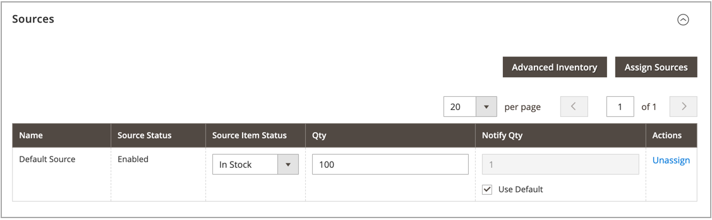
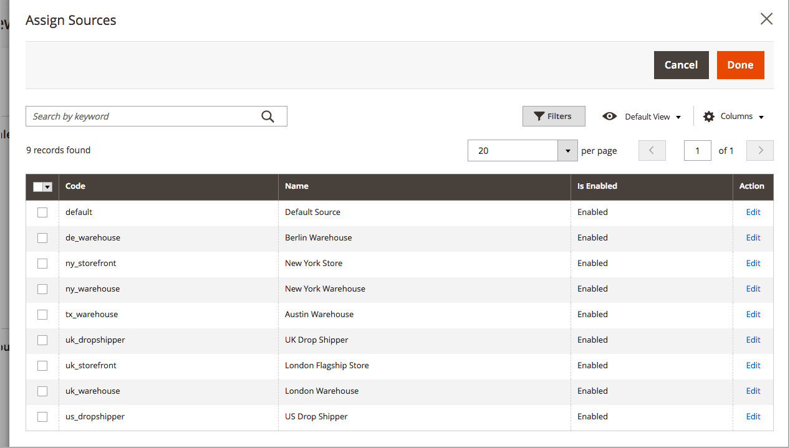

# Assign Sources per Product

Before modifying quantities and settings, you must assign [sources](sources-manage.md) to the products.

{{$include /help/_includes/unassign-source.md}}

## Assign sources to a product

1. On the _Admin_ sidebar, go to **[!UICONTROL Catalog]** > **[!UICONTROL Products]**.

1. Open a product in _Edit_ mode.

1. Expand  the **[!UICONTROL Sources]** section.

   This section allows you to modify the source, update inventory quantities, and more.

   >[!NOTE]
   >
   >Currently, only Simple, Configurable, Virtual, Downloadable, and Grouped products support multiple sources. Bundle products can be created and managed with only the Default Source and Stock.

   

1. To add a source, click **[!UICONTROL Assign Sources]**.

1. On the _[!UICONTROL Assign Sources]_ page, select the checkbox next to each source that you want to assign for the product.

   

1. Click **[!UICONTROL Done]** to add the sources.

1. Do one of the following to save:

   - Click **[!UICONTROL Save]**.
   - On the _[!UICONTROL Save]_ ( <!-- set width 25px --> ) menu, choose **[!UICONTROL Save & Close]**.

After assigning sources, update the [inventory quantity](quantities-assign-per-product.md) for each product source.
