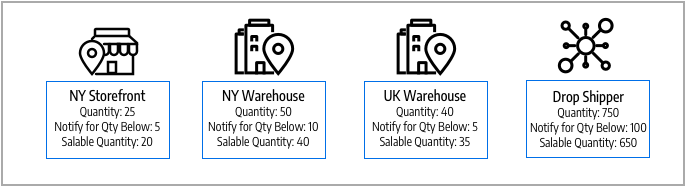
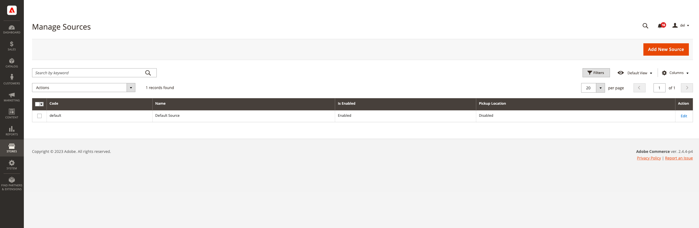

# Manage Sources

Sources are the physical locations where product inventory is managed and shipped for order fulfillment, or where services are available. These locations can include warehouses, brick-and-mortar stores, distribution centers, pickup locations, and drop shippers. You allocate inventory quantities to these sources, and [!DNL Commerce] automatically aggregates the total salable products for your stocks. For large companies, add multiple sources for all of your locations: in different geographic locations by country and continent, locations in a city, based on the type of inventory, even based on services.

It is recommended that you provide specific physical geographical locations when creating a source. That allows the _Distance Priority Algorithm_ to compare the location of the shipping destination address with the available source locations to determine the closest source to fulfill shipments. You can use Google Maps or offline calculations, which use geocodes. For more information about this _Distance Priority Algorithm_, see [Configure Distance Priority Algorithm](distance-priority-algorithm.md).

Start with a _Default Source_ that you can update but not disable. This source is used by single-source merchants and for product migration. You always need a default source.

- **Location Information** - Each source includes the name, country, physical address of the location, and a point of contact.
- **Enabling Resources** - You can enable and disable sources as needed. Only enable a source if it accepts and fulfills orders and backorders.
- **Available Inventory** - Assign and update inventory quantities for each source through the product page. The inventory quantities are calculated, provided, and reserved through the source and stock mapping.

The following diagram helps illustrate the Sources for a Bicycle Shop merchant selling a mountain bike, which available to stocks and accessible by the SSA for shipments.

All stores begin with a Default Source that must remain enabled:

- All new products imported into [!DNL Commerce] require a source and stock, automatically assigned for immediate access to [!DNL Inventory Management].
- Single-source merchants use the Default Source as their single point of inventory location and shipments.

## Edit sources

You can update the name, address, GPS location, and point of contact information. The source's code is a protected value, acting as a unique ID associating the source with your product quantities and stocks.

If editing the Default Source, you can edit all configurations except the name and code. It is recommended that single-source merchants add information matching their location.

The _[!UICONTROL Manage Sources]_ page lists all available inventory locations and fulfillment facilities. You can add new inventory sources, and edit existing locations.

1. On the _Admin_ sidebar, go to **[!UICONTROL Stores]** > _[!UICONTROL Inventory]_ > **[!UICONTROL Sources]**.

1. To add an inventory location, see [Adding a New Source](sources-add.md).

1. Find the inventory source and open it in _Edit_ mode.

1. Update the information and save the changes.

   

## Button bar

|Button|Description|
|--|--|
|[!UICONTROL Add New Source]|Opens the New Source form that is used to enter a new inventory source, fulfillment facility, or location.|

## Manage sources column descriptions

|Column|Description|
|--|--|
|[!UICONTROL Code]|A unique, alphanumeric code that is used by the system to identify the inventory source.|
|[!UICONTROL Name]|A unique name that identifies the  inventory source for Admin users.|
|[!UICONTROL Is Enabled]|Indicates if the inventory source is active and available to use.|
|[!UICONTROL Pickup Location]|Indicates if the source is active as a pickup location for [in-store delivery](https://docs.magento.com/user-guide/shipping/shipping-in-store-delivery.html){target="_blank"}.|
|[!UICONTROL Action]|Clicking **Edit** opens the inventory source record in edit mode.|

## Other columns

|Column|Description|
|--- |--- |
|[!UICONTROL Latitude]|Specifies the latitude coordinate of the inventory source for GPS. Enter the value as a number, preceded by a plus or minus sign as needed. The degree symbol and letters are not permitted. For example: `32.7555`|
|[!UICONTROL State/Province]|The state or province where the source is located.|
|[!UICONTROL Postcode]|The ZIP or postal code of the source.|
|[!UICONTROL Email]|The email of the primary contact.|
|[!UICONTROL Longitude]|Specifies the longitude coordinate of the inventory source for GPS. Enter the value as a number, preceded by a plus or minus sign as needed. The degree symbol and letters are not permitted. For example: Longitude -97.3308|
|[!UICONTROL City]|The city where the source is located.|
|[!UICONTROL Phone]|The telephone number of the primary contact.|
|[!UICONTROL Country]|The country where the source is located.|
|[!UICONTROL Street]|The street address of the source.|
|[!UICONTROL Fax]|The area code and fax number of the primary contact.|
