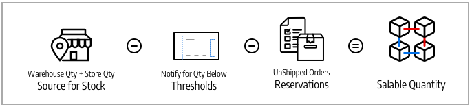

# Stocks and Sources

Manage your inventory regardless of warehouse location, type of product or service, or sales channel. Fulfill orders and ship products from multiple warehouses, brick-and-mortar stores, distribution centers, and drop shipping to complete orders with a focus on balanced inventory, shipping costs, and more.

These descriptions include products, sources, and stocks for a bicycle company with multiple shipment locations and websites in the United States and Europe.

## Sources

[Sources](sources-manage.md) are the physical locations where product inventory is managed and shipped for order fulfillment or where services are available. These locations can include warehouses, brick-and-mortar stores, distribution centers, and drop shippers. [!DNL Commerce] uses the quantities and salable quantities per stock and manages inventory amounts automatically for managed products and orders. If you have one source, you are considered in _single-source_ mode. If you have multiple sources, you are considered in _multi-source_ mode.

A source can have priority in the scope of stock in one warehouse, but not necessarily in all warehouses as the source can be reused in different stocks. The number of stocks and sources adds to the complexity for determining the best warehouse or store to fulfill an order. For example, you may have a limited number of products available from your brick-and-mortar locations with an extensive inventory in your warehouses and services in key locations with limited availability.

In this example, the merchant has a mountain bike available for shipment from stores, warehouses, and a drop shipper.

## Stocks

[Stocks](stocks-manage.md) represent a virtual, aggregated inventory of products available for sale to your sales channels (websites). Each stock maps your sales channels with sources for available inventories and salable quantities. Depending on your site configuration, the stock may be assigned to one or more sales channels and sources.

Sales Channels represent entities selling your inventory, including websites, stores views, B2B customer groups, and so on. Sales channels can only be associated to one Stock. Each sales channel can only have a single stock assigned to it, and a single stock can be assigned to multiple websites. Through the stock, you can modify the prioritization of sources used when shipping orders and by the [Source Selection Algorithm](selection-reservations.md).

You start with a Default Stock assigned with the Default Source and your website, best used by single-source merchants. Only the Default Source can be assigned to this stock. Multi-source merchants create custom stocks for custom sources and websites as needed.

## Product quantities

Quantity is the number of products in your active inventory that is available for purchase. The quantity of products increases and decreases when you complete shipments or adjust inventory. Adding products to a cart does not affect this amount. The Salable Quantity tracks the availability of the product for a sales channel and also uses this value for determining available stock for purchase. Depending on the number of your sources, you see and manage product quantity for one of the following:

- **Quantity** - For single-source merchants, the _[!UICONTROL Quantity]_ column and value tracks the amount of on-hand inventory available.
- **Quantity per Source** - For multi-source merchants, the _[!UICONTROL Quantity per Source]_ column and values tracks the on-hand inventory available by location. If you add multiple sources, this value replaces the Quantity and lists every source and assigned quantity.

Reservations track stock requests for the entire shopping process---adding products to cart, completing checkout, and managing refunds. For available inventory and stock, reservations reserve inventory amounts per order through the checkout process, subtracted from the salable quantity. Reservations convert to quantity deductions when invoicing and shipping products.

Salable Quantity calculates the virtual inventory of products (or availability), using configured thresholds, reserved or sold amounts, and quantities per source. For each stock, [!DNL Commerce] accesses all assigned sources and aggregates associated product quantities. With this base value, it then subtracts all reservation amounts and the _[!UICONTROL Notify for Quantity Below]_ threshold.

## Inventory configurations

Every product, source, and stock includes several options to configure for your store at the global, source, stock, and product level. For a full list of these options, refer to [Configuring Inventory Management](configuration.md).

The following are important options to understand for [!DNL Inventory Management]:

- **[!UICONTROL Out-of-Stock Threshold]** - Sets an amount to subtract from your Salable Quantity. If you enable Backorders, this value is not deducted from the Salable Quantity.
- **[!UICONTROL Backorders]** - Determines if products can be sold beyond a zero inventory, saving orders until restocked. When backorders are enabled, configuring the [!UICONTROL Out-of-Stock Threshold] is recommended.

>[!NOTE]
>
>The Out-of-Stock Threshold value supports negative and positive amounts. If you enable Backorders, set this value to a negative amount for the maximum number of products that can be backordered before the product is truly considered out of stock.
