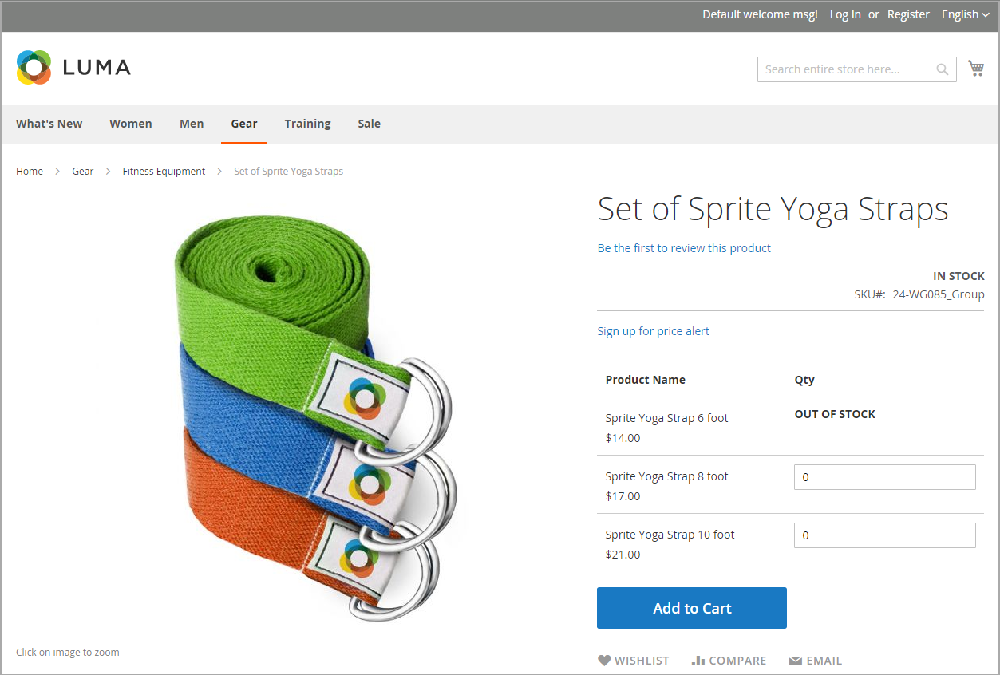
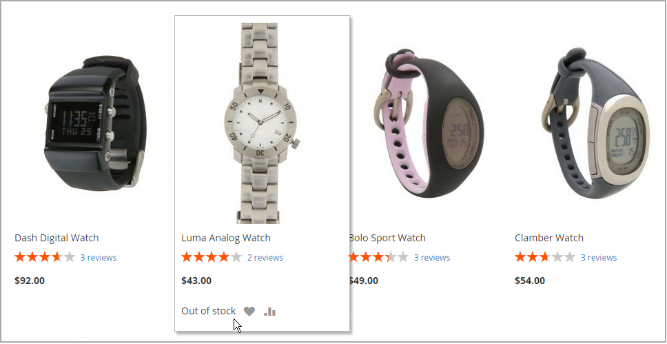

# Stock Message Scenarios

You can use a combination of configuration settings to control stock availability messages on product pages and in listings of products on catalog pages.

{width="600" zoomable="yes"}

## Product page stock messages

There are several variations of messaging available for the product page, depending on the combination of Manage Stock and Stock Availability settings.

### Example 1: Show availability message

#### Scenario 1

This combination of settings causes the availability message to appear on the product page, according to the stock availability of each product.

|Stock Options|Setting|Message|
|--|--|--|
| [!UICONTROL Display product availability in stock in the frontend] | `Yes` | |
| [!UICONTROL Manage Stock] | `Yes` | |
| [!UICONTROL Stock Availability] | `In Stock` | _[!UICONTROL Availability: In Stock]_|
| | `Out of Stock` | _[!UICONTROL Availability: Out of Stock]_ |

#### Scenario 2

When stock is not managed for a product, this combination of settings can be used to display the availability message on the product page.

|Stock Options|Setting|Message|
|--|--|--|
| [!UICONTROL Display product availability in stock in the frontend] | `Yes` |  |
| [!UICONTROL Manage Stock] | `No` | _[!UICONTROL Availability: In Stock]_ |

### Example 2: Hide availability message

#### Scenario 1

This combination of configuration and product settings prevents the availability message from appearing on the product page.

|Stock Options|Setting|Message|
|--|--|--|
| [!UICONTROL Display product availability in stock in the frontend] | `No` |  |
| [!UICONTROL Manage Stock] | `Yes` |  |
| [!UICONTROL Stock Availability] | `In Stock` | None |
|  | `Out of Stock` | None |

#### Scenario 2

When stock is not managed for a product, this combination of configuration and product settings prevents the availability message from appearing on the product page.

|Stock Options|Setting|Message|
|--|--|--|
| [!UICONTROL Display product availability in stock in the frontend] | `No` |  |
| [!UICONTROL Manage Stock] | `No` | None |

## Catalog page stock messages

The following display options are possible for the category and search results lists, depending on the product availability and configuration settings.

{width="600" zoomable="yes"}

### Example 1: Show product with "Out of stock" message

This combination of configuration settings includes out of stock products in the category and search results lists, and displays an "out of stock" message.

|Stock Options|Setting|Message|
|--|--|--|
| [!UICONTROL Display Out of Stock Products] | `Yes` |  |
| [!UICONTROL Display product availability in stock in the frontend] | `Yes` | _[!UICONTROL Out of stock]_ |
| [!UICONTROL Display Out of Stock Products] | `Yes` |  |
| [!UICONTROL Display product availability in stock in the frontend] | `No` | None |

### Example 2: Show product without "Out of stock" message

This combination of configuration settings includes out of stock products in the category and search results lists, but does not display a message.

|Stock Options|Setting|Message|
|--|--|--|
| [!UICONTROL Display Out of Stock Products] | `Yes` | None |
| [!UICONTROL Display product availability in stock in the frontend] | `No` |  |

### Example 3: Hide product until back in stock

This configuration setting omits out of stock products entirely from the category and search results lists, until they are back in stock.

|Stock Options|Setting|Message|
|--|--|--|
| [!UICONTROL Display Out of Stock Products] | `No` | None |
