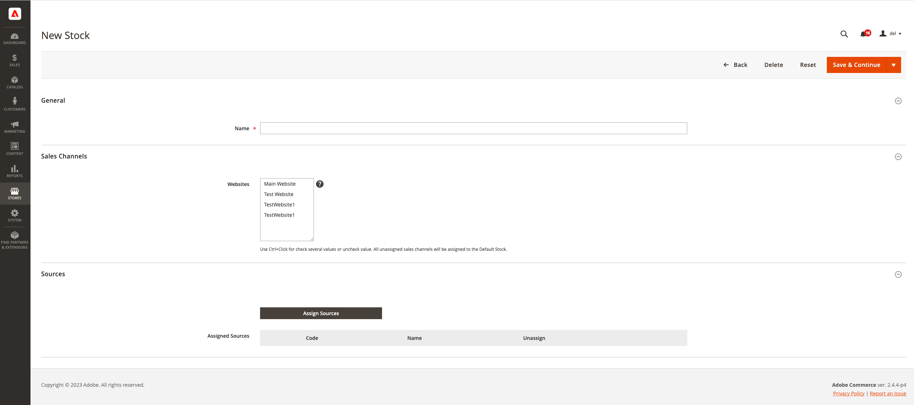
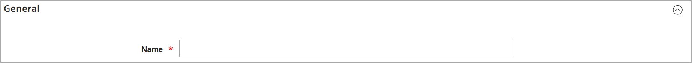
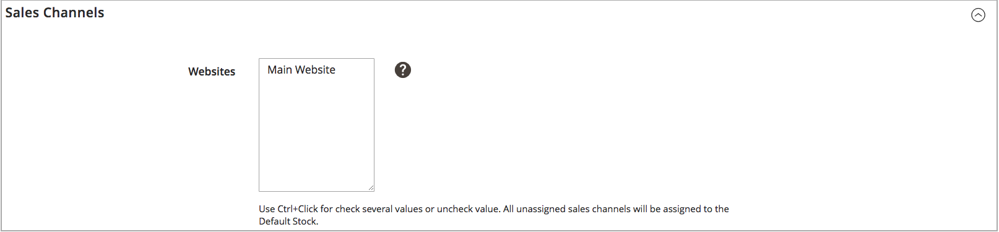
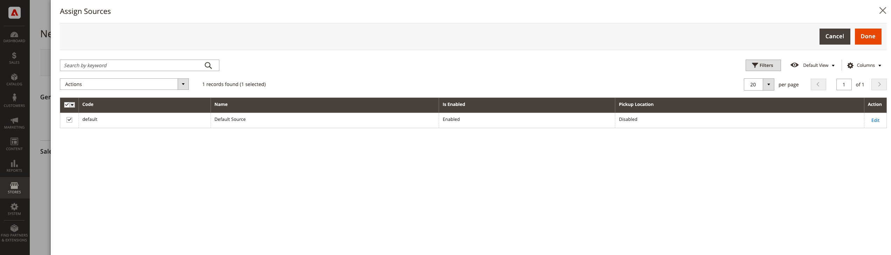
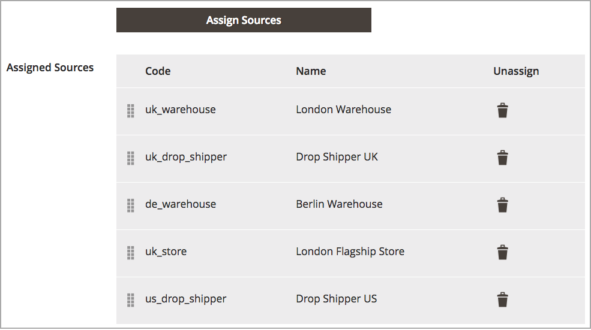

# Add a stock

Stocks map your sources to sales channels (or websites), providing a direct link to salable quantities and product inventories.

When creating a custom stock, you assign websites and sources. Sources can include enabled and disabled sources. For example, you might add a warehouse to your stock, preparing to open the location for managing inventory and completing shipments.

After adding sources, you must prioritize the order for the sources from top (first) to bottom (last). This order affects recommendations during order shipment.

{width="600" zoomable="yes"}

## Add the inventory stock

1. On the _Admin_ sidebar, go to **[!UICONTROL Stores]** > _[!UICONTROL Inventory]_ > **[!UICONTROL Stock]**.

1. Click **[!UICONTROL Add New Stock]**.

1. Expand  the **[!UICONTROL General]** section and enter a unique **[!UICONTROL Name]** to identify the new stock.

   {width="350" zoomable="yes"}

1. Expand  the **[!UICONTROL Sales Channels]** section and select the **[!UICONTROL Websites]** where this stock is available.

   For a multisite installation, hold down the Ctrl key (PC) or the Command key (Mac) and click each website.

   >[!NOTE]
   >
   >If you select a website or sales channel assigned to another stock, it is unassigned from that stock. Any Sales Channels not assigned to a custom stock are assigned to the Default Stock.

   {width="350" zoomable="yes"}

1. Expand  the **[!UICONTROL Sources]** section and do the following for any stock other than the default:

    - Click **[!UICONTROL Assign Sources]**.

    {width="350" zoomable="yes"}

    - Select checkboxes for all sources that you want to assign to the stock.

   >[!IMPORTANT]
   >
   >If you assign the same source to multiple stocks, it could result in overselling of the products assigned to that source.

    - Click **[!UICONTROL Done]**.

      The added sources display in Assigned Sources.

      {width="600" zoomable="yes"}

1. Use  to drag and drop the sources into a priority from top (first) to bottom (last).

   The source order is important when shipping orders.

   {width="600" zoomable="yes"}

1. On the _[!UICONTROL Save]_ () menu, choose **[!UICONTROL Save & Close]**.

## Field descriptions

|Field|Description|
|--|--|
|**[!UICONTROL General]**| |
|[!UICONTROL Name]|Name for the stock. For example: `UK Stock`, `US Stock`|
|**[!UICONTROL Sales Channels]**| |
|[!UICONTROL Websites]|Defines the [scope](../getting-started/websites-stores-views.md#scope-settings) of the stock by assigning the stock to specific websites as _sales channels_. Select one or more websites per stock. Each website can only be assigned to one stock.|
|**[!UICONTROL Sources]**| |
|[!UICONTROL Assign Sources]|Assigns inventory sources to this stock. Custom sources cannot be assigned to Default Stock.|
|[!UICONTROL Assigned Sources]|List of assigned sources. Drag and drop the sources using  into a prioritized order for order fulfillment and shipping.  **[!UICONTROL Code]** - Unique code ID for the source. **[!UICONTROL Name]** - Name description for the source. **[!UICONTROL Unassign]** - Remove the assigned source from the stock using .|
