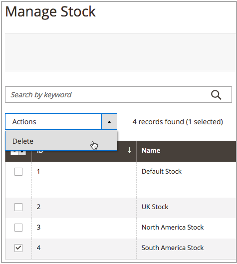
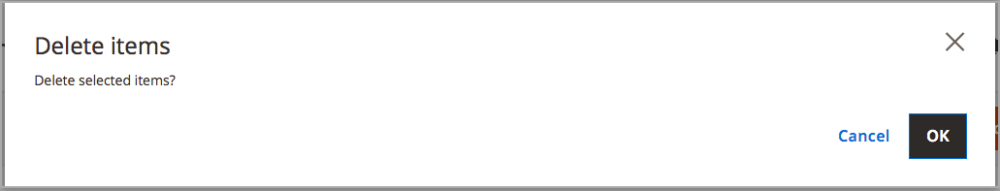

# Delete Stocks

When you delete the stock, all assigned websites are assigned to the Default Stock. Reassigning websites to other stocks before deletion is recommended.

>[!IMPORTANT]
>
>Deleting a [stock](stocks-manage.md) can affect salable quantities and unprocessed orders for a sales channel. If you continue using a sales channel, please add the sales channel to another existing or new stock.

1. On the _Admin_ sidebar, go to **[!UICONTROL Stores]** > _[!UICONTROL Inventory]_ > **[!UICONTROL Stocks]**.

1. Select one or more stocks to delete.

   Browse or search and select checkboxes for stocks you want to delete.

1. From the **[!UICONTROL Actions]** menu, select **[!UICONTROL Delete]**.

   

1. In the confirmation dialog, click **[!UICONTROL OK]**.

   The stock is deleted and any assigned sales channels are unmapped.

   
