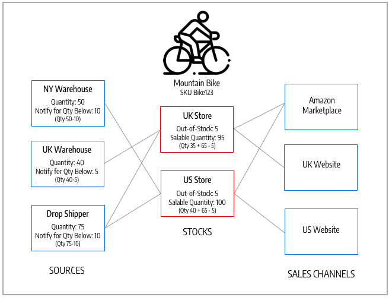
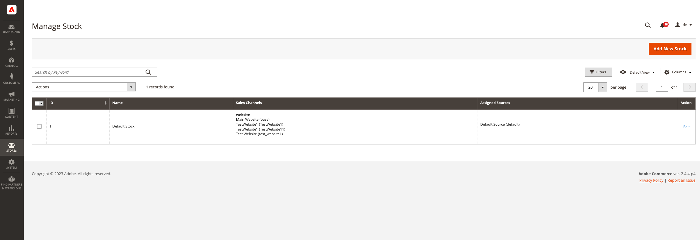

# Manage Stock

Stock represents a virtual, aggregated inventory of products for sources of your sales channels (websites). Depending on your site configuration, the stock may be assigned to one or more sales channels. Each sales channel can only have a single stock assigned to it, and a single stock can be assigned to multiple sales channels. Through the stock, you can modify the prioritization of sources used as orders come through a sales channel.

You start with a Default Stock that cannot be removed or disabled. You can add additional sales channels to the stock only. The only assigned source is Default Source. This stock is used by single-source Merchants, third-party integrations, and imported products.

Sales Channels represent entities selling your inventory. By default, [!DNL Commerce] provides your store websites as sales channels. Sales channels can be extended to support additional channels such as B2B customers groups and store views. Each sales channel can be associated to only one Stock.

- **Sales Channel Support** - Sales channels currently include websites out-of-the-box. You can extend sales channels to include custom options like B2B customers groups and store views. Each sales channel can only have a single stock assigned to it. A single stock can be assigned to multiple sales channels.
- **Map to Sources** - Each stock can have one or more enabled or disabled sources assigned, calculating the virtual aggregated inventory per product.
- **Priority Order Fulfillment** - The out-of-the-box Priority algorithm for the Source Selection Algorithm uses the stock's source list from top to bottom when fulfilling orders.

The following diagram helps define how a Stock works in relation to Sources and Sales Channels for a Bicycle Shop merchant.

{width="600" zoomable="yes"}

## Example stocks for a mountain bike and store

All stores start with a Default Stock. It must remain `Enabled` for the following reasons:

- It is used when importing new products, automatically assigning products to the default source and stock for immediate access to [!DNL Inventory Management].
- You cannot add additional sources beyond the Default Source to this stock.
- It is required and used by single-source merchants, Bundle products, and Grouped products.

For multi-source merchants, create and configure stocks to best fit your stores and order fulfillment. When you assign new stock to a sales channel, any pre-existing stock in that sales channel becomes unassigned.

For a multi-store installation, the Default Stock is initially assigned to the [Main Website](../stores-purchase/stores.md#add-websites){target="_blank"} and default store. Correct stock and quantities are displayed for enabled and disabled products in the **[!UICONTROL Products]** grid view.

{width="600" zoomable="yes"}

## Button bar

|Button|Description|
|--|--|
|[!UICONTROL Add New Stock]|Opens the _[!UICONTROL New Stock]_ form that is used to enter a new inventory stock for mapping inventory to sales channel.|

## Manage Stock column descriptions

|Column|Description|
|--|--|
|[!UICONTROL ID]|Unique, numeric ID generated for the stock entry.|
|[!UICONTROL Name]|Unique name that identifies the inventory stock.|
|[!UICONTROL Sales Channels]|Defines the scope of the stock by assigning the stock to specific websites as _sales channels_.|
|[!UICONTROL Assigned sources]|Sources assigned to the stock that supply all product quantities.|
|[!UICONTROL Action]|**[!UICONTROL Edit]** - Opens the inventory stock record in edit mode.|
