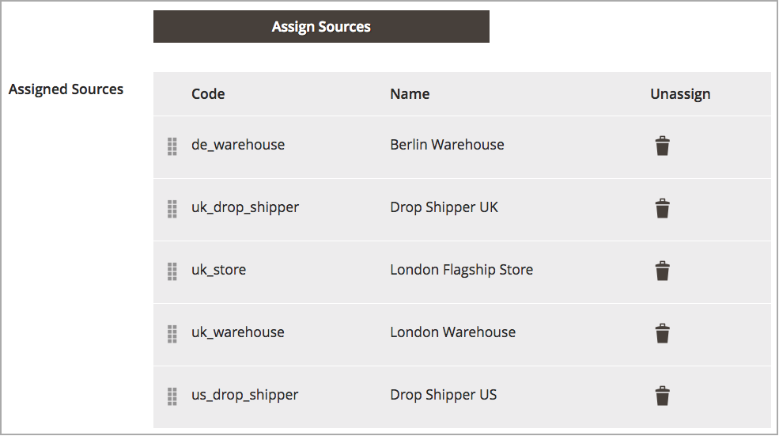

# Prioritize Sources for a Stock

After adding [sources](sources-manage.md) to the [stock](stocks-manage.md), arrange those sources from top to bottom in priority for fulfilling orders. The Source Selection Algorithm (SSA) provides an algorithm Priority using this order when determining shipment and inventory deductions.

The source priority on stocks does not influence assigned sources when editing product inventories.

In this example, the UK Stock has sources assigned out of order for a store and two warehouses in London and a warehouse in Berlin.

{width="350" zoomable="yes"}

The merchant prefers to have shipments prioritized from the larger Berlin warehouse, then the London warehouse, the London overflow location, and finally the storefront in London. To change the order, entries are dragged and dropped into the desired order.

1. On the _Admin_ sidebar, go to **[!UICONTROL Stores]** > _[!UICONTROL Inventory]_ > **[!UICONTROL Stocks]**.

1. Open the stock in the _Edit_ mode.

1. Expand the _[!UICONTROL Sources]_ tab, if needed.

1. Use  to drag and drop the sources into a priority from top (first) to bottom (last).

   This order is important when shipping orders. SSA recommends shipments based on the order of sources

1. Click **[!UICONTROL Save & Continue]** to save the changes.

{width="350" zoomable="yes"}
