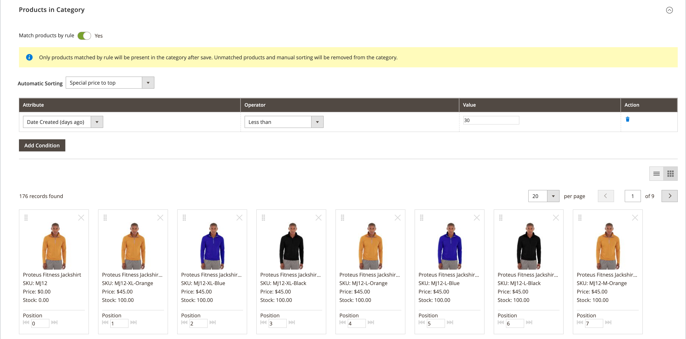
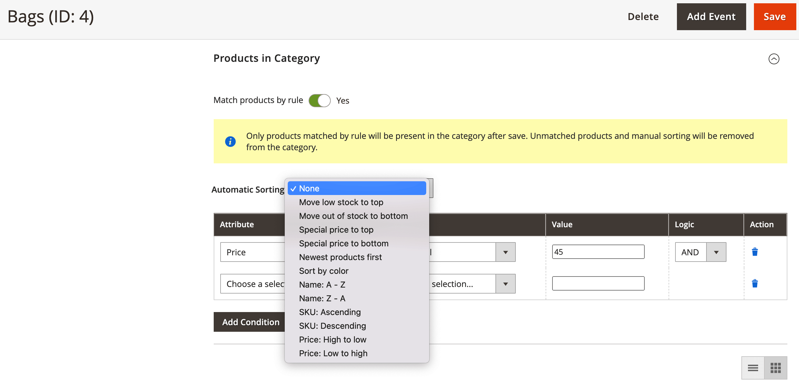

# Category rules for merchandising

{{ee-feature}}

Category rules dynamically change the product selection according to a set of conditions. Each category can have only one category rule, although the single rule can have multiple conditions. For example, you can create a category rule for a specific brand. Products of the same brand are automatically added to the list, even if they're not assigned to the same category. You can add as many conditions to the expression as needed to describe the products that you want to include.

>[!TIP]
>
>During category rule setup, the products are _sorted_, _matched_, _assigned_, and _unassigned_ according to that rule **_only_** when this category is saved. For example, if you add a product to the catalog and want to assign it according to the rule, you **must resave each category** that is set to match products by rule. Also, if any product stock status is changed to `In Stock` or `Out of Stock` and products in the category should be _sorted_ according to the **[!UICONTROL Automatic Sorting]** rule, you must click **[!UICONTROL Save Category]**.

Each condition consists of an attribute, value, and logical operator. Only attributes with the _[[!UICONTROL Use in Product Listing]](../catalog/attribute-product-create.md)_ property set to `Yes` can be used in category rules. You must set this property for the attribute if you want to use an attribute that is not included in product listings. Although Date attributes are not supported, you can use the Date Created or Date Modified attributes to define a date, or range of dates. For example, to include only products that were created during the past week, set "Date Created" to a value of `<7`.

>[!NOTE]
>
>Make sure to configure each attribute that is used in the rule as a [_smart_ attribute](smart-attributes-configure.md).

<!-- zoom -->

Category product rules can speed up the process of assigning specific products to categories, based on conditions that determine which products appear in the category. The "smart" attributes that can be used with category product rules are specified in the [Visual Merchandiser](visual-merchandiser.md) configuration.

>[!NOTE]
>
>Use caution when applying a category product rule, because any products that do not meet the condition are removed from the category. For example, if you create a rule that includes only purple tank tops, all other tank tops are removed from the category.

## Step 1: Configure the _smart_ attributes

1. For each attribute that is to be used in the rule, make sure that the [[!UICONTROL Use in Product Listing]](../catalog/product-attributes.md) storefront property is set to `Yes`.

   >[!NOTE]
   >
   >Make sure the attribute that you select is NOT a multiselect _[!UICONTROL Input Type]_.

1. Complete the [configuration](smart-attributes-configure.md) to identify each _smart_ attribute that is to be used with Visual Merchandiser.

## Step 2: Create the category rule

1. In the category tree, open the category to be edited.

1. In the **[!UICONTROL Products in Category]** section, set **[!UICONTROL Match products by rule]** to `Yes`.

   The automatic sorting and condition options appear.

1. Click **[!UICONTROL Add Condition]**.

1. Choose the **[!UICONTROL Attribute]** that is the basis of the condition.

1. Set **[!UICONTROL Operator]** to one of the following:

    - `Equal`
    - `Not equal`
    - `Greater than`
    - `Greater than or equal to`
    - `Less than`
    - `Less than or equal to`
    - `Contains`

1. Enter the **[!UICONTROL Value]** that is to be matched.

   <!-- zoom -->

1. Repeat this process for each attribute that is needed to describe the conditions to be met.

   For example, to match products that were created between seven and 30 days ago, do the following:

    - Set **[!UICONTROL Date Created]** to `Less than 30`.

    - Set **[!UICONTROL Logic]** to `AND`.

      >[!NOTE]
      >
      >When you choose `AND`, the rule applies to products where all the conditions are met. WHen you choose `OR`, it applies to products where at least one condition is met.

    - Set **[!UICONTROL Date Modified]** to `Greater than 7`.

1. To apply a sort order automatically to the dynamically generated product list, set **[!UICONTROL Automatic Sorting]**.

   <!-- zoom -->

   Sorting is based on current conditions:

   |Sort option| Description|
   |-----------| -----------|
   |[!UICONTROL Stock quantity]|Sort based on stock, from top or bottom: `Move low stock to top` or `Move out of stock to bottom`|
   |[!UICONTROL Special price]|Sort based on price, from top or bottom: `Special price to top` or `Special price to bottom`|
   |[!UICONTROL New Products]|List newest products: `Newest products first`|
   |[!UICONTROL Color]|Sort alphabetically by color: `Sort by color`|
   |[!UICONTROL Product Names]|Sort by name in ascending or descending order: `Name A - Z` or `Name Z -A`|
   |[!UICONTROL SKU]|Sort by SKU in ascending or descending order: `SKU: Ascending` or `SKU: Descending`|
   |[!UICONTROL Price]|Sort by price in ascending or descending order: `Price: High to low` or `Price: Low to high`|

   {style="table-layout:auto"}

1. When complete, click **[!UICONTROL Save Category]**.

>[!NOTE]
>
>When setting up a category rule, the products are matched and assigned to the rule when the category is saved. If you add a product to the catalog and want to include it in the rule, you must resave each category that is set to match products by rule. This ensures that the new product is included.

### Menu options

- **[!UICONTROL Match products by rule]** - Determines if the list of products in the category is dynamically generated by a category rule. Options: `Yes` / `No`

- **[!UICONTROL Automatic Sorting]** - Automatically applies a sorting order to the list of category products. Options: `None`, `Move low stock to top`, `Move low stock to bottom`, `Special price to top`, `Special price to bottom`, `Newest products first`, `Sort by color`, `Name: A - Z`, `Name: Z - A`, `SKU: Ascending`, `SKU: Descending`, `Price: High to Low`, and `Price: Low to High`

   >[!NOTE]
   >
   >If you have a configurable product with child products, the parent product stock is calculated based on the combined total of child product stocks. Consider an example where you have configurable product _Proteus Fitness Shirt_ with orange, red, and yellow child products with different stock quantities of each. The parent product stock is calculated based on the combined total of stock of orange, red, and yellow child products. With the `Move low stock to top` option, it calculates the stock of parent products by combining all of its salable child products stock and sorts it accordingly.

- **[!UICONTROL Add Condition]** - Adds another condition to the rule.

- **[!UICONTROL Attribute]** - Determines the attribute that is used as the basis of the condition. Options:

   | Option | Description |
   | ------ | ----------- |
   |`Clone Category ID(s)`|Dynamically clones products, without their sorting and order, from multiple categories based on Category ID.|
   |`Color`|Includes products based on color.|
   |`Date Created (days ago)`|Includes products based on the number of days since the products were added to the catalog.|
   |`Date Modified (days ago)`|Includes products based on the number of days since the products were last modified.|
   |`Name`|Includes products based on the product name.|
   |`Price`|Includes products based on price. This attribute not applicable for configurable products because they don't have their own price.|
   |`Quantity`|Includes products based on the quantity in stock.|
   |`SKU`|Includes products based on SKU.|

   {style="table-layout:auto"}

   >[!NOTE]
   >
   >The quantity of a configurable product with child options is calculated by combining all the salable child product quantities. Consider an example where you have a configurable product _Basic Fitness Tank_ with purple, red, and yellow color options and different quantities of each. In this case, the parent product (Basic Fitness Tank) quantity is the combined salable quantity of the purple, red, and yellow color child products.

- **[!UICONTROL Operator]** - Specifies the operator that is applied to the attribute value to meet the  condition. Unless an operator is specified, `Equal` is used as the default. Options: `Equal`, `Not equal`, `Greater than`, `Greater than or equal to`, `Less than`, `Less than or equal to`, and `Contains`

- **[!UICONTROL Value]** - Specifies the value that the attribute must have to meet the condition.

- **[!UICONTROL Logic]** - The Logic column is used to define multiple conditions, and appears only when another condition is added. The operators follow the rules of precedence for MySQL [boolean operators](https://dev.mysql.com/doc/refman/8.0/en/operator-precedence.html). Options: `AND` / `OR`
