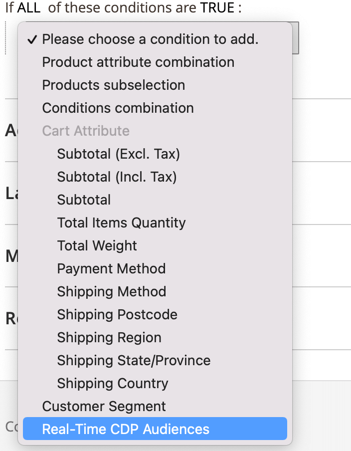

# Create a cart price rule based on an Real-Time CDP audience

You can create a cart price rule in Adobe Commerce using the Real-Time CDP audiences you imported from Experience Platform.

>[!IMPORTANT]
>
>Make sure you have [installed](customer-segment-rtcdp.md#install-the-extension) and [configured](customer-segment-rtcdp.md#configure-the-extension) the Real-Time CDP audience extension before you create a cart price rule.

1. On the _Admin_ sidebar, go to **[!UICONTROL Marketing]** > _[!UICONTROL Promotions]_ > **[!UICONTROL Cart Price Rules]** and click **[!UICONTROL Add New Rule]**. 

   The following steps use the example of a 50% discount rule.

1. Expand **[!UICONTROL Rule Information]** and fill in the fields according to your requirements.

   

1. Expand **[!UICONTROL Conditions]**, click the "+" icon, and select **[!UICONTROL Real-Time CDP Audience]** from the list.

   

1. Select the "..." icon, click **[!UICONTROL Open Chooser]**, and locate the specific Real-Time CDP audience that you want to use.

   

1. Expand **[!UICONTROL Actions]** and add a value in the **[!UICONTROL Discount Amount]** field.

   

1. Click **[!UICONTROL Save]** to save the new cart price rule.

1. Clean the [cache](https://experienceleague.adobe.com/docs/commerce-admin/systems/tools/cache-management.html).

You have now configured a cart price rule based on an Real-Time CDP audience. When a customer browses your site, Commerce determines if they belong to a specific Audience. If they do, any cart price rules that are based on that audience get applied to that customer at checkout. If they do not belong to any audiences, then no cart price rules get applied.
