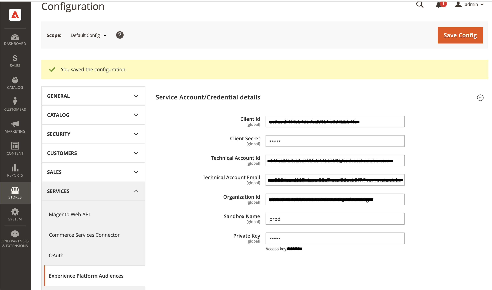

# Integrate Experience Platform Audiences in Commerce

>[!IMPORTANT]
>
>The Experience Platform Audiences extension is in beta and only available to a select number of customers.

The Experience Platform Audiences extension for Adobe Commerce lets you import Experience Platform Audiences into Adobe Commerce to dynamically personalize cart price rules. The Audiences built within Experience Platform are based on data from various enterprise systems, such as Enterprise Resource Planning (ERP), Customer Relationship Management (CRM), point of sale, and marketing systems.

You can use Experience Platform Audiences in a Luma storefront or headless storefront. The main difference is that in a Luma storefront, Audience information (segment membership) is stored in a cookie on the Commerce side while in a headless storefront, it is passed in the GraphQL API header as a parameter named: `aep-segments-membership`.

## Storefront implementation

The following tasks apply to both Luma and headless storefront implementations. To use Experience Platform Audiences in Adobe Commerce, you must:

- [Install Adobe Commerce on cloud infrastructure, version 2.4.4 or higher](https://experienceleague.adobe.com/docs/commerce-cloud-service/user-guide/overview.html)
- [Activate](https://experienceleague.adobe.com/docs/experience-platform/destinations/catalog/personalization/adobe-commerce.html) Adobe Commerce as a destination in Experience Platform
- [Install](#install-the-extension) the Experience Platform Audiences extension in Adobe Commerce
- [Configure](#configure-the-extension) the Experience Platform Audiences extension in the Admin to import Experience Platform Audiences into Commerce
- [Create](#create-a-cart-price-rule) a cart price rule based on the imported Experience Platform Audiences

### Install the extension

To install the Experience Platform Audiences extension in Adobe Commerce, run the following command:

   ```bash
   composer require adobe/experience-platform-audiences
   ```

### Configure the extension

After you install the Experience Platform Audiences extension, you need to log into your Commerce Admin and complete the following:

1. On the _Admin_ sidebar, go to **[!UICONTROL System]** > _[!UICONTROL Services]_ > **[!UICONTROL Commerce Services Connector]**, [sign in](https://experienceleague.adobe.com/docs/commerce-merchant-services/user-guides/integration-services/saas.html?lang=en#organizationid) to your Adobe account, and select your organization ID.
1. On the _Admin_ sidebar, go to **[!UICONTROL System]** > _[!UICONTROL Services]_ > **[!UICONTROL Experience Platform Connector]** and in the **[!UICONTROL Datastream ID]** field paste the ID of the datastream ID that you created when you [activated](https://experienceleague.adobe.com/docs/experience-platform/destinations/catalog/personalization/adobe-commerce.html) Adobe Commerce as a destination in Experience Platform.
1. On the _Admin_ sidebar, go to **[!UICONTROL Stores]** > _[!UICONTROL Settings]_ > **[!UICONTROL Configuration]**. Expand **[!UICONTROL Services]** and select **[!UICONTROL Experience Platform Audiences]**. Then, enter the configuration credentials found in the [developer console](https://developer.adobe.com/console/home).

    

1. Click **Save Config**.

### Create a cart price rule

You can create a cart price rule in Commerce using the Experience Platform Audiences you imported from Experience Platform.

1. On the _Admin_ sidebar, go to **[!UICONTROL Marketing]** > _[!UICONTROL Promotions]_ > **[!UICONTROL Cart Price Rules]** and click **[!UICONTROL Add New Rule]**. 

   The following steps use the example of a 50% discount rule.

1. Expand **[!UICONTROL Rule Information]** and fill in the fields according to your requirements.

   

1. Expand **[!UICONTROL Conditions]**, click the "+" icon, and select **[!UICONTROL Experience Platform Audience]** from the list.

   

1. Select the "..." icon, click **[!UICONTROL Open Chooser]**, and locate the specific Experience Platform Audience that you want to use.

   

1. Expand **[!UICONTROL Actions]** and add a value in the **[!UICONTROL Discount Amount]** field.

   

1. Click **[!UICONTROL Save]** to save the new cart price rule.

1. Clean the [cache](https://experienceleague.adobe.com/docs/commerce-admin/systems/tools/cache-management.html).

You have now configured a cart price rule based on an Experience Platform Audience. When a customer browses your site, Commerce determines if they belong to a specific Audience. If they do, any cart price rules that are based on that Audience get applied to that customer at checkout. If they do not belong to any Audiences, then no cart price rules get applied.

## Headless support

You can use Experience Platform Audiences in a headless Adobe Commerce instance, such as AEM, PWA, and so on. A headless storefront communicates to the Experience Platform via the [Commerce Integration Framework (CIF)](https://experienceleague.adobe.com/docs/experience-manager-cloud-service/content/content-and-commerce/integrations/magento.html). The framework provides a server-side API that is implemented using GraphQL. Audience information, like which segment a shopper belongs to, is passed to Commerce via a GraphQL header parameter named: `aep-segments-membership`.

The overall architecture is as follows:


After you [install](#install-the-extension) and [configure](#configure-the-extension) the extension, the AEP Web SDK contains the Audience information in the form of segment membership. You pass those segments to the Commerce server-side within the GraphQL header. For example:

```bash
curl 'http://magento.config/graphql' -H 'Authorization: Bearer abc123' -H 'aep-segments-membership: urlencoded_list_of_segments' -H 'Content-Type: application/json' --data-binary '{"query":"query {\ncustomer {\nfirstname\nlastname\nemail\n}\n}"}'
```

The segment information now appears in the Admin when you specify a condition for a [cart price rule](#create-a-cart-price-rule).
