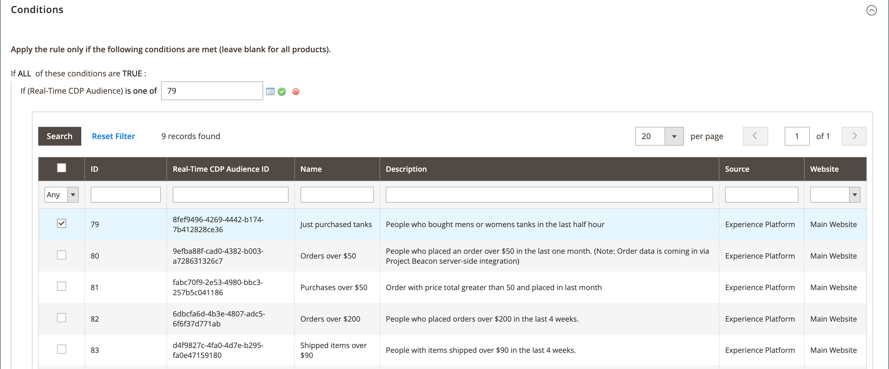

# Integrate Experience Platform Audiences in Commerce

>[!IMPORTANT]
>
>The Experience Platform Audiences extension is in beta and only available to a select number of customers.

The Experience Platform Audiences extension for Adobe Commerce lets you import Experience Platform Audiences into Adobe Commerce to dynamically personalize cart price rules. The Audiences built within Experience Platform are based on data from various enterprise systems, such as Enterprise Resource Planning (ERP), Customer Relationship Management (CRM), point of sale, and marketing systems.

Using Experience Platform Audiences in Adobe Commerce requires that you:

- [Activate](https://experienceleague.adobe.com/docs/experience-platform/destinations/catalog/personalization/adobe-commerce.html) Adobe Commerce as a destination in Experience Platform
- [Install](#install-the-extension) the Experience Platform Audiences extension in Adobe Commerce
- [Configure](#configure-the-extension) the Experience Platform Audiences extension in the Admin to import Experience Platform Audiences into Commerce
- [Create](#create-a-cart-price-rule) a cart price rule based on the imported Experience Platform Audiences

## Install the extension

To install the Experience Platform Audiences extension in Adobe Commerce, run the following command:

   ```bash
   composer require adobe/experience-platform-audiences
   ```

## Configure the extension

After you install the Experience Platform Audiences extension, you need to log into your Commerce Admin and complete the following:

On the _Admin_ sidebar, go to **[!UICONTROL Marketing]** > _[!UICONTROL Communications]_ > **[!UICONTROL Email Reminder Rules]**.

1. On the _Admin_ sidebar, go to **[!UICONTROL System]** > _[!UICONTROL Services]_ > **[!UICONTROL Commerce Services Connector]**, [sign in](https://experienceleague.adobe.com/docs/commerce-merchant-services/user-guides/saas.html?lang=en#organizationid) to your Adobe account, and select your organization ID.
1. On the _Admin_ sidebar, go to **[!UICONTROL System]** > _[!UICONTROL Services]_ > **[!UICONTROL Experience Platform Connector]** and in the **[!UICONTROL Datastream ID]** field paste the ID of the datastream ID that you created when you [activated](https://experienceleague.adobe.com/docs/experience-platform/destinations/catalog/personalization/adobe-commerce.html) Adobe Commerce as a destination in Experience Platform.
1. On the _Admin_ sidebar, go to **[!UICONTROL Stores]** > _[!UICONTROL Settings]_ > **[!UICONTROL Configuration]**. Expand **[!UICONTROL Services]** and select **[!UICONTROL Experience Platform Audiences]**. Then, enter the configuration credentials found in the [developer console](https://developer.adobe.com/console/home).

    

1. Click **Save Config**.

## Create a cart price rule

You can create a cart price rule in Commerce using the Experience Platform Audiences you imported from Experience Platform.

1. On the _Admin_ sidebar, go to **[!UICONTROL Marketing]** > _[!UICONTROL Promotions]_ > **[!UICONTROL Cart Price Rules]** and click **[!UICONTROL Add New Rule]**. 

   The following steps use the example of a 50% discount rule.

1. Expand **[!UICONTROL Rule Information]** and fill in the fields according to your requirements.

   

1. Expand **[!UICONTROL Conditions]**, click the "+" icon, and select **[!UICONTROL Experience Platform Audience]** from the list.

   

1. Select the "..." icon, click **[!UICONTROL Open Chooser]**, and locate the specific Experience Platform Audience that you want to use.

   

1. Expand **[!UICONTROL Actions]** and add a value in the **[!UICONTROL Discount Amount]** field.

   

1. Click **[!UICONTROL Save]** to save the new cart price rule.

1. Clean the [cache](https://docs.magento.com/user-guide/system/cache-management.html).

## Headless support

You can use Experience Platform Audiences in a headless Adobe Commerce instance.

>[!IMPORTANT]
>
>Documentation not yet available.

<!--### Prerequisits

- GraphQL endpoint
- Others?
- Configure Admin as above (it's the same for headless)

Do we have a list of GraphQL Queries/Mutations? Or an example of a call to the endpoint?
What headers are needed?

You need the AEP Web SDK (alloy.js). This returns segment membership. It's cookie based.

And then the change here is that when AEP segment memberships is passed in the header, you're sending the the discount values back.

how to get frontend to implement integration between aep segments and what you belong to, then pass that in header to commerce.-->

## AEM support

You can use Experience Platform Audiences in an AEM-Commerce storefront.

>[!IMPORTANT]
>
>Documentation not yet available.
