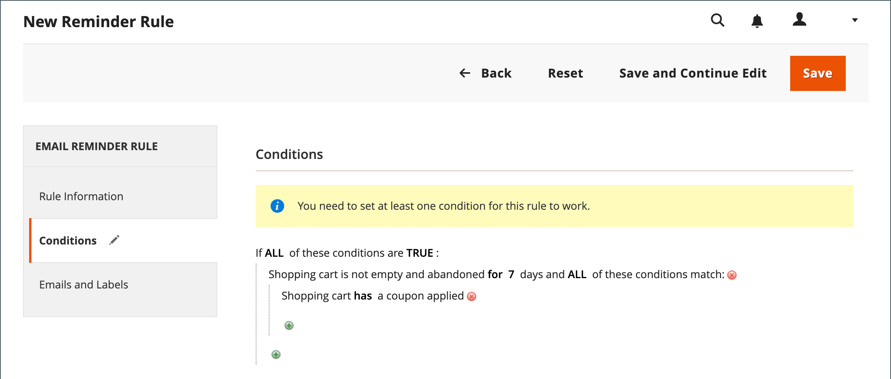

# Create email reminders

Before setting up an email reminder rule, you must first set up a cart price rule to define the promotion that is being offered. Rule conditions that trigger an email reminder can be based on cart properties, wishlist properties, or both.

>[!NOTE]
>
>Email reminders might promote a cart price rule with, or without, a coupon. A cart price rule that defines an auto-generated coupon generates a random coupon code for each customer.

1. On the _Admin_ sidebar, go to **[!UICONTROL Marketing]** > _[!UICONTROL Communications]_ > **[!UICONTROL Email Reminder Rules]**.

1. In the upper-right corner, click **[!UICONTROL Add New Rule]**.

1. Complete the _[!UICONTROL Rule Information]_, as follows:

    <!-- zoom -->

   - Enter a **[!UICONTROL Rule Name]** to identify the rule internally.

   - Enter a brief **[!UICONTROL Description]** of the rule.

   - To choose the **[!UICONTROL Cart Price Rule]** promotion that this reminder is to advertise, click **[!UICONTROL Select Rule…]**, and select the rule.

      <!-- zoom -->

   - If you want the rule to go into effect immediately, set **[!UICONTROL Status]** to `Active`.

   - To set up a date range for the rule to be active, enter the **[!UICONTROL From]** and **[!UICONTROL To]** dates.

      You can also choose the date from the Calendar (  ).

   - To send the reminder more than once, enter the number of days before the next email blast in the **[!UICONTROL Repeat Schedule]** field.

1. In the panel on the left, choose **[!UICONTROL Conditions]**.

   At least one condition must be defined for the rule. The process is similar to building a [catalog price rule.](price-rules-catalog.md)

   <!-- zoom -->

   Click _Add_ ( ) to display the list of options and then choose one of the following conditions:

      - Wish List
      - Shopping Cart

   Complete the condition to describe the scenario that triggers the email reminder.

   <!-- zoom -->

1. In the panel on the left, choose **[!UICONTROL Emails and Labels]**.

   <!-- zoom -->

1. In the **[!UICONTROL Email Templates]** section, choose the email template to be used for each website and store view in your [store hierarchy](../getting-started/websites-stores-views.md).

   If you do not want to send the reminder email to customers of a store view, leave the value `Not Selected`.

1. In the _Default Titles and Description_ section, do the following:

   - Enter the **[!UICONTROL Rule Title for All Store Views]**.

      >[!NOTE]
      >
      >This value can be incorporated into email templates by using the `promotion_name` variable.

   - Enter the **[!UICONTROL Rule Description for All Store Views]**.

      <!-- zoom -->

   - In the _[!UICONTROL Titles and Descriptions Per Store View]_ section, enter the **[!UICONTROL Rule Title]** and **[!UICONTROL Description]** for the _Default Store View_. For multiple store views, enter the appropriate title and description for each.

      >[!NOTE]
      >
      >The description can be incorporated into email templates by using the promotion_description variable.

      <!-- zoom -->

1. When complete, click **[!UICONTROL Save]**.

## Trigger conditions

|Source|Trigger|
|--- |--- |
|[!UICONTROL Wish List]|[!UICONTROL Conditions Combination] [!UICONTROL Sharing] [!UICONTROL Number of Items] [!UICONTROL Items Sub selection]|
|[!UICONTROL Shopping Cart]|[!UICONTROL Conditions Combination] [!UICONTROL Coupon Code] [!UICONTROL Cart Line Items] [!UICONTROL Items Quantity] [!UICONTROL Virtual Only] [!UICONTROL Total Amount] [!UICONTROL Items Subselection]|

{style="table-layout:auto"}

## Field descriptions

|Field|Description|
|--- |--- |
|[!UICONTROL Rule Name]|The name of the automated reminder rule identifies the rule internally.|
|[!UICONTROL Description]|A description of the rule for internal reference.|
|[!UICONTROL Shopping Cart Price Rule]|The shopping cart rule that is associated with this email reminder. Reminder emails can promote a shopping cart price rule with or without coupon. If a shopping cart price rule includes an auto-generated coupon, the reminder rule generates a random, unique coupon code for each customer.|
|[!UICONTROL Assigned to Website]|The websites that receive automated reminder email based on this rule.|
|[!UICONTROL Status]|Activates the rule. If status is inactive, then all other settings are ignored, and the rule is not triggered. Options: `Active` / `Inactive`|
|[!UICONTROL From Date]|The starting date for this automated reminder rule. If no date is specified, the rule becomes active immediately.|
|[!UICONTROL To Date]|The ending date for this automated reminder rule. If no date is specified, the rule becomes active indefinitely.|
|[!UICONTROL Repeat Schedule]|The number of days before the rule is triggered, and the reminder email sent again, provided the conditions are met. To trigger the rule more than once, enter the number of days before the next email blast, separated by a comma. For example, enter `7` to have the rule triggered again seven days later; enter `7,14` to have the rule triggered in seven days, and again 14 days later.|
|[!UICONTROL Email Templates]|Determines the email template to be used for each store view.|
|[!UICONTROL Rule Title for All Store Views]|Determines the title of the rule for each store view.|
|[!UICONTROL Rule Description for All Store Views]|Determines the description of the rule for each store view.|

{style="table-layout:auto"}
