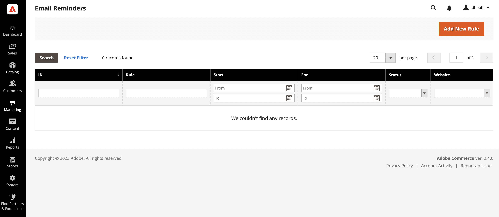
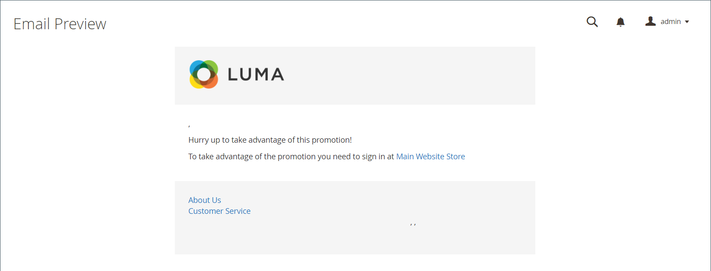

# Email reminders

{{#ee-feature}}

The purpose of an email reminder is encourage people who have visited your store to take advantage of a promotion and make a purchase. Email reminders can be automatically sent to customers when a specific set of conditions is met. For example, you might send a reminder to customers who have added something to their cart or wishlist, but have not yet made a purchase. You can use email reminders to encourage customers to return to your store, and include a [coupon code](price-rules-cart-coupon.md) as an incentive. Coupon codes can be automatically generated for each batch of email reminders, to give you control over the offers that are associated with each batch.

Email reminders can be triggered after a certain number of days have passed since a cart was abandoned, or for any other condition you want to define, such as total cart value, quantity, items in cart, and so on.

<!-- zoom -->

## Configure email reminders

Email reminder rules can be sent at regular intervals by the minute, hour, or day. The configuration determines how many emails are sent in a batch, and the store identity that appears as the sender of the message.

1. On the _Admin_ sidebar, go to **Stores** > _Settings_ > **Configuration**.

1. In the left panel, expand **Customers** and choose **Promotions**.

1. Expand  the **Automated Email Reminder Rules** section and do the following:

   <!-- zoom -->

   - Set **Enable Reminder Emails** to `Yes`.

   - To set how often to run checks for new customers who qualify automated email reminders, set **Frequency** to one of the following:

      - `Minute Intervals`
      - `Hourly`
      - `Daily`

   - Set the appropriate **Interval**, based on the Frequency setting.

   - Set **Start Time** to the hour, minute, and second the email is sent, based on a 24-hour clock.

   - To limit the number of emails that can be sent in a batch, enter the number in the **Maximum Emails per One Run** field.

   - To avoid repeated attempts to send failed email, enter the maximum number of attempts in the **Email Send Failure Threshold** field.

   - Set **Reminder Email Sender** to the [store contact](https://docs.magento.com/user-guide/stores/store-email-addresses.html) that appears as the sender of the reminder email.

   For a detailed list of these options, see [Automated Email Reminder Rules](https://docs.magento.com/user-guide/configuration/customers/promotions.html#automated-email-reminder-rules) in the _Configuration Reference_.

1. When complete, click **Save Config**.

## Email reminder templates

The default email reminder template can be customized, and additional templates created for different promotions. Email reminders have a selection of specific variables that can be incorporated into the message. The information in these variables is determined by the email reminder rule that you set up, and by the cart price rule that is associated with the coupon. The Insert Variable button can be used to insert the markup tag with the variable into the template. To learn more, see [Email](https://docs.magento.com/user-guide/marketing/email-templates.html).

<!-- zoom -->

### Customize an email reminder template

1. On the _Admin_ sidebar, go to **Marketing** > _Communications_ > **Email Templates**.

1. Click **Add New Template**.

1. In the **Template** list under Magento_Reminder, choose the **Promotion Notification/Reminder** template.

1. Click **Load Template**.

Follow the standard [instructions](https://docs.magento.com/user-guide/marketing/email-template-custom.html) to customize the template.

### Email reminder variables

|Variable|Markup Tag|
|--- |--- |
|Coupon Code|`{{var coupon.getCode()|escape}}`|
|Coupon Usage Limit|`{{var coupon.usage_limit|escape}}`|
|Coupon Usage Per Customer|`{{var coupon.usage_per_customer|escape}}`|
|Customer Account URL|`{{var this.getUrl($store,'customer/account/',[_nosid:1])}}`|
|Customer Name|`{{var customer_data.name|escape}}`|
|Email Footer Template|`{{template config_path="design/email/footer_template"}}`|
|Email Header Template|`{{template config_path="design/email/header_template"}}`|
|Email Logo Image Alt|`{{var logo_alt}}`|
|Email Logo Image URL|`{{var logo_url}}`|
|Promotion Description|`{{var promotion_description|escape|nl2br}}`|
|Promotion Name|`{{var promotion_name|escape}}`|
|Store Name|`{{var store.frontend_name}}`|
|Store URL|`{{store url=""}}`|

{style="table-layout:auto"}
