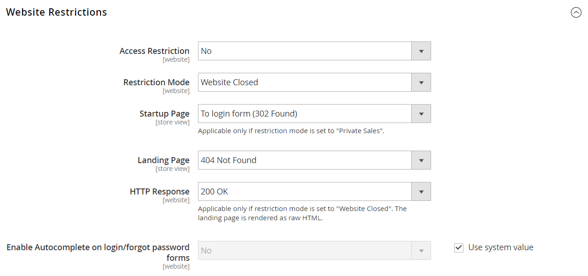

# Configure events

{{ee-feature}}

Before you can create an event, you must complete the basic configuration to enable events and set up the event block in the sidebar.

## Enable and configure events

1. On the _Admin_ sidebar, go to **[!UICONTROL Stores]** > _[!UICONTROL Settings]_ > **[!UICONTROL Configuration]**.

1. In the left panel, expand **[!UICONTROL Catalog]** and choose **[!UICONTROL Catalog]** underneath.

1. Expand  the **[!UICONTROL Catalog Events]** section and do the following:

    <!-- zoom -->

    - Set **[!UICONTROL Enable Catalog Events Functionality]** to `Yes`.

    - Set **[!UICONTROL Enable Catalog Event Widget on Storefront]** to `Yes`.

    - Enter the **[!UICONTROL Number of Events to be Displayed in the Event Slider Sidebar Widget]**. By default, this value is set to `5`. If you want to display only one event in the slider at a time, enter `1`.

    - Enter the number of **[!UICONTROL Events to Scroll per Click in Event Slider Sidebar Widget]**. By default, this value is set to `2`. If you want the slider to display the next event in sequence when clicked, enter `1`.

1. When complete, click **[!UICONTROL Save Config]**.

## Access restrictions

Access to a private sale, event, or site can be limited to registered customers who log in, or extended to non-registered customers who must register before gaining access.

<!-- zoom -->

### Set up exclusive access

1. On the _Admin_ sidebar, go to **[!UICONTROL Stores]** > _[!UICONTROL Settings]_ > **[!UICONTROL Configuration]**.

1. In the left panel, expand **[!UICONTROL General]** and choose **General** underneath.

1. Expand  the **Website Restrictions** section and do the following:

   - Set **Access Restriction** to `Yes`.

   - Set **Restriction Mode** to one of the following:

      - `Website Closed`
      - `Private Sales: Login Only`
      - `Private Sales: Login and Register`

   - Set **Startup Page** to one of the following:

        |To login form (302 Found)|Users are redirected to the login form before gaining access to the site.|
        |To landing page (302 Found)|Users are redirected to the specified landing page until they log in.  **Important!** Be sure to include a link to the login page from the landing page so customers can log in to access the site.|

   - Choose the **Landing Page** that appears before customers log in to the private sale site.

   - To let search engine bots and spiders know that the landing page is correct and there are no other pages on the site to index, set **HTTP Response** to `200 OK`. In all other cases set to `503 Service Unavailable`.

   >[!NOTE]
   >
   >Applicable only if restriction mode is set to "Website Closed". The landing page is rendered as raw HTML.

   - If you want the fields in the customer login and forgot password forms to be filled automatically from previous entries, set **Enable Autocomplete on login/forgot password forms** to `Yes`.

1. When complete, click **[!UICONTROL Save Config]**.

### Restrict access

Access to a private sale, event, or site can be limited to registered customers who log in, or extended to non-registered customers who must register before gaining access.

<!-- zoom -->

1. On the _Admin_ sidebar, go to **[!UICONTROL Stores]** > _[!UICONTROL Settings]_ > **[!UICONTROL Configuration]**.

1. In the left panel, expand **[!UICONTROL General]** and choose **[!UICONTROL General]** underneath.

1. Expand  the **[!UICONTROL Website Restrictions]** section.

1. Set **[!UICONTROL Access Restriction]** to `Yes`.

1. Set **[!UICONTROL Restriction Mode]** to one of the following:

   - `Website Closed`
   - `Private Sales: Login Only`
   - `Private Sales: Login and Register`

1. Set **[!UICONTROL Startup Page]** to one of the following:

   - `To login form (302 Found)` - Users are redirected to the login form before gaining access to the site.

   - `To landing page (302 Found)` - Users are redirected to the specified landing page until they log in. 

      >[!IMPORTANT]
      >
      >Be sure to include a link to the login page from the landing page so customers can log in to access the site.

1. Choose the **[!UICONTROL Landing Page]** that appears before customers log in to the private sale site.

1. To let search engine bots and spiders know that the landing page is correct and there are no other pages on the site to index, set **[!UICONTROL HTTP Response]** to `200 OK`.

   In all other cases set to `503 Service Unavailable`.

   >[!NOTE]
   >
   >Applicable only if restriction mode is set to _Website Closed_. The landing page is rendered as raw HTML.

1. If you want the fields in the customer login and forgot password forms to be filled automatically from previous entries, set **[!UICONTROL Enable Autocomplete on login/forgot password forms]** to `Yes`.

1. When complete, click **[!UICONTROL Save Config]**.

### Restrict sales

By default, products that appear in upcoming or closed events are not available for general sale and the _[!UICONTROL Add to Cart]_ button does not appear on the product list or product page.

To restore the _[!UICONTROL Add to Cart]_ button for a closed event, the event must be deleted (see [Update events](event-create.md#update-events)). However, if a product is associated with another category that has no selling restrictions, the button is available on the product page. Similarly, the ticker block does not appear on the product page if the product is associated with another category that has no selling restrictions.
