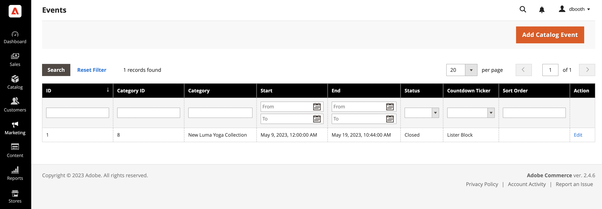
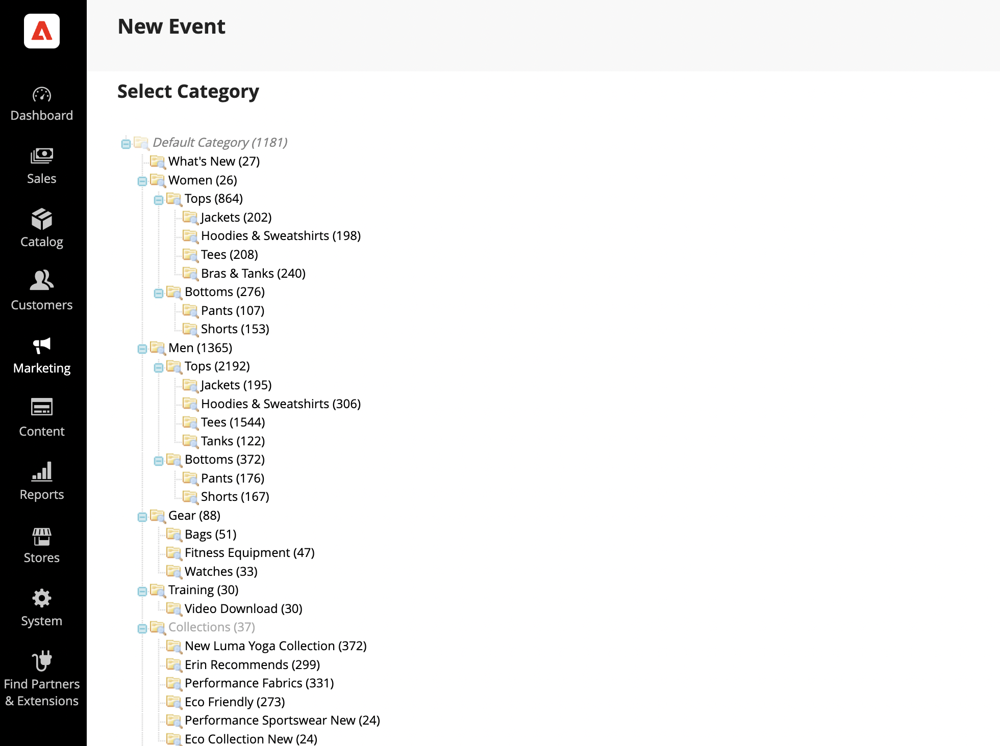
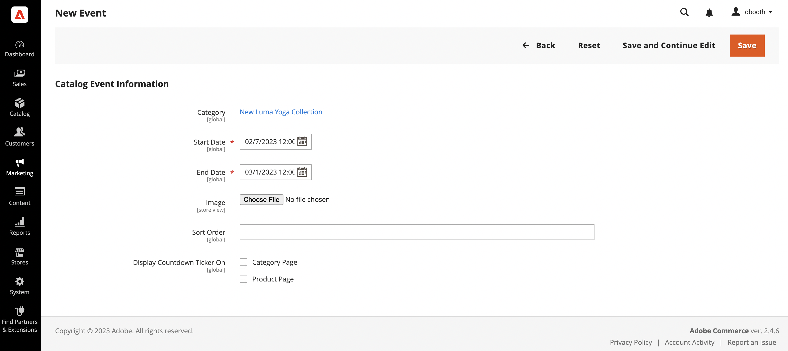
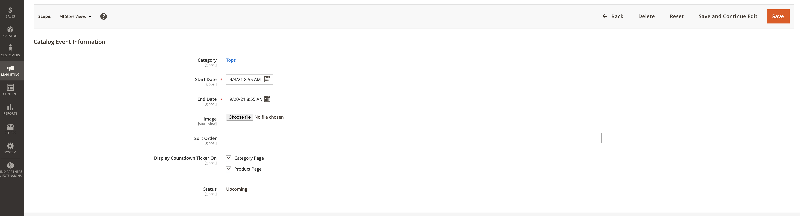

# Create and update events

{{ee-feature}}

Each event is associated with a category from your catalog, and only one event can be associated with any given category at a time. To display a list of upcoming events in your store, you must also set up a [Catalog Events Carousel](../content-design/widget-event-carousel.md) widget.

<!-- zoom -->

## Create an event

1. On the _Admin_ sidebar, go to **[!UICONTROL Marketing]** > _[!UICONTROL Private Sales]_ > **[!UICONTROL Events]**.

1. In the upper-right corner, click **[!UICONTROL Add Catalog Event]**.

1. In the category tree, choose the category that you want to associate with the event.

   Because each category can have only one event at a time, any categories that already have an event are disabled.

   <!-- zoom -->

1. Define the **[!UICONTROL Catalog Event Information]**:

   <!-- zoom -->

   - For the **[!UICONTROL Start Date]** of the event, use the calendar () to choose the date. Use the **[!UICONTROL Hour]** and **[!UICONTROL Minute]** sliders to set the time that the event begins.

   - For the **[!UICONTROL End Date]** of the event, use the calendar () to choose the date. Use the **[!UICONTROL Hour]** and **[!UICONTROL Minute]** sliders to set the time that the event ends.

   - To upload an **[!UICONTROL Image]** for the event widget, click **[!UICONTROL Choose File]** and select the image file from your directory.

   - In the **[!UICONTROL Sort Order]** field, enter a number to indicate the sequence in which this event appears when listed with other events.

   - Select the checkbox of each page type where you want to display the countdown ticker.

1. When complete, click **[!UICONTROL Save]**.

## Update events

Events can be edited from either the Events page or from the category that is associated with the event. When a category has an associated event, an Edit Event button appears in the upper-right corner.

<!-- zoom -->

### Method 1: Edit an event from the Events page

1. On the _Admin_ sidebar, go to **[!UICONTROL Marketing]** > _[!UICONTROL Private Sales]_ > **[!UICONTROL Events]**.

1. Find the event in the list, and open it in edit mode.

1. Make the necessary changes to the event.

1. When complete, click **[!UICONTROL Save]**.

### Method 2: Edit an event from a category

1. On the _Admin_ sidebar, go to **[!UICONTROL Catalog]** > **[!UICONTROL Categories]**.

1. In the category tree on the left, select the category that is associated with the event.

1. In the upper-right corner, click **[!UICONTROL Edit Even]t**.

1. Make the necessary changes to the event.

1. When complete, click **[!UICONTROL Save]**.

## Delete an event

1. On the _Admin_ sidebar, go to **[!UICONTROL Marketing]** > _[!UICONTROL Private Sales]_ > **[!UICONTROL Events]**.

1. Find the event in the list and open it in edit mode.

1. In the upper-right corner, click **[!UICONTROL Delete]**.

1. To confirm the action click **[!UICONTROL OK]**.

## Field descriptions

|Field|[Scope](../getting-started/websites-stores-views.md#scope-settings)|Description|
|--- |--- |--- |
|[!UICONTROL Category]|Global|When creating an event, this field links back to the category tree. When editing an event, it links to the category page related to the event.|
|[!UICONTROL Start Date]|Global|The starting date and time of the event in `MMDDYYYY HH;MM` format. Click the calendar icon to select the date.|
|[!DNL End Date]|Global|The ending date and time of the event in `MMDDYYYY HH;MM` format. Click the calendar icon to select the date.|
|[!UICONTROL Image]|Store View|Uploads an image that appears in the [Catalog Events Carousel widget](../content-design/widget-event-carousel.md).|
|[!UICONTROL Sort Order]|Global|Determines the sequence in which this event appears when listed with other events.|
|[!UICONTROL Display Countdown Ticker On]|Global|Displays the countdown ticker in the header of each page specified. Options: `Category Page` / `Product Page`|
|[!UICONTROL Status]|Global|Indicates the status of the event based on the Start Date and End Date range. Status is a read-only value. Values: `Open` / `Closed` / `Upcoming`|

{style="table-layout:auto"}

## Button bar

|Button|Description|
|--- |--- |
|**[!UICONTROL Back]**|Returns to the Events page without saving the new event or changes in an existing event.|
|**[!UICONTROL Delete]**|Deletes the event.|
|**[!UICONTROL Reset]**|Clears the form of any unsaved changes and restores the original event information.|
|**[!UICONTROL Save and Continue Edit]**|Saves all changes and keeps the form open in edit mode.|
|**[!UICONTROL Save]**|Saves changes, closes the form, and returns to the Events page.|

{style="table-layout:auto"}
