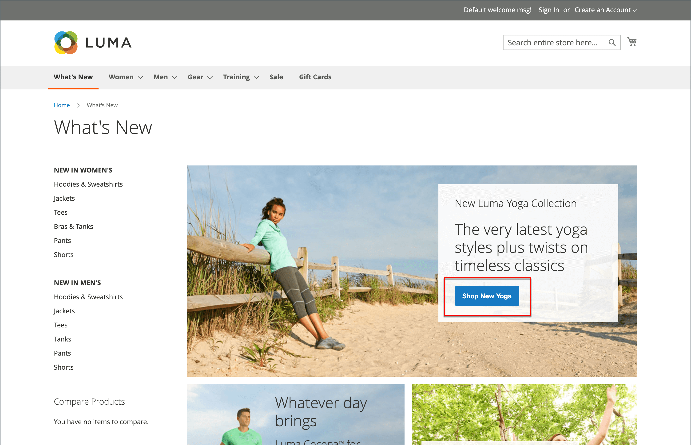
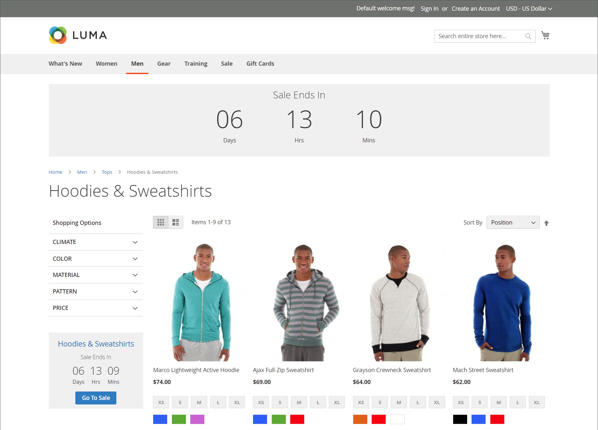
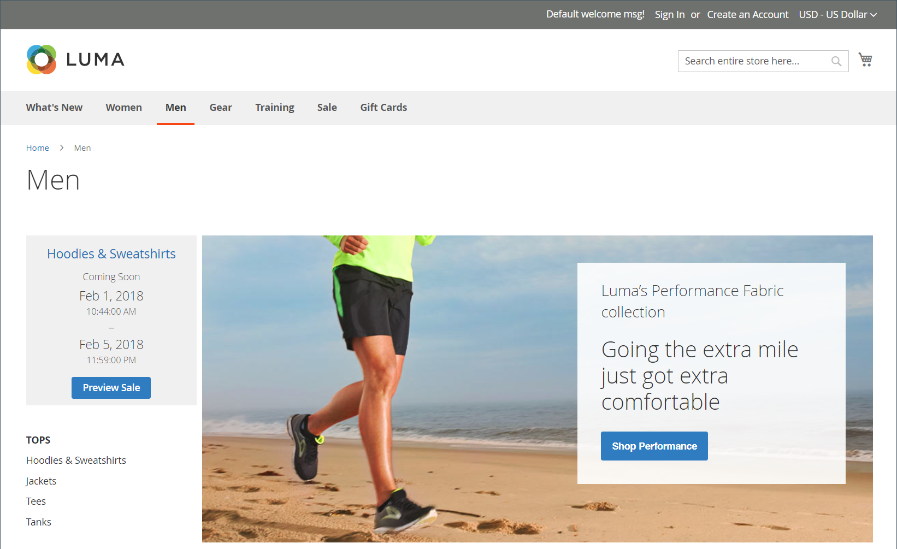

# Private sales and events

{{ee-feature}}

Private sales and other catalog events are a great way to use your existing customer base to generate buzz and new leads, or to offload surplus inventory. You can create limited-time sales, limit sales to specific members, or create a stand-alone private sale page. You can also define invitations and event details. Increase brand loyalty and generate a buzz by giving your best customers the VIP treatment. Offer exclusive access to Member Only sales or private sales to increase brand loyalty. You can also use these sales to liquidate excess merchandise. Customer Groups are useful in setting up these types of Members Only and VIP sales.

<!-- zoom -->

## Event management components

- **Categories** - Each event is associated with a [category](../catalog/category-create.md) from your catalog.

- **Events** - Event sales are based on a starting and ending date. You can use a [countdown ticker](#event-ticker) to show the time remaining.

- **Catalog event carousel** - When the [Catalog Event widget](../content-design/widget-event-carousel.md) is enabled in the configuration, it can be placed on store pages as a listing of open and upcoming events, sorted by end date. If two or more events have the same end date, the events are sorted based on the order specified in the configuration.

- **[!UICONTROL Websites]** - Category permissions are based primarily on [customer groups](../customers/customer-groups.md).

- **Category permissions** - [Category permissions](../catalog/category-permissions.md) gives you full control over the specific activities that can take place in a given category.

- **Access restrictions** - Prevents public [access](event-configure.md#restrict-access) to the site by redirecting to a landing page, login page, or registration page.

- **Invitations** - Email messages are sent with a link to create an account in the store. You can restrict the ability to create an account to only those who receive an [invitation](invitations.md).

- **Private sales reports** - The [Private Sales Reports](../getting-started/private-sales-reports.md) provide information about invitations sent, customers invited, and conversions.

## Event ticker

The ticker block displays a countdown ticker for open events, with the start and end date for upcoming events. If an event has closed, the ticker shows the starting and ending dates.

<!-- zoom -->

If the category page ticker is enabled for an event, the ticker block appears at the top of the category listing. If the product page ticker is enabled, the ticker block also appears at the top of the product page of any product that is associated with the category.

The event ticker can be enabled when you [creating events](event-create.md).

<!-- zoom -->
