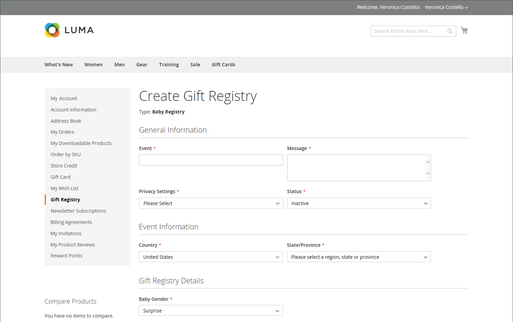

# Gift registries

{{ee-feature}}

Adobe Commerce gives your customers the ability to create gift registries for special occasions, and to invite their friends and family to purchase their gifts from the gift registry. Adobe Commerce tracks the items purchased and the quantities remaining.

{width="700" zoomable="yes"}

The gift registry owner can add products to the registry from their [customer dashboard](gift-registry-storefront.md#gift-registry-information). In addition, products can be transferred from the wish list or cart. As a store administrator, you can view and share customer gift registries. You can also perform maintenance, such as adding items from the customer's cart, updating quantities, or deleting a gift registry.

To access a gift registry, recipients can click the link in the email they receive, or search by the recipient's name, email, or gift registry ID. In most stores, the footer of each page has a link to the gift registry, although the location might vary by theme. In addition, the [Widget](../content-design/widgets.md) tool can be used to place [Gift Registry Search](gift-registry-search.md) anywhere in your store.

Registry visitors who want to make a purchase can add the item to their carts directly from the gift registry. When the order is placed, the gift registry is updated to reflect the purchase.

## Gift registry workflow

1. **Configure gift registry for the store**. The store administrator [enables the gift registry](gift-registry-configure.md), and [sets up the registry type and attributes](gift-registry-create.md).

1. **Customer creates their own registry**. A [customer creates a gift registry](gift-registry-storefront.md#create-a-new-gift-registry) from their store account for an upcoming occasion, and completes the required fields in each section of the gift registry. After adding items to the registry, it can be shared with friends and family.

1. **Customer shares their registry**. A link to the gift registry is included in each [invitation](gift-registry-storefront.md#share-a-gift-registry). If [Gift Registry Search](gift-registry-search.md) is available in the store, customers can search for specific gift registries by name, email address, or gift registry ID.

1. **Invitation recipients place orders**. Those who receive an invitation or information about the registry can place an order for any item directly from the gift registry. As items are sold, Adobe Commerce updates the gift registry item counts, and notifies the gift registry owner.
