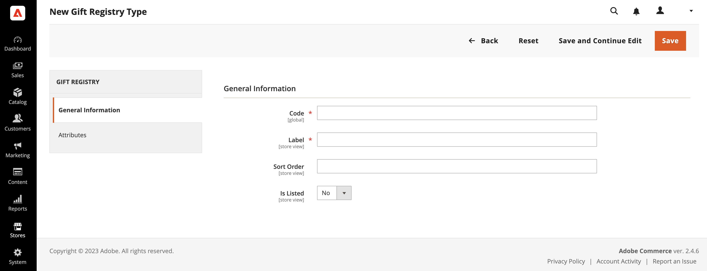
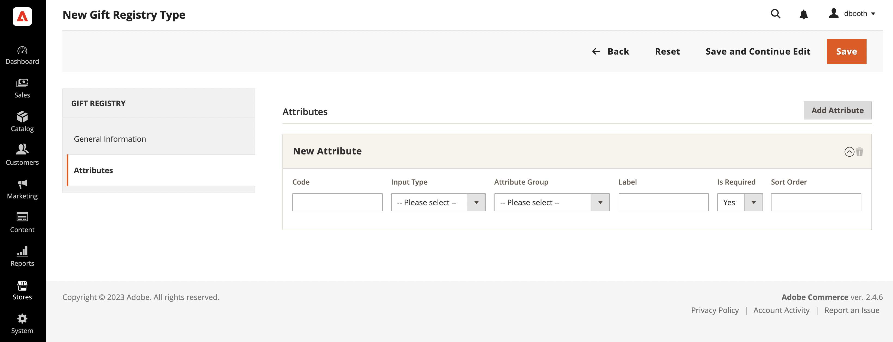
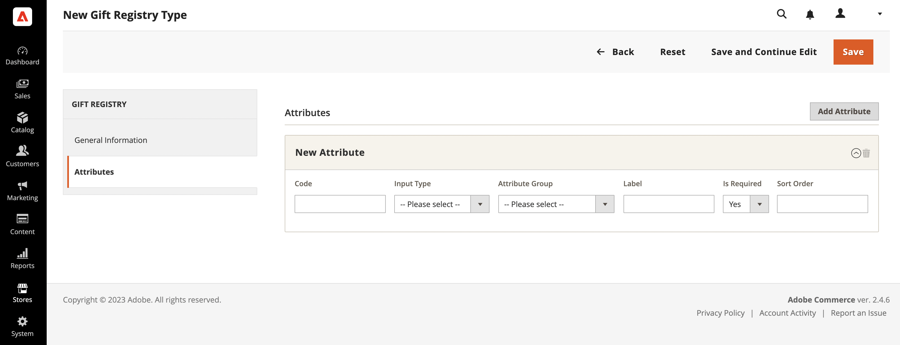

# Gift registry setup

{{ee-feature}}

A gift registry can be created for any type of event, such as a wedding, birthday, anniversary, new baby, or any other special occasion. By default, Adobe Commerce includes the following special events:

- Baby
- Birthday
- Wedding

When you create a registry, it becomes an option in the list of gift registry types in the customer's account.

You can use one of the three prepared gift registries, or create your own custom registry. Each gift registry type includes several attributes, which are the data entry fields that a customer completes to create a gift registry. The attributes provide additional information about the event, time and location, or any other information that is needed. Depending on the input type, some attributes have multiple options. For example, the `Wedding` gift registry type has the attribute `Role`, with the `Bride`, `Groom`, and `Partner` options. To learn more about attributes and input types, see [Attributes](https://docs.magento.com/user-guide/stores/attributes.html).

<!-- zoom -->

## Use a prepared gift registry

1. On the _Admin_ sidebar, go to **[!UICONTROL Stores]** > _[!UICONTROL Other Settings]_ > **[!UICONTROL Gift Registry]**.

    The birthday, wedding, and baby registries are ready for customers to use from their accounts.

1. Make sure to complete the [email template](https://docs.magento.com/user-guide/marketing/email-template-configuration.html) configuration, so they reflect your brand.

## Create a custom gift registry

1. On the Admin sidebar, go to **[!UICONTROL Stores]** > _[!UICONTROL Other Settings]_ > **[!UICONTROL Gift Registry]**.

1. In the upper-right corner, click **[!UICONTROL Add Gift Registry Type]**.

1. Under **[!UICONTROL General Information]**, complete the following:

   - Enter a unique **[!UICONTROL Code]** to identify the gift registry internally.

      The code must begin with a lowercase letter. The rest of the code can be any combination of lowercase letters (a-z), numbers (0-9), and underscore (`_`).

   - For **[!UICONTROL Label]**, enter a name for the gift registry, as you want it to appear in the store.

      This label is an option in the list of gift registry types that are available to the customer.

   - For **[!UICONTROL Sort Order]**, enter a number to determine the order that this gift registry appears when listed with other types.

   - To activate the gift registry, set **[!UICONTROL Is Listed]** to `Yes`.

      <!-- zoom -->

1. Examine each section of the Gift Registry to determine the type of information you want to include.

1. In the left panel, choose **[!UICONTROL Attributes]** and click **[!UICONTROL Add Attribute]**.

   <!-- zoom -->

1. For each attribute, do the following:

   - Assign a unique **[!UICONTROL Code]** to identify the attribute internally. The code can be up to 15 characters in length, and must begin with a lowercase letter. The rest of the code can include lowercase letters(`a`-`z`), numbers (`0`-`9`), and the underscore (`_`) character to separate words.

   - Choose the **[!UICONTROL Input Type]** to be used for data entry. You can use one of the custom or static types.

   - If the input type has multiple options, click **[!UICONTROL Add New Option]** and complete the information for each option.

      Some input types have additional properties. For example, the Event Location has additional properties to make the event searchable, and included in your store's public list of gift registries.

      - Set **[!UICONTROL Attribute Group]** to the section in the gift registry where you want the attribute to appear.

      - For **[!UICONTROL Label]**, enter a name to identify the data entry field in the registry.

      - If the customer is required to make a selection or enter a value in the field, set **[!UICONTROL Is Required]** to `Yes`.

      - For **[!UICONTROL Sort Order]**, enter a number to determine the sequence in which this gift registry appears when listed with other gift registries that might be available in the store.

1. To add another option, click **Add New Option**.

   Each new option added appears in a new section at the top. Repeat this process for the new attribute.

    <!-- zoom -->

1. When complete, click **[!UICONTROL Save]**.

## Field descriptions

### [!UICONTROL General Information]

|Field|Description|
|--- |--- |
|[!UICONTROL Code]|A unique name to identify the gift registry type internally. The first character of the code must be a lowercase letter. The rest of the code can be any combination of lowercase letters (a-z), numbers (0-9), and the underscore character (`_`).|
|[!UICONTROL Label]|The name of the gift registry type that appears in the store.|
|[!UICONTROL Sort Order]|Determines the sequence in which this gift registry type appears when listed with other types.|
|[!UICONTROL Is Listed]|Determines if the gift registry type is available to customers in the store. Options: `Yes` / `No`.|

{style="table-layout:auto"}

### [!UICONTROL Attributes]

|Field|Description|
|--- |--- |
|[!UICONTROL Code]|A unique name to identify the attribute internally. The code can include any combination of lowercase letters (a-z), numbers (0-9), and the underscore character (`_`).|
|[!UICONTROL Input Type]|Determines the type of data and input control that is associated with the attribute, according to type.|
|[!UICONTROL Attribute Group]|Select the group where the attribute is listed in the gift registry.|
|[!UICONTROL Label]|The name that identifies the attribute in the customer's account dashboard.|
|[!UICONTROL Is Required]|Indicates if the attribute is a required entry. The gift registry cannot be saved until all required attributes are complete. Options: `Yes` / `No`.|
|[!UICONTROL Sort Order] | Determines the sequence in which attribute appears when listed with other attributes.|

{style="table-layout:auto"}

#### [!UICONTROL Input Type Options]

Select the type of data and input control that is associated with the attribute.

**_[!UICONTROL Custom Types]_**

|Field|Description|
|--- |--- |
|[!UICONTROL Text]|Displays the attribute as a text field.|
|[!UICONTROL Select]|Displays the attribute as a drop-down list. Click **[!UICONTROL Add New Option]** to add more conditions to the drop-down list: **[!UICONTROL Code]** - A unique name to identify the attribute internally. **[!UICONTROL Label]** - The name that identifies the attribute in the customer's account dashboard. **[!UICONTROL Is Default]** - Set this switch to select the default condition. **[!UICONTROL Delete Option]** - Click to delete the option.|
|[!UICONTROL Date]|Displays the attribute as a date field. Options: `Short (3/23/2014)` / `Medium (Mar 23, 1914)` / `Long (March 23, 1914)` / `Full (Sunday, March 23, 2014)`|
|[!UICONTROL Country]|Displays the attribute as a drop-down list of countries. Set **[!UICONTROL Show Region]** to: `Yes` / `No`.|

{style="table-layout:auto"}

**_[!UICONTROL Static Types]_**

|Field|Description|
|--- |--- |
|[!UICONTROL Event Date]|Determines how the date attribute is used in the store. Options:  **[!UICONTROL Searchable]** - Determines if the attribute is available for Advanced Search. Options: `Yes` / `No`. **[!UICONTROL Is Listed]** - Determines if the event is included in the list of events that is available in the store. Options: `Yes` / `No`.  **[!UICONTROL Date Format]** - Determines the format of the event date. Options: `Short (3/23/2014)` / `Medium (Mar 23, 1914)` / `Long (March 23, 1914)` / `Full (Sunday, March 23, 2014)`|
|[!UICONTROL Event Country]|Displays the attribute as a list of countries. Options:  **[!UICONTROL Searchable]** - Determines if the attribute is available for Advanced Search. Options: `Yes` / `No`. **[!UICONTROL Is Listed]** - Determines if the event is included in the list of events that is available in the store. Options: `Yes` / `No`.  **[!UICONTROL Show Region]** - Determines the region of the event.|
|[!UICONTROL Event Location]|The location of the event that is related to the gift registry.  Set **[!UICONTROL Is Searcheable]** to: `Yes` / `No`  Set **[!UICONTROL Is Listed]** to: `Yes` / `No`|
|[!UICONTROL Role]|The role that identifies the gift recipient. For example, `Bride`, `Groom`, or `Partner`. **[!UICONTROL Is Searcheable]** - Set to `Yes`/ `No`  **Is Listed** - Set to `Yes` / `No`  **[!UICONTROL Add New Option]** - Click  to add more conditions to the drop-down menu: **Code** - A unique name to identify the attribute internally. **[!UICONTROL Label]** - The name that identifies the attribute in the customer's account dashboard. **[!UICONTROL Is Default]** - Set this switch to select the default condition. **[!UICONTROL Delete Option]** - Click to delete the option.|

{style="table-layout:auto"}

#### [!UICONTROL Attribute Group Options]

Select the group where the attribute is listed in the gift registry.

|Field|Description|
|--- |--- |
|[!UICONTROL Event Information]|Groups all gift registry attributes that add the information about the gift registry event, its time, place, and so on.|
|[!UICONTROL Gift Registry Properties]|Combines all attributes that add information directly about the gift registry.|
|[!UICONTROL Privacy Settings]|Lists the attributes that add information about the gift registry event privacy.|
|[!UICONTROL Recipients Information]|Groups the attributes that provide information about the person who creates a gift registry.|
|[!UICONTROL Shipping Address]|Combines the attributes that add information about the gift registry event shipping address.|

{style="table-layout:auto"}
