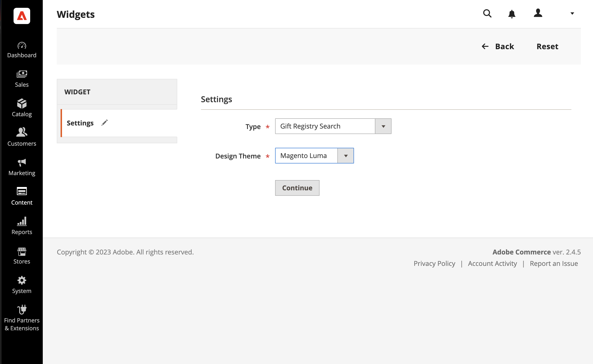
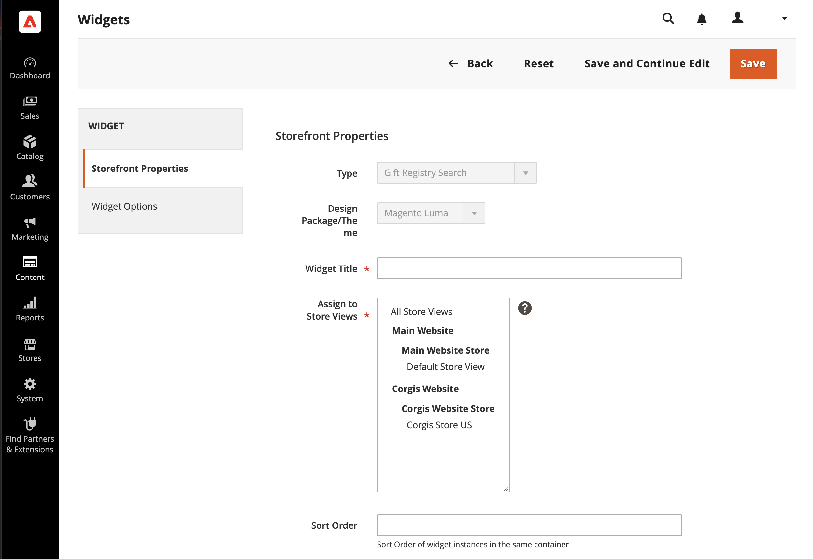
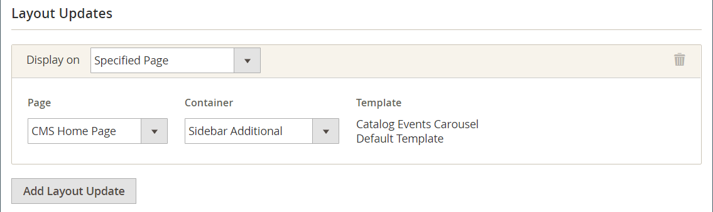
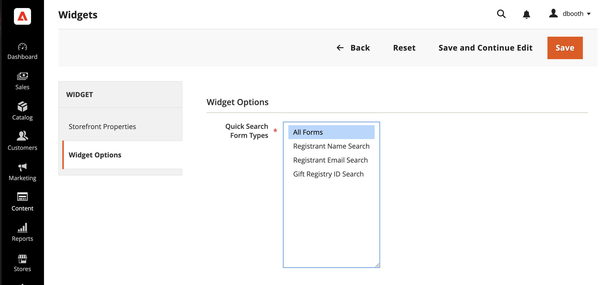

---

title: Add gift registry search
description: Learn how to place a gift registry search box most anywhere in your store.
---
# Add gift registry search

{{ee-feature}}

The [Widget](../content-design/widgets.md) tool can be used to place a gift registry search box most anywhere in your store. You can specify the search options to be available to customers, such as name, email address, and gift registry ID. When the customer clicks the Search button, the results appear on the Gift Registry Search page. If the search returns no results, the customer can try again with other parameters.

<!-- zoom -->

## Configure gift registry search

1. On the _Admin_ sidebar, go to **[!UICONTROL Content]** > _[!UICONTROL Elements]_ > **[!UICONTROL Widgets]**.

1. In the upper-right corner, click **[!UICONTROL Add Widget]**.

1. Choose the **[!UICONTROL Settings]** tab and do the following:

   - Set **[!UICONTROL Type]** to `Gift Registry Search`.

   - Set **[!UICONTROL Design Theme]** to the theme that is used by the store.

   - Click **[!UICONTROL Continue]**.

   <!-- zoom -->

1. In the _Storefront Properties_ section, do the following:

   - Enter a **[!UICONTROL Widget Title]** for internal reference.

   - Set **[!UICONTROL Assign to Store Views]** to the store views where Gift Registry Search is to be available.

   - Set **[!UICONTROL Sort Order]** to determine the order that the Gift Registry Search block appears if there are other blocks assigned to the same location on the page.

   <!-- zoom -->

1. In the **[!UICONTROL Layout Updates]** section, click **[!UICONTROL Add Layout Update]**.

1. To determine where the Gift Registry Search appears in the store, do the following:

   - Set **[!UICONTROL Display On]** to the pages in your store where you want Gift Registry Search block to appear.

   - If applicable, choose the **[!UICONTROL Categories]** where you want it to appear.

   - Set **[!UICONTROL Container]** to the location on the page to place the Gift Registry Search block.

   <!-- zoom -->

1. In the left panel, choose **[!UICONTROL Widget Options]**.

1. To determine how visitors to your site can search for gift registries, select as many of the following that apply:

   - [!UICONTROL All Forms]
   - [!UICONTROL Registrant Name Search]
   - [!UICONTROL Registrant Email Search]
   - [!UICONTROL Gift Registry ID Search]

   <!-- zoom -->

1. When complete, click **[!UICONTROL Save]**.

1. When prompted to refresh the page cache, click the link in the message at the top of the workspace and follow the instructions.

## Field descriptions

### [!UICONTROL Settings]

|Field|Description|
|--- |--- |
|[!UICONTROL Type]|Identifies `Gift Registry Search` as the type of Widget.|
|[!UICONTROL Design Theme]|The theme that is used by the store where the Gift Registry Search is to appear.|

{style="table-layout:auto"}

### [!UICONTROL Storefront Properties]

|Field|Description|
|--- |--- |
|[!UICONTROL Widget Title]|A name for internal reference.|
|[!UICONTROL Assign to Store Views]|Identifies the store views where the Gift Registry Search is to be available.|
|[!UICONTROL Sort Order]|Indicates the order that Gift Registry Search block appears if there are other blocks assigned to appear in the same location.|

{style="table-layout:auto"}

### [!UICONTROL Layout Updates]

|Field|Description|
|--- |--- |
|[!UICONTROL Display On]|Indicate the specific pages, or types of pages where Gift Registry Search block appears.|
|[!UICONTROL Categories]|If applicable, identifies the category pages where Gift Registry Search appears.|
|[!UICONTROL Container]|Indicates the page layout block where Gift Registry Search is placed. The options vary by template and theme.|

{style="table-layout:auto"}

### [!UICONTROL Widget Options]

|Field|Description|
|--- |--- |
|[!UICONTROL Quick Search Form Types]|Determines the types of searches that can be performed with Gift Registry Search. Options: `All Forms` / `Registrant Name Search` /` Registrant Email Search` / `Gift Registry ID Search`|

{style="table-layout:auto"}
