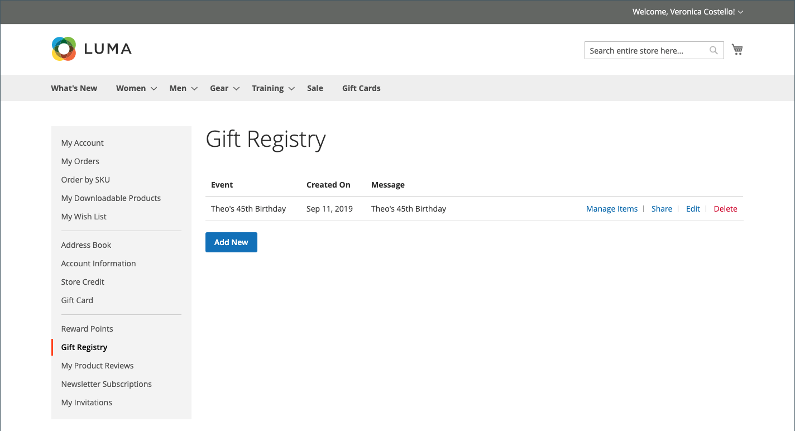
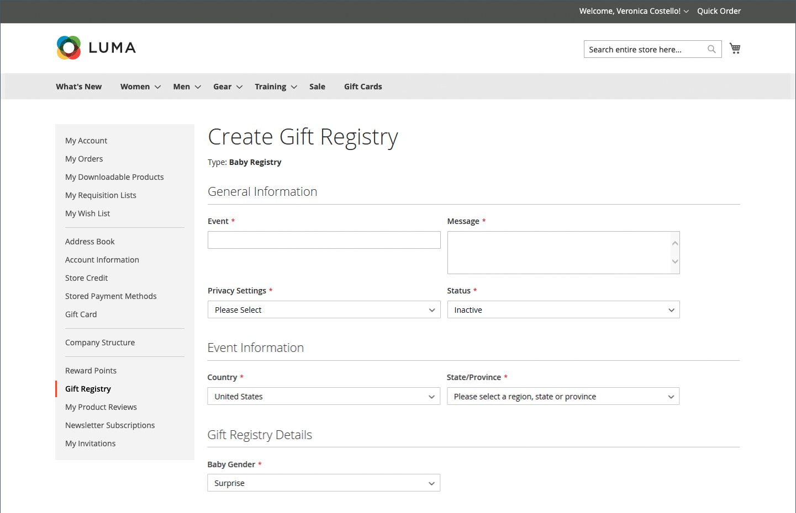
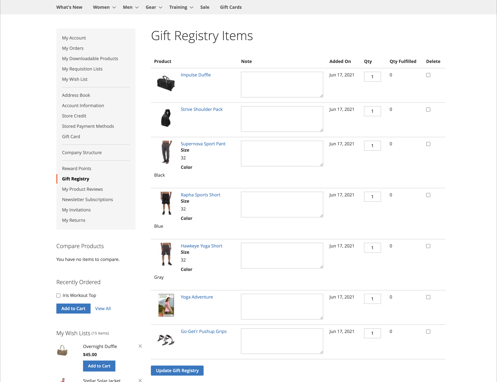

# Gift registry storefront experience

{{ee-feature}}

The [Gift Registry](gift-registries.md) section of the customer account lists the customer's current gift registries and the associated event.  Customers can manage the current registries and add new ones.

<!-- zoom -->

## Gift registry information

Customers can create and manage gift registries from their accounts. All of the information that is associated with each type of registry is available from the customer's account.

<!-- zoom -->

|Section|Description|
|--- |--- |
|General Information|The General Information section typically includes the name of the event, a message or description of the event, privacy settings, and event status.|
|Event Information|The Event Information section includes the location and date of the event. For a wedding, it might also include the number of guests each person can bring.|
|Gift Registry Details|The Gift Registry Details might include additional information that is specific to the occasion.|
|Registrant Information|The Registrant Information section includes the name and contact information of each person who is to receive notification of the  registry. For a wedding registry, the Role field might be included to associate the registrant as a friend of the bride or groom.|
|Shipping Address|The Shipping Address section shows where gifts are to be sent, and includes the information a carrier needs to deliver the package.|

{style="table-layout:auto"}

>[!NOTE]
>
>When a gift registry is inactivated, searching and linking does not function for the registry. If the registry is later reactivated, links remain broken.

## Create a new gift registry

1. The customer selects **Gift Registry** in their account dashboard.

1. On the _Gift Registry_ page, clicks **Add New**.

1. Chooses a **Gift Registry Type**:

   - Birthday

   - Baby Registry

   - Wedding

1. Clicks **Next**.

1. Enters the required information, and clicks **Save**.

## Add a product to a registry

1. The customer opens the product that they want to add to the gift registry event.

1. Clicks **Add to Cart**.

1. Clicks **View and Edit Cart** on the mini cart.

1. On the Shopping Cart page, selects the event they want and clicks/taps **Add All To Gift Registry**.

   Items are added to the gift registry of the selected event.

## Share a gift registry

1. From their account dashboard, the customer goes to **Gift Registry**.

1. Finds the registry event that they want to manage and clicks **Share**.

1. Enters the required information and clicks **Share Gift Registry**.

## Edit a gift registry

1. From their account dashboard, the customer goes to **Gift Registry**.

1. Finds the registry event that they want to manage and clicks **Edit**.

1. Changes any options as needed.

1. Edits the required options and clicks **Save**.

## Manage gift registry items

1. From their account dashboard, the customer goes to **Gift Registry**.

   <!-- zoom -->

1. Finds the registry event, selects the items that they want to manage, and clicks **Manage Items**.

1. Changes the required options, such as **Note** and **Qty**.

1. If needed, removes an item from the gift registry by selecting the checkbox and clicking **Delete**.

1. Clicks **Update Gift Registry** to save the changes.

## Delete a gift registry

1. From their account dashboard, the customer goes to **Gift Registry**.

1. Finds the registry event that they want to manage and clicks **Delete**.

1. Clicks **OK** to confirm.
