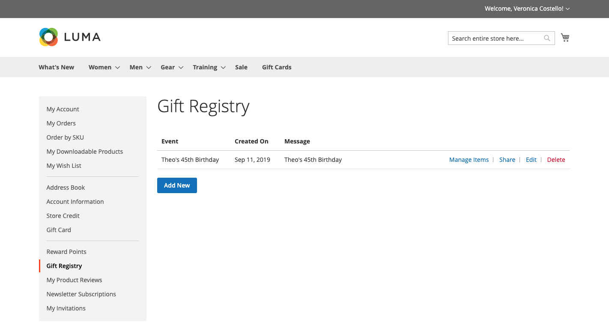
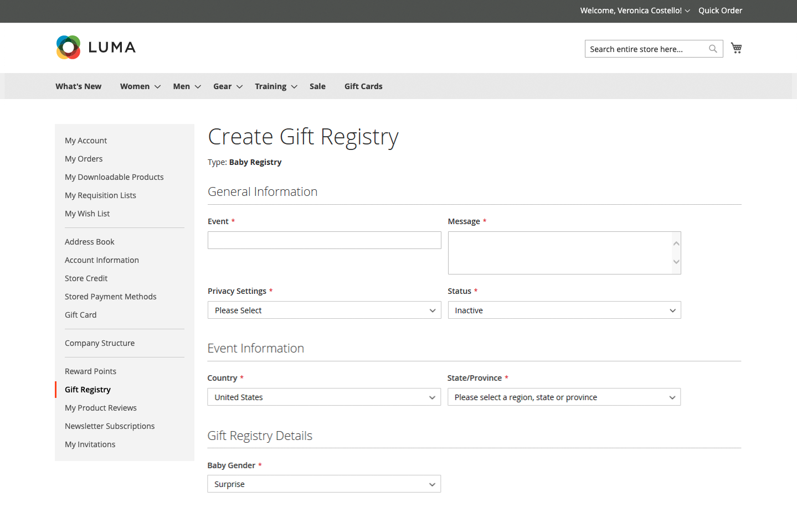
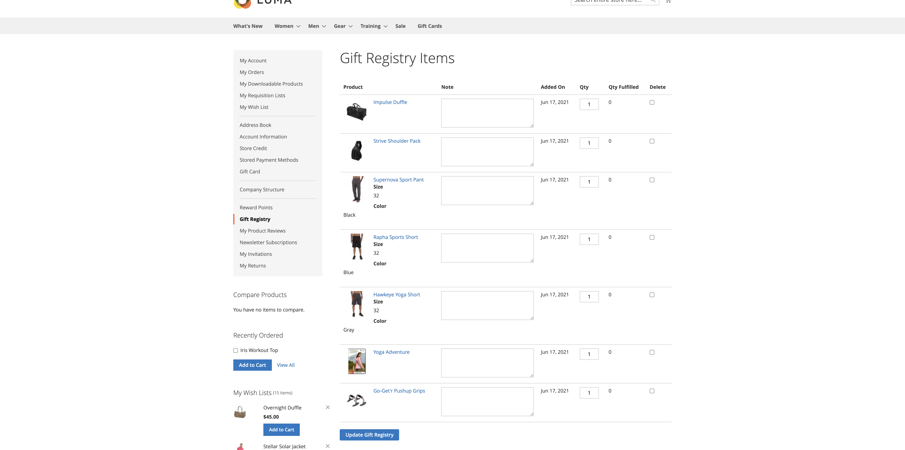

# Gift registry storefront experience

{{ee-feature}}

The [Gift Registry](gift-registries.md) section of the customer account lists the customer's current gift registries and the associated event. Customers can manage the current registries and add new ones.

{width="700" zoomable="yes"}

## Gift registry information

Customers can create and manage gift registries from their accounts. All information that is associated with each type of registry is available from the customer's account.

{width="700" zoomable="yes"}

|Section|Description|
|--- |--- |
|[!UICONTROL General Information]|This section typically includes the name of the event, a message or description of the event, privacy settings, and event status.|
|[!UICONTROL Event Information]|This section includes the location and date of the event. For a wedding, it might also include the number of guests each person can bring.|
|[!UICONTROL Gift Registry Details]|This might include additional information that is specific to the occasion.|
|[!UICONTROL Registrant Information]|This section includes the name and contact information of each person who is to receive notification of the  registry. For a wedding registry, the Role field might be included to associate the registrant as a friend of the bride or groom.|
|[!UICONTROL Shipping Address]|This section shows where gifts are to be sent, and includes the information a carrier needs to deliver the package.|

{style="table-layout:auto"}

>[!NOTE]
>
>When a gift registry is inactive, search and link do not function for the registry. If the registry is later reactivated, links remain broken.

## Create a gift registry

1. The customer selects **[!UICONTROL Gift Registry]** in their account dashboard.

1. On the _Gift Registry_ page, clicks **[!UICONTROL Add New]**.

1. Chooses a **[!UICONTROL Gift Registry Type]**, such as:

   - Birthday

   - Baby Registry

   - Wedding

1. Clicks **[!UICONTROL Next]**.

1. Enters the required information, and clicks **[!UICONTROL Save]**.

## Add a product to a registry

1. The customer opens the product that they want to add to the gift registry event.

1. Clicks **[!UICONTROL Add to Cart]**.

1. Clicks **[!UICONTROL View and Edit Cart]** on the mini cart.

1. On the Shopping Cart page, selects the event they want and clicks/taps **[!UICONTROL Add All To Gift Registry]**.

   Items are added to the gift registry of the selected event.

## Share a gift registry

1. From their account dashboard, the customer goes to **[!UICONTROL Gift Registry]**.

1. Finds the registry event that they want to manage and clicks **[!UICONTROL Share]**.

1. Enters the required information and clicks **[!UICONTROL Share Gift Registry]**.

## Edit a gift registry

1. From their account dashboard, the customer goes to **[!UICONTROL Gift Registry]**.

1. Finds the registry event that they want to manage and clicks **[!UICONTROL Edit]**.

1. Changes any options as needed.

1. Edits the required options and clicks **[!UICONTROL Save]**.

## Manage gift registry items

1. From their account dashboard, the customer goes to **[!UICONTROL Gift Registry]**.

   {width="700" zoomable="yes"}

1. Finds the registry event, selects the items that they want to manage, and clicks **[!DNL Manage Items]**.

1. Changes the required options, such as **[!UICONTROL Note]** and **[!UICONTROL Qty]**.

1. If needed, removes an item from the gift registry by selecting the checkbox and clicking **[!UICONTROL Delete]**.

1. Clicks **[!UICONTROL Update Gift Registry]** to save the changes.

## Delete a gift registry

1. From their account dashboard, the customer goes to **[!UICONTROL Gift Registry]**.

1. Finds the registry event that they want to manage and clicks **[!UICONTROL Delete]**.

1. Clicks **[!UICONTROL OK]** to confirm.
