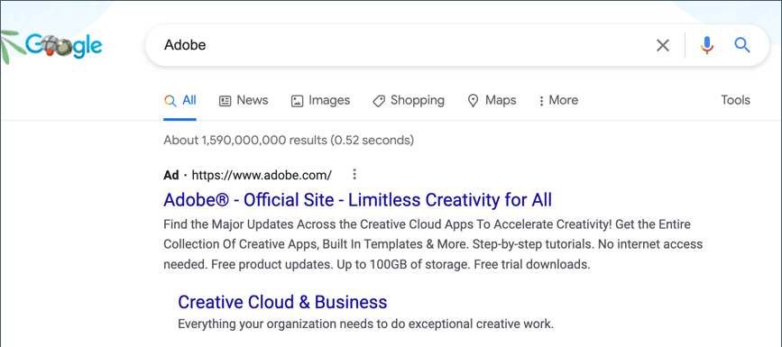

# Google AdWords

[Google AdWords][1] is a service that you can use to place ads in Google Search results and on the pages of companies in the Google Display Network. The AdWords dashboard includes tools to manage your campaigns, track response, and measure results.

Conversion tracking shows the number of ad clicks that lead to a sale or other valuable action. The _Success_ page that appears to your customer after an order has been submitted is used to track conversions because it appears only after a sale. After completing the Google AdWords configuration for your store, there is no need to copy the conversion tracking script to the Success page, because Commerce already has the necessary information. To learn more, see [Google AdWords Help][2].

<!-- zoom -->

## Step 1. Create a Google AdWords campaign

1. Visit [Google AdWords][3], and sign up for an account.

1. Follow the instructions to create a campaign.

1. To set up conversion tracking for your campaign, do the following:

   - On the **[!UICONTROL Tools]** tab of your AdWords dashboard, choose **[!UICONTROL Conversions]** and click **[!UICONTROL Conversion]**.

   - When prompted for the conversion source, choose **[!UICONTROL Website]**.

   - Enter a name for the conversion action that you want to track and click **[!UICONTROL Done]**.

   - Click **[!UICONTROL Value]** and, if applicable, assign a value to the conversion. For example:

      - If you make $5 on each sale, choose `Each time it happens` and assign a value of `$5`.
      - If the value of each sale varies, leave the value blank.

      To complete, click **[!UICONTROL Done]**.

   - Click **[!UICONTROL Conversion windows]** and complete the settings to determine how long the conversions are to be tracked, the reporting category, and the attribution model.

1. When complete, click **[!UICONTROL Save and Continue]**.

## Step 2. Get your conversion tag

1. Under **[!UICONTROL Install your tag]**, choose to count conversions on **[!UICONTROL Page load]**.

1. As an option, you can add the **[!UICONTROL Google Site Stats]** notification to the conversion page.

    The notification appears in the lower corner with a link to Google's security standards and cookie usage.

1. To choose how you want to manage your AdWords tag, do one of the following:

   - If you plan to add the script to your store yourself, choose **[!UICONTROL Save instructions and tag]**.
   - If you plan to have someone else add the script to your store, choose **[!UICONTROL Email instructions and tag]**.

1. When complete, click **[!UICONTROL Done]**.

## Step 3. Configure your store

{{gtag-api-note}}

1. On the _Admin_ sidebar, go to **[!UICONTROL Stores]** > _[!UICONTROL Settings]_ > **[!UICONTROL Configuration]**.

1. If configuring Google AdWords for a specific store view, do the following:

   - In the upper-left corner, choose the **[!UICONTROL Store View]** that is to be configured.

   - When prompted to confirm scope switching, click **[!UICONTROL OK]**.

1. In the left panel, expand **[!UICONTROL Sales]** and choose **[!UICONTROL Google API]**.

1. Expand  the **[!UICONTROL Google AdWords]** section and do the following:

   - Set **[!UICONTROL Enable]** to `Yes`.

   - Enter the **[!UICONTROL Conversion ID]** from your Google AdWords script.

   <!-- zoom -->

1. To format the Google Sites Stat notification, do the following:

   - Set **[!UICONTROL Conversion Language]** to the language that is identified in your Google AdWords script.

   - Enter the **[!UICONTROL Conversion Format]** to be used for the Google Sites Stat notification on the conversion page.

      - `1`  - Displays a one-line notification with a link to more information about Google tracking.
      - `2` - Displays a two-line notification with a link to more information about Google tracking.
      - `3` - Displays no customer notification.

   - Enter the [hexadecimal code][4]{:target="_blank"} for the **[!UICONTROL Conversion Color]** that you want to use for the Google Site Stats notification label.

   - Enter the encrypted text for the **[!UICONTROL Conversion Label]** that appears on the Google Sites Stat notification.

        For example: `MlEYCOKBnGoQz6CZoAM`

        **Sample Google AdWords Tag Code**

        ```html
        <!-- Google Code for Back to School Sale Conversion Page -->
        <script type="text/javascript">
        /* <![CDATA[ */
        var google_conversion_id = 999999999;
        var google_conversion_language = "en";
        var google_conversion_format = "3";
        var google_conversion_color = "ffffff";
        var google_conversion_label = "MlEYCOKBnGoQz6CZoAM";
        var google_remarketing_only = false;
        /* ]]> */
        </script>

        <script type="text/javascript" src="//www.googleadservices.com/pagead/conversion.js">
        </script>
        <noscript>
        <div style="display:inline;">
        

        </noscript>
        ```

1. Set **[!UICONTROL Conversion Value Type]** to one of the following:

   - `Dynamic` - Determines that a conversion has occurred based on the dynamic Order Amount value.
   - `Constant` - Determines that a conversion has occurred based on a specific value entered.

   For a _Constant_ conversion value type, enter a specific **[!UICONTROL Value]** for the _[!UICONTROL Order Amount]_ to qualify as a conversion.

1. When complete, click **[!UICONTROL Save Config]**.

## Step 4. Verify the configuration

Within a few hours, the tracking status in your Google AdWords dashboard changes from `Unverified` to `No recent conversions` or `Recording conversions`. When someone clicks your ad and makes a purchase, the conversion appears on the Conversion Actions page of your dashboard and campaign report.

[1]: https://www.google.com/adwords/
[2]: https://support.google.com/adwords/answer/6095821
[3]: https://ads.google.com/
[4]: https://www.w3schools.com/colors/colors_picker.asp
