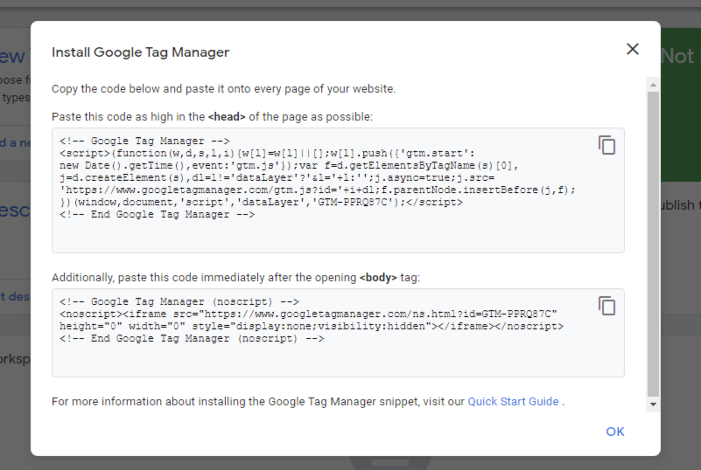
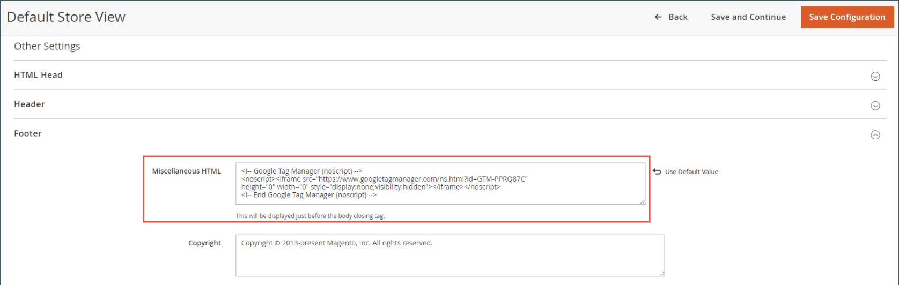
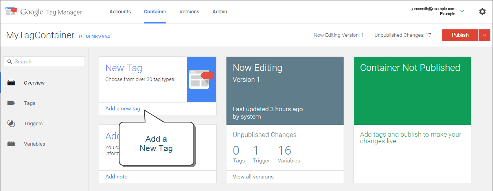
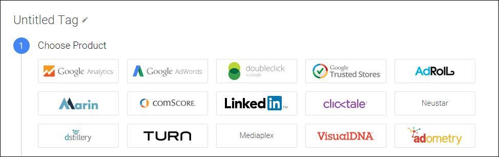
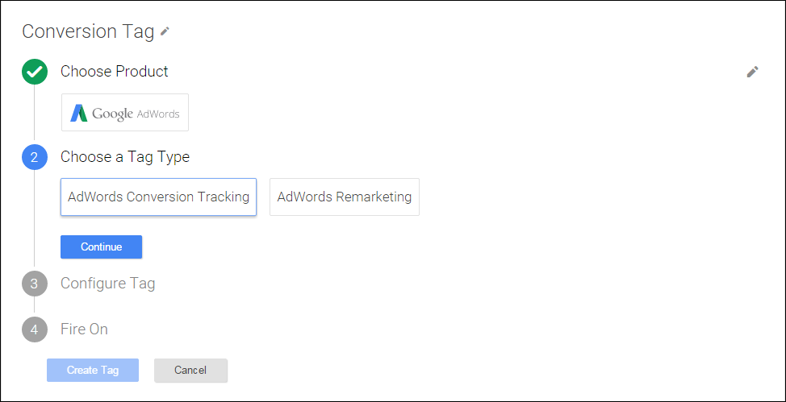
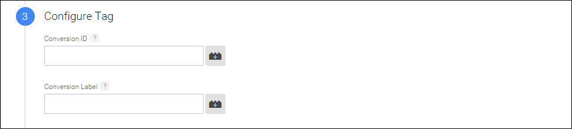
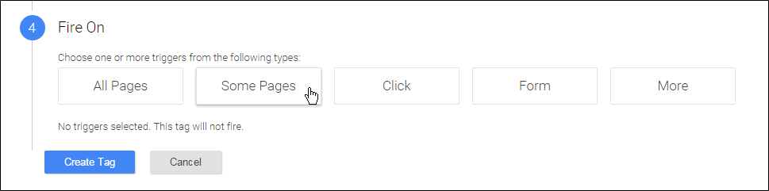
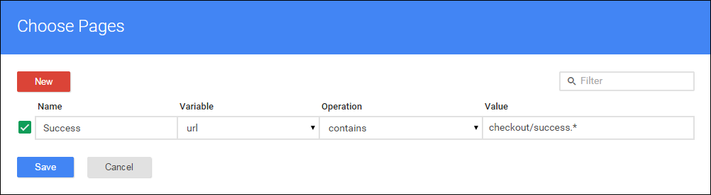
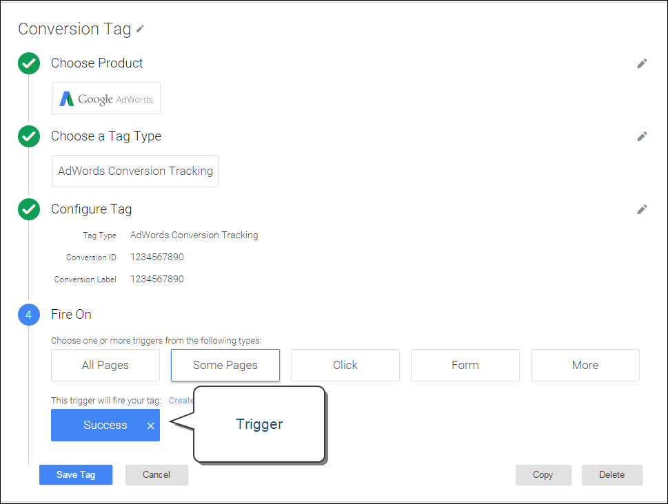

# Google Tag Manager

{{ee-feature}}

Google Tag Manager helps you manage the many tags, or snippets of code, that are related to your marketing campaign events. Google Tag Manager gives you the ability to add tracking tags to your site to measure the audience, or to personalize, retarget, or conduct search engine marketing initiatives.

Google Tag Manager directly transfers data and events to Google Analytics, Enhanced Ecommerce and other third-party analytics solutions, to produce a clear picture of how well your site, products, and promotions are performing.

You should have a Google Analytics and Tag Manager account to continue this process. The following instructions walk you through the process of configuring your Google accounts, configuring your Commerce store, and creating a tag.

>[!NOTE]
>
>If your business is subject to privacy regulations such as the [General Data Protection Regulation](../getting-started/compliance-gdpr.md) and/or the [California Consumer Privacy Act](../getting-started/compliance-ccpa.md), see [Google Privacy Settings](google-tools.md#google-privacy-settings).

## Step 1. Configure your Google Analytics account

See Google's [Set up Site Search][7] for the basics you need to get started. Also see the Google guides for [Google Analytics][1] and [Google Tag Manager][2].

1. Sign in to your Google Analytics account.

1. To enable **Internal Site Search Tracking**, do the following:

    - Navigate to **Select View** > **View Settings**.

    - Set **Site Search Tracking** to `On`.

    - Set **Query** parameter to `q`.

    - When complete, **Save** the settings.

1. To enable display features, do the following:

    - Choose **Property Settings**.

    - Under Advertising Features, set **Enable Demographics and Interest Reports** to `On`.

    - **Save** the settings.

1. To enable Ecommerce Tracking, do the following:

    - Navigate to **Select View** > **Ecommerce Settings**.

    - Set **Enable Ecommerce** to `On`.

    - Set **Enable Enhanced Ecommerce Reporting** to `On`.

    - **Save** the settings.

1. Reload the page to verify that all the settings remain `On`.

   >[!NOTE]
   >
   >If not all settings are `On`, repeat the previous steps, save, and reload the page. Repeat this process until all settings are set to `On`.

## Step 2. Configure your Google Tag Manager account

The following instructions show how to configure a new container with the basic settings. A sample [Composer][4] configuration (.json) file is used to simplify the process, importing to generate a tag in a new container. For this example, we recommend that you create a new container, rather than modify an existing container.

>[!NOTE]
>
>For additional information, see Google's [Container export and import][5]. These instructions walk-through importing a sample JSON to a new container.

1. Download the linked file [GTM_M2_Config_json.txt][6] and open the file in an editor, and save as `GTM_M2_Config.json`.

   The json file is uploaded directly to Google Tag Manager and does not need to be copied to your server.

1. Navigate to **Admin** > **Container** > **Import Container**.

1. Click **Choose container file** and select the json file.

1. Under **Choose workspace**, click **New**.

1. Enter a title and description, then click **Save**.

1. Select one of the following actions to import the file:

    - The **Overwrite** option should be selected for a new container.

    - The **Merge** option should be selected if you are using an existing container.

1. Click **Preview** to review the tags, triggers, and variables.

1. To edit the **Google Analytics ID** that is referenced in variables, do the following:

    - Navigate to **Variables** > **User-Defined Variables**.

    - Choose **Google Analytics** and update the placeholder (`UA-xxxxxx-x`) with your own **GA ID**.

1. Follow Google's instructions to add tags, triggers, and variables to the new container.

    If you have settings in another container that you want to use, they can be moved to the new container.

1. Click **Confirm** when complete.

1. Follow Google's instructions to publish the new container.

## Step 3. Configure your store

1. Log in to the Admin of your Commerce store.

1. On the _Admin_ sidebar, go to **Stores** > _Settings_ > **Configuration**.

1. In the left panel, expand **Sales** and choose **Google API**.

1. Expand  the **Google Analytics** section and configure the following:

    <!-- zoom -->

    - Set **Enable** to `Yes`.

    - Set **Account type** to `Google Tag Manager`.

    - In the **Container ID** field, enter your GTM ID (`GTM-xxxxxx`).

    - If you are also using Google Analytics to content experiments, set **Enable Content Experiments** to `Yes`.

    - Use the default values for the remaining fields.

    {{gtag-api-note}}

1. When complete, click **Save Config**.

1. Test your Google Tag Manager settings to verify that everything works correctly.

>[!NOTE]
>
>Each container is associated with one website and you only need one container per account. If you have a multi-site Commerce instance, you need separate containers.

## Step 4. Add the GTM code to your Adobe Commerce store

1. To copy the GTM code, go to **Admin** > **Install Google Tag Manager**.

   There are two GTM code snippets to be added to your Commerce site: the first one for the `<head>` tag and the and the second for the `<body>` tag.

    <!-- zoom -->

1. In the Commerce Admin, go to **Content** > _Design_ > **Configuration** and open the store view in edit mode.

1. Under _Other Settings_, expand **HTML Head** and paste the code you copied from GTM for the `<head>` tag in the **Scripts and Style Sheets** field.

    <!-- zoom -->

1. Expand **Footer** and paste the GTM code for `<body>` in the **Miscellaneous HTML** field.

    <!-- zoom -->

1. When complete, click **Save Configuration**.

## Field descriptions

|Field|Scope|Description|
|--- |--- |--- |
|Enable|Store View|Determines if Google Analytics Enhanced Ecommerce can be used to analyze activity in your store. Options: Yes / No|
|Account type|Store View|Determines the Google tracking code that is used to monitor store activity and traffic.  Options: Google Analytics / Google Tag Manager|
|Anonymize IP|Store View|Determines if identifying information is removed from IP addresses that appear in Google Analytics results.|
|Enable Content Experiments|Store View|Activates Google Content Experiments, which can be used to test up to ten different versions of the same page. Options: Yes / No|
|Container Id|Store View|If Google Tag manager is already installed and configured for your store, the Container ID appears automatically in this field.|
|List property for the catalog page|Store View|Identifies the Tag Manager property associated with the catalog page. Default value: Catalog Page|
|List property for the cross-sell block|Store View|Identifies the Tag Manager property associated with the cross-sell block. Default value: Cross-sell|
|List property for the up-sell block|Store View|Identifies the Tag Manager property associated with the up-sell block. Default value: Up-sell|
|List property for the related products block|Store View|Identifies the Tag Manager property associated with the related products block. Default value: Related Products|
|List property for the search results page|Store View|Identifies the Tag Manager property associated with the search results page. Default value: Search Results|
|"Internal Promotions" for promotions field "Label"|Store View|Identifies the Tag Manager property associated with the labels for internal promotions. Default value: Label|

{style="table-layout:auto"}

## Create a tag to track conversions

If you have a Google AdWords account, you can create a tag that tracks conversions. The following example shows how to use both Google Tag Manager and Google Analytics to create a tag that fires on your store's conversion "Success" page.

### Step 1. Create a tag

1. Log in to your Google Tag Manager account and click the link for the container that you created for your store.

1. In the **New Tag** box, click **Add a new tag**.

   <!-- zoom -->

1. Get the following information from your AdWords account:

    - Conversion ID
    - Conversion Label

   If you need help, visit Google's [support site][8].

1. From the Google Tag Manager dashboard, click **Google AdWords** and do the following:

    - Click the title placeholder and enter a name for the new tag.

    - Under **Choose Product**, select **Google Adwords**.

      <!-- zoom -->

    - Under **Choose a Tag Type**, select **AdWords Conversion Tracking** and click **Continue**.

      <!-- zoom -->

1. Enter the **Conversion ID** and **Conversion Label** from your AdWords account and click **Continue**.

    <!-- zoom -->

### Step 2. Create a rule

Continuing from the Google Tag Manager dashboard, the next step is to create a rule that fires the tag on the conversion page.

1. Under **Fire On**, click **Some Pages**.

    <!-- zoom -->

1. In the _Choose Pages_ section, complete the following settings:

   - **Name**: Enter a name for the page description.

   - **Variable**: url

   - **Operation**: matches RegEx

      To learn more, see [Regex and CSS selector operators][9] in Tag Manager Help.

   - **Value**: `checkout/success.*`

   <!-- zoom -->

1. Select the green checkbox and click **Save**.

   The trigger that you set up appears as a blue button in the Fire On section.

1. When complete, click **Save Tag**.

   <!-- zoom -->

### Step 3. Preview and publish

The next step in the process is to preview the tag. Each time the tag is previewed, a snapshot of the version is saved. When you are satisfied with the results, go to the version that you want to use and click **Publish.**

[1]: https://support.google.com/analytics/answer/1008015
[2]: https://support.google.com/tagmanager/answer/6102821
[3]: https://support.google.com/analytics/answer/1012264
[4]: https://developer.adobe.com/commerce/php/development/composer/
[5]: https://support.google.com/tagmanager/answer/6106997
[6]: https://docs.magento.com/m2/downloads/GTM_M2_Config_json.txt
[7]: https://support.google.com/analytics/answer/1012264
[8]: https://support.google.com/tagmanager/answer/6105160
[9]: https://support.google.com/tagmanager/answer/7679109
