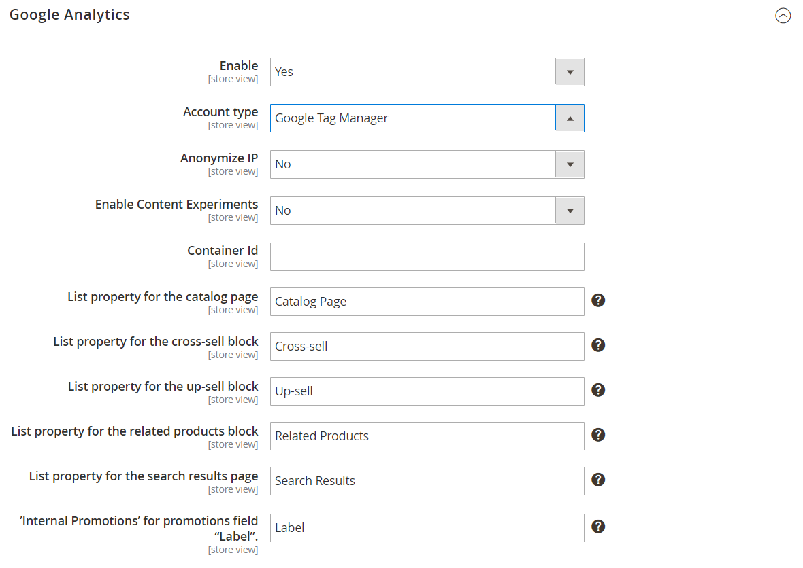

# [!DNL Google Tag Manager]

{{ee-feature}}

[!DNL Google Tag Manager] is a powerful tool that helps you efficiently manage and deploy various tags (snippets of code) associated with your marketing campaign events. [!DNL Google Tag Manager] gives you the ability to add tracking tags to your site to measure the audience, or to personalize, retarget, or conduct search engine marketing initiatives.

[!DNL Google Tag Manager] directly transfers data and events to [!DNL Google Analytics], Enhanced Ecommerce, and other third-party analytics solutions to produce a clear picture of how well your site, products, and promotions are performing.

You should have a [!DNL Google Analytics] and [!DNL Tag Manager] account to continue this process. The following instructions walk you through the process of configuring your Google accounts, configuring your Commerce store, and creating a tag.

>[!NOTE]
>
>If your business is subject to privacy regulations such as the [General Data Protection Regulation](../getting-started/compliance-gdpr.md) and/or the [California Consumer Privacy Act](../getting-started/compliance-ccpa.md), see [Google Privacy Settings](google-tools.md#google-privacy-settings).

## Step 1. Configure your [!DNL Google Analytics] account

See [Set up Site Search](https://support.google.com/analytics/answer/1012264) in Google Help for the basics you need for getting started. Also see the Google guides for [Google Analytics](https://support.google.com/analytics/answer/9304153) and [Google Tag Manager](https://support.google.com/tagmanager/answer/6102821).

1. Sign in to your [!DNL Google Analytics] account.

1. To enable **[!UICONTROL Internal Site Search Tracking]**, do the following:

    - Navigate to **[!UICONTROL Select View]** > **[!UICONTROL View Settings]**.

    - Set **[!UICONTROL Site Search Tracking]** to `On`.

    - Set **[!UICONTROL Query]** parameter to `q`.

    - When complete, **[!UICONTROL Save]** the settings.

1. To enable display features, do the following:

    - Choose **[!UICONTROL Property Settings]**.

    - Under _[!UICONTROL Advertising Features]_, set **[!UICONTROL Enable Demographics and Interest Reports]** to `On`.

    - **[!UICONTROL Save]** the settings.

1. To enable Ecommerce Tracking, do the following:

    - Navigate to **[!UICONTROL Select View]** > **[!UICONTROL Ecommerce Settings]**.

    - Set **[!UICONTROL Enable Ecommerce]** to `On`.

    - Set **[!UICONTROL Enable Enhanced Ecommerce Reporting]** to `On`.

    - **[!UICONTROL Save]** the settings.

1. Reload the page and verify that all the settings remain `On`.

   >[!NOTE]
   >
   >If not all settings are `On`, repeat the previous steps, save, and reload the page. Repeat this process until all settings are set to `On`.

## Step 2. Configure your [!DNL Google Tag Manager] account

The following instructions show how to configure a new container with the basic settings. A sample [Composer](https://developer.adobe.com/commerce/php/development/composer/) configuration (.json) file is used to simplify the process, importing to generate a tag in a new container. For this example, creating a container, rather than modify an existing container, is recommended.

>[!NOTE]
>
>For additional information, see Google's [Container export and import](https://support.google.com/tagmanager/answer/6106997). These instructions provide a walk-through for importing a sample JSON in a new container.

1. Download the linked file [GTM_M2_Config_json.txt](./assets/GTM_M2_Config_json.txt), open the file in an editor, and save it as `GTM_M2_Config.json`.

   The json file is uploaded directly to [!DNL Google Tag Manager].

1. Navigate to **[!UICONTROL Admin]** > **[!UICONTROL Container]** > **[!UICONTROL Import Container]**.

1. Click **[!UICONTROL Choose container file]** and select the json file.

1. Under **[!UICONTROL Choose workspace]**, click **[!UICONTROL New]**.

1. Enter a title and description, then click **[!UICONTROL Save]**.

1. To import the file, select one of the following actions:

    - The **[!UICONTROL Overwrite]** option should be selected for a new container.

    - The **[!UICONTROL Merge]** option should be selected if you are using an existing container.

1. Click **[!UICONTROL Preview]** to review the tags, triggers, and variables.

1. To edit the **[!UICONTROL Google Analytics ID]** that is referenced in variables, do the following:

    - Navigate to **[!UICONTROL Variables]** > **[!UICONTROL User-Defined Variables]**.

    - Choose **[!UICONTROL Google Analytics]** and update the placeholder (`UA-xxxxxx-x`) with your own **[!UICONTROL GA ID]**.

1. Follow Google's instructions for adding tags, triggers, and variables to the new container.

    If you have settings in another container that you want to use, they can be moved to the new container.

1. Click **[!UICONTROL Confirm]** when complete.

1. Follow Google's instructions for publishing the new container.

## Step 3. Configure your store

{{gtag-api-note}}

1. Log in to the Admin of your Commerce store.

1. On the _Admin_ sidebar, go to **[!UICONTROL Stores]** > _[!UICONTROL Settings]_ > **[!UICONTROL Configuration]**.

1. In the left panel, expand **[!UICONTROL Sales]** and choose **[!UICONTROL Google API]**.

1. Expand  the **[!UICONTROL Google Analytics]** section and configure the following:

    {width="600" zoomable="yes"}

    - Set **[!UICONTROL Enable]** to `Yes`.

    - Set **[!UICONTROL Account type]** to `Google Tag Manager`.

    - In the **[!UICONTROL Container ID]** field, enter your GTM ID (`GTM-xxxxxx`).

    - If you are also using Google Analytics to content experiments, set **Enable Content Experiments** to `Yes`.

    - Use the default values for the remaining fields.

1. When complete, click **[!UICONTROL Save Config]**.

1. Test your [!DNL Google Tag Manager] settings and verify that everything works correctly.

>[!NOTE]
>
>Each container is associated with one website and you only need one container per account. If you have a multi-site Commerce instance, you need separate containers.

## Field descriptions

|Field|Scope|Description|
|--- |--- |--- |
|[!UICONTROL Enable]|Store View|Determines if Google Analytics Enhanced Ecommerce can be used to analyze activity in your store. Options: `Yes` / `No`|
|[!UICONTROL Account type]|Store View|Determines the Google tracking code that is used to monitor store activity and traffic. Options: `Google Analytics` / `Google Tag Manager`|
|[!UICONTROL Anonymize IP]|Store View|Determines if identifying information is removed from IP addresses that appear in Google Analytics results.|
|[!UICONTROL Enable Content Experiments]|Store View|Activates Google Content Experiments, which can be used to test up to ten different versions of the same page. Options: `Yes` / `No`|
|[!UICONTROL Container Id]|Store View|If [!DNL Google Tag Manager] is already installed and configured for your store, the Container ID appears automatically in this field.|
|[!UICONTROL List property for the catalog page]|Store View|Identifies the Tag Manager property associated with the catalog page. Default value: `Catalog Page`|
|[!UICONTROL List property for the cross-sell block]|Store View|Identifies the Tag Manager property associated with the cross-sell block. Default value: `Cross-sell`|
|[!UICONTROL List property for the up-sell block]|Store View|Identifies the Tag Manager property associated with the up-sell block. Default value: `Up-sell`|
|[!UICONTROL List property for the related products block]|Store View|Identifies the Tag Manager property associated with the related products block. Default value: `Related Products`|
|[!UICONTROL List property for the search results page]|Store View|Identifies the Tag Manager property associated with the search results page. Default value: `Search Results`|
|[!UICONTROL "Internal Promotions" for promotions field "Label"]|Store View|Identifies the Tag Manager property associated with the labels for internal promotions. Default value: `Label`|

{style="table-layout:auto"}

## Create a tag for tracking conversions

If you have a Google AdWords account, you can create a tag that tracks conversions. The following example shows how to use both [!DNL Google Tag Manager] and [!DNL Google Analytics] to create a tag that fires on your store's conversion _Success_ page.

### Step 1. Create a tag

1. Log in to your [!DNL Google Tag Manager] account and click the link for the container that you created for your store.

1. In the **[!UICONTROL New Tag]** box, click **[!UICONTROL Add a new tag]**.

1. Get the following information from your AdWords account:

    - Conversion ID
    - Conversion Label

   If you need help, visit Google's [support site](https://support.google.com/tagmanager/answer/6105160).

1. From the [!DNL Google Tag Manager] dashboard, click **[!UICONTROL Google AdWords]** and do the following:

    - Click the title placeholder and enter a name for the new tag.

    - Under **[!UICONTROL Choose Product]**, select **[!UICONTROL Google AdWords]**.

    - Under _[!UICONTROL Choose a Tag Type]_, select **[!UICONTROL AdWords Conversion Tracking]** and click **[!UICONTROL Continue]**.

1. Enter the **[!UICONTROL Conversion ID]** and **[!UICONTROL Conversion Label]** from your AdWords account and click **[!UICONTROL Continue]**.

### Step 2. Create a rule

Continuing from the [!DNL Google Tag Manager] dashboard, the next step is to create a rule that fires the tag on the conversion page.

1. Under **[!UICONTROL Fire On]**, click **[!UICONTROL Some Pages]**.

1. In the _[!UICONTROL Choose Pages]_ section, complete the following settings:

   - **[!UICONTROL Name]** - Enter a name for the page description.

   - **[!UICONTROL Variable]** `url`

   - **Operation** - `matches RegEx`

      To learn more, see [Regex and CSS selector operators](https://support.google.com/tagmanager/answer/7679109) in the Google Tag Manager Help.

   - **[!UICONTROL Value]** - `checkout/success.*`

1. Select the green checkbox and click **[!UICONTROL Save]**.

   The trigger that you set up appears as a blue button in the Fire On section.

1. When complete, click **[!UICONTROL Save Tag]**.

### Step 3. Preview and publish

The next step in the process is to preview the tag. Each time the tag is previewed, a snapshot of the version is saved. When you are satisfied with the results, go to the version that you want to use and click **[!UICONTROL Publish]**.

## Custom HTML Tag with JavaScript

This section explains how to add a CSP Nonce to the Custom HTML Tag JavaScript for execution on the checkout page, ensuring compliance with Content Security Policy (CSP) requirements. This addition enhances site security by preventing the execution of unauthorized scripts. For more detailed information, see the [Content Security Policy](https://developer.adobe.com/commerce/php/development/security/content-security-policies) documentation.

>[!NOTE]
>
>Importing the `cspNonce` global variable into Google Tag Manager is supported only on Adobe Commerce version 2.4.8 and later.

>[!WARNING]
>
>Adding unfamiliar scripts to your store can risk data compromise. Scripts authorized on the checkout page may steal sensitive customer information, including payment details. It is essential to take precautions to protect your Google Tag Manager account. Only add trusted scripts, regularly review and audit your tags, and implement strong security measures like two-factor authentication (2FA) and access controls.

### Step 1. Create a CSP Nonce Variable

You can create a CSP Nonce Variable that can be used within your Google Tag Manager by importing the variable configuration or configuring it manually.

#### Import the variable configuration

The CSP Nonce Variable is included in the example container [GTM_M2_Config_json.txt](./assets/GTM_M2_Config_json.txt). You can create the variable by importing this code into your workspace.

#### Create the variable manually

If you can't import the variable configuration, complete the following the steps below to create it.

1. In your workspace, navigate to the **Variables** section in the sidebar.
1. Click on the **New** button at the bottom of the page in the **User-Defined Variables** section.
1. Name the variable `gtmNonce`.
1. Click on the pencil icon to edit the variable.
1. Select **JavaScript Variable** from the **Page Variable** section.
1. In the **Global Variable Name** field, enter `window.cspNonce`.
1. Save the variable.

To learn more about [Google Tag Manager Variables](https://support.google.com/tagmanager/answer/7683056?hl=en), see [User-defined variable types for web](https://support.google.com/tagmanager/answer/7683362?hl=en) in the Google documentation. This documentation offers detailed guidance on creating and managing custom variables to tailor your tag management for specific marketing and analytical needs.

### Step 2. Create a Custom HTML Tag

1. In your workspace, navigate to the **Tags** section in the sidebar.
1. Click the **New** button.
1. In the **Tag Configuration** section, select **Custom HTML Tag**.
1. Enter your required JavaScript in the text area, and add a nonce attribute to the opening `<script>` tag, pointing to the variable you created in the previous step. For example:

    ```html
    <script nonce="{{gtmNonce}}">
        // Your JavaScript code here
    </script>
    ```

1. Select **Support document.write**.
1. In the **Triggering** section, select the desired trigger. For example, **Consent Initialization - All Pages**.

For more information about [Tags](https://support.google.com/tagmanager/answer/3281060) in Google Tag Manager, see [Custom tags](https://support.google.com/tagmanager/answer/6107167) in the Google documentation.
