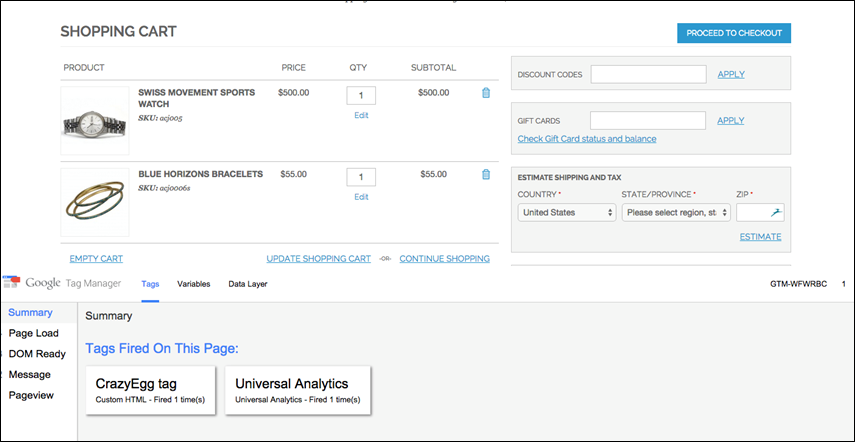
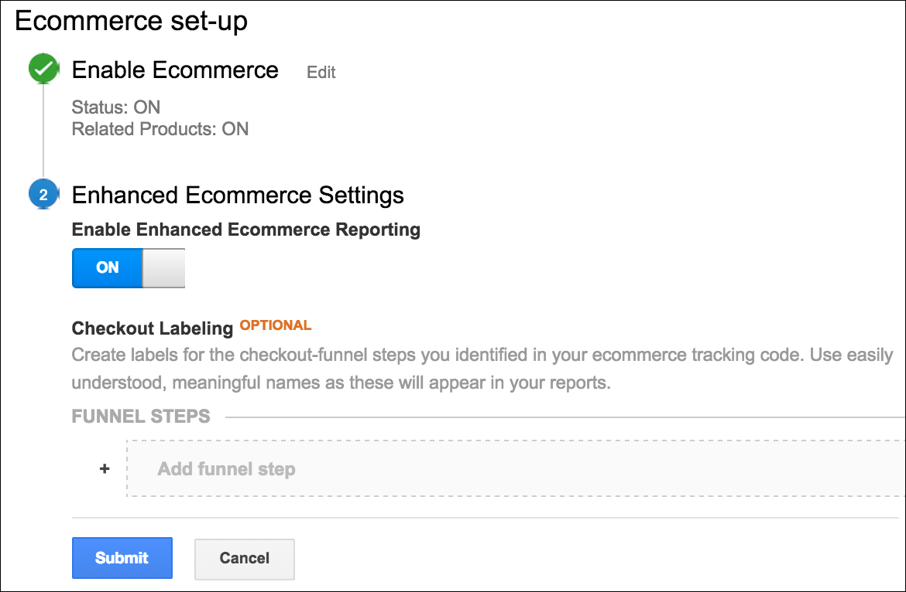

# Google Analytics

Google Analytics gives you the ability to define additional custom dimensions and metrics for tracking, with support for offline and mobile app interactions, and access to ongoing updates. Google Analytics 4 is Google's next-generation measurement solution, and is replacing Universal Analytics. On July 1, 2023, standard Universal Analytics properties will stop processing new hits.

>[!NOTE]
>
>If your business is subject to privacy regulations such as the [General Data Protection Regulation](../getting-started/compliance-gdpr.md) and/or the [California Consumer Privacy Act](../getting-started/compliance-ccpa.md), see [Google Privacy Settings](google-tools.md#google-privacy-settings).

## Google Universal Analytics

>[!IMPORTANT]
>
>On July 1, 2023, standard Universal Analytics properties will no longer process data. If you still rely on Universal Analytics, it is recommended that you [prepare to use Google Analytics 4](https://support.google.com/analytics/answer/10759417) going forward.

### Step 1: Set up Google Universal Analytics

Visit the Google website, and sign up for a [Google Universal Analytics][1] account.

### Step 2: Complete the Commerce configuration

1. Log in to the Admin for your Commerce store.

1. On the _Admin_ sidebar, go to **Stores** > _Settings_ > **Configuration**.

1. In the left panel, expand **Sales** and choose **Google API**.

1. Expand  the **Google Analytics** section and do the following:

   - Set **Enable** to `Yes`.

   - Enter your Google Analytics **Account Number**.

   - If you want to conduct A/B testing and other performance tests on your content, set **Content Experiments** to `Yes`.

   <!-- zoom -->

1. When complete, click **Save Config**.

>[!IMPORTANT]
>
>If you enable the [Cookie Restriction Mode](../getting-started/compliance-cookie-law.md), Google Analytics does not collect data about visitors unless they have accepted cookies.

## Google Analytics 4

{{#gtag-api-note}}

### Step 1: Set up Google Analytics 4

If you do not already have a Google Analytics 4 setup for your site, follow one of these methods:

- [Set up Analytics data collection for the first time](https://support.google.com/analytics/answer/9304153)
- [Add Google Analytics 4 to a site with Universal Analytics](https://support.google.com/analytics/answer/9744165)

### Step 2: Complete the Commerce configuration

1. Log in to the Admin for your Commerce store.

1. On the _Admin_ sidebar, go to **Stores** > _Settings_ > **Configuration**.

1. In the left panel, expand **Sales** and choose **Google API**.

1. Expand  the **Google GTag** section.

1. Expand  the **Google Analytics4** subsection and do the following:

   - Set **Enable** to `Yes`.

   - Leave the **Account type** as `Google Analytics4`.

   - Enter your **Measurement ID**. To learn more, see [Google Analytics Help](https://support.google.com/analytics/answer/9539598).

   - If you want to conduct A/B testing and other performance tests on your content, set **Content Experiments** to `Yes`.

   <!-- zoom -->

   [_Google API - GTag - Google Analytics4_](../configuration-reference/sales/google-api.md %})

1. When complete, click **Save Config**.

## Enhanced Ecommerce

Enhanced Ecommerce is a plugin for Google Universal Analytics that gives you insight into the shopping and purchasing behavior of your customers. You can use Enhanced Ecommerce to produce reports about key customer activities, such as when customers add items the cart, begin the checkout process, or complete a purchase. You can also identify and analyze patterns of shoppers who abandon their carts without making a purchase.

The following instructions show how to configure Google Tag Manager with Universal Analytics to produce Enhanced Ecommerce data and reports.

<!-- zoom -->

### Step 1. Sign Up for Google Accounts

1. Sign up for a [Google Tag Manager](google-tag-manager.md) account, and complete the Commerce configuration.

1. Sign up for a new [Google Universal Analytics][1] account.

### Step 2. Configure Enhanced Ecommerce

1. Sign in to your Google Universal Analytics account.

1. Create a new property for Enhanced Ecommerce analytics with the following settings:

   - Status: ON
   - Related Products: ON
   - Enable Enhanced Ecommerce Reporting: ON
   - Checkout Labeling: (not required)

1. When complete, click **Submit**.

    <!-- zoom -->

### Step 3. Create Tags and Triggers

1. Sign in to your Google Tag Manager account and create the following triggers:

    |Name|Event Type|Filter|
    |--- |--- |--- |
    |addToCart|Custom Event||
    |checkout|Custom Event||
    |checkout only|Page View|Page URL matches RegEx /checkout/.*|
    |checkoutOption|Custom Event||
    |gtm.dom|Custom Event||
    |productClick|Custom Event||
    |promotionClick|Custom Event||
    |removeFromCart|Custom Event||

1. Create the following Universal Analytics tags with the same basic configuration.

   - Universal Analytics Tags

      |Name|Type|Firing triggers|
      |--- |--- |--- |
      |Add to cart tracking|Universal Analytics|addToCart|
      |Checkout option tracking|Universal Analytics|checkoutOption|
      |Checkout tracking|Universal Analytics|checkout|
      |Pageview tracking|Universal Analytics|gtm.dom|
      |Product click tracking|Universal Analytics|productClick|
      |Promo click tracking|Universal Analytics|promotionClick|
      |Remove from cart tracking|Universal Analytics|removeFromCart|

   - Basic Tag Configuration

      |Setting|Value|
      |--- |--- |
      |Product|Google Analytics|
      |Tag Type|Universal Analytics|
      |Tracking ID|UA-XXX (The tracking ID from your Universal Analytics account.)|
      |Enable Enhanced Ecommerce Features|True|
      |Use data layer|True|
      |Use Debug version|True|

1. Complete the individual tracking configurations.

   - Enter the following **Add to Cart** tracking settings:

      |Setting|Value|
      |--- |--- |
      |Track Type|Event|
      |Category|Ecommerce|
      |Action|Add to Cart|
      |Trigger|addToCart|

   - Enter the following **Checkout option** tracking settings:

      |Setting|Value|
      |--- |--- |
      |Track Type|Event|
      |Category|Ecommerce|
      |Action|Checkout Option|
      |Trigger|checkoutOption|

   - Enter the following **PageView** tracking settings:

      |Setting|Value|
      |--- |--- |
      |Track Type|PageView|
      |Trigger|gtm.dom|

   - Complete the following **Product Click** tracking configuration:

      |Setting|Value|
      |--- |--- |
      |Track Type|Event|
      |Category|Ecommerce|
      |Action|Product Click|
      |Trigger|productClick|

   - Complete the following **Promotion Click** tracking configuration:

      |Setting|Value|
      |--- |--- |
      |Track Type|Event|
      |Category|Ecommerce|
      |Action|Promotion Click|
      |Trigger|promotionClick|

   - Complete the following **Remove from Cart** tracking configuration:

      |Setting|Value|
      |--- |--- |
      |Track Type|Event|
      |Category|Ecommerce|
      |Action|Remove from Cart|
      |Trigger|removeFromCart|

1. When complete, click **Preview** and verify that the tags work correctly.

1. After verifying the settings, click **Publish**.

[1]: https://support.google.com/analytics/answer/2817075?hl=en
