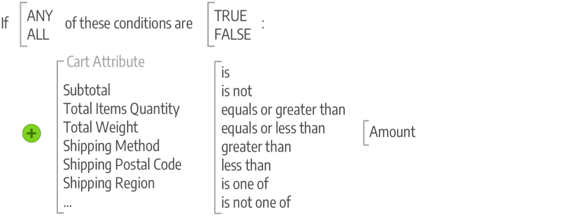

# Introduction to merchandising and promotions

Target promotions and create opportunities for customer engagement, and turn shoppers into buyers. Manage customer relationships by supporting post-purchase activities and offering special discounts to returning customers. Learn best practices and techniques to support your SEO initiatives.

## Merchandising

_Merchandising_ is a term used in retail to describe the art and science of floor plan development and the presentation of products.  In your Adobe Commerce store, you might think of the [category-based navigation] as the floor plan of the store, and the dynamic presentation of products as the conditions that you can apply to the listing of products in the store. Additionally, you can implement programs that drive more product sales.

>[!TIP]
>
>To learn about Product Recommendations and how they can give you the insight and control you need to create the best experience for your buyers, see the [Product Recommendations User Guide](https://experienceleague.adobe.com/docs/commerce-merchant-services/product-recommendations/guide-overview.html).

- [Visual Merchandiser](visual-merchandiser.md) - A set of advanced tools that allows you to position products, and apply conditions that determine which products appear in the category listing.

- [Gift registries](gift-registries.md) - Give your customers the ability to create gift registries for special occasions, and to invite their friends and family to purchase their gifts from the gift registry.

- [Rewards and loyalty](rewards-loyalty.md) - Use a points system to implement unique programs that drive customer engagement and promote customer loyalty. You can award points for a wide range of transaction and customer activities and control the point allotment, balance, and expiration.

- [Private sales and events](events-private-sales.md) - Use your existing customer base to generate buzz and new leads, or to offload surplus inventory through private sales and other catalog events.

## Promotions

In Adobe Commerce, use the promotions features to set up product relationships and use price rules to trigger discounts based on a variety of conditions.

You can use price rules to offer customer incentives, such as:

- Send your best customers a coupon for a discount on a specific product
- Offer free shipping for purchases over a certain amount
- Schedule a promotion for a period of time

A rule is a collection of conditions (one or more) that apply changes in prices to products when one or all are met. Each rule can have multiple conditions, applying when all or any (one or more, but not all) statements are true or false.

Conditions are statements that refine the list of products and situations for applying the rule. The attributes and options for conditions differ between the types of available rules. When met, the action is completed such as discounts, buy one get one free (BOGO), and other options. Rules can be as simple or as complicated as needed to match your business needs, seasonal discounts and promotions, and year long opportunities. For example, you may want to add a few more options for the holidays while providing free shipping year-round when carts have a high subtotal.

>[!NOTE]
>
>If you want to define a condition based on a specific product attribute, **Use for Promo Rule Conditions** must be set to `Yes` for the attribute in your [Storefront Properties](../catalog/attribute-product-create.md).

For [catalog price rules](price-rules-catalog.md), you build conditions based on [attribute sets](../catalog/attribute-sets.md) in your catalog, comparison functions, and selected attributes. You create the conditions like sentences by selecting a few statements. For example, you may create two price rules to apply discounts for children's clothing and men's/women's clothing based on the category.

<!-- zoom -->

[Cart price rule](price-rules-cart.md) conditions can be based on any category that is a child of the store's [root](../catalog/category-root.md). Price rules are set up in advance, and spring into action whenever the required conditions are met. These rules use attributes including product attribute combination like matching a SKU in the cart using product attributes, product subselection like the total quantity matching conditions, condition combinations for complicated rules, and cart attributes like subtotal.

<!-- zoom -->

## Communications and SEO

Mastering [Search Engine Optimization (SEO)](seo-overview.md) is crucial to bring in potential buyers. Learn about search engine optimization and fine-tuning the content and presentation of your site to improve the way the pages are indexed by search engines.

One of the tasks to complete before launching your store is to review the email templates that are used for all communications sent from your store to make sure that they reflect your brand. But you should take this a step further by developing other communications that promote your brand and products to existing customers. You can personalize the content with variables and markup tags.

>[!NOTE]
>
>Adobe Commerce and Magento Open Source releases 2.4.0 through 2.4.3 included the dotdigital vendor-developed extension used to integrate with the dotdigital Engagement Cloud. Starting with the 2.4.4 release, this extension is no longer bundled with the core release and must be installed and updated from the Commerce Marketplace. The Marketplace also provides access to current documentation provided by the extension developer.
>  
>If you have the bundled extension enabled and configured, you must update your composer.json file as part of the 2.4.4 upgrade process and to manage extension updates going forward. See [Upgrade modules](https://experienceleague.adobe.com/docs/commerce-operations/upgrade-guide/modules/upgrade.html) in the _Upgrade Guide_ for more information.

- [Email](email-templates.md) - Use responsive email templates that are triggered by a variety of events that take place during the operation of your store.

- [Sales documents](sales-communications.md) - Customize generated invoices, packing slips, and credit memos before your store goes live. You can customize your logo, store address, and address format, as well as include additional information for reference.

- [Newsletters](newsletters.md) - Produce newsletters, build and manage your list of subscribers, develop content, and drive traffic to your store.

- [RSS Feeds](social-rss.md#rss-feeds) - Use RSS feeds to publish your product information to shopping aggregation sites, and even include them in your newsletters. Customers can subscribe to your RSS feeds to learn about new products and promotions.

- [Social networks](social-rss.md#social-networks) - Integrate your store with your social networks by installing a Marketplace extension or adding a plugin to your content pages.

- [Variables](variables.md) - Create your own custom variables to use in your email templates, blocks, and content pages.

## Google marketing tools

Your store configuration is integrated with the following Google tools to help optimize your content, analyze your traffic, and connect your catalog to shopping aggregators and marketplaces.

>[!NOTE]
>
>Starting with the 2.4.5 release, the Google services integration is updated to support use of the GTag APIs. GTag is a unified mechanism for integration with Google functionality for web pages and supports the newest capabilities and opportunities for tracking and managing content through Google Services. For more information, see the [Google Analytics developer documentation](https://developers.google.com/analytics/devguides/collection/gtagjs).

- [Google Analytics](google-universal-analytics.md) - Use Google Universal Analytics to define additional custom dimensions and metrics for tracking, with support for offline and mobile app interactions, and access to ongoing updates.

- [Google Content Experiments](google-content-experiments.md) - Setup an A/B test of products, categories, or content pages using Google Analytics Content

- [Google Tag Manager](google-tag-manager.md) -  (Adobe Commerce only) Use Google Tag Manager to manage the many tags related to marketing campaign events.

- [Google AdWords](google-adwords.md) - Create a Google AdWords campaign and track conversions for your store.
