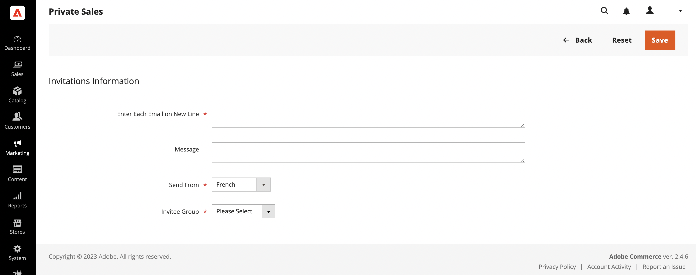

# Event invitations

{{ee-feature}}

When invitations are enabled, customers can send and [view invitations](invitations-storefront.md) from the dashboard of their customer accounts. The invitation email includes a link to your store's customer login page.

## Invitation workflow

1. **Customer prepares invitations**: From the account dashboard, the customer prepares the list of recipients and completes the invitation. A custom message can be included, depending on the configuration.
1. **Customer sends invitations**: When ready, the customer clicks the _Send Invitations_ button.
1. **System manages transmission**: The system sends invitations in batches, according to the number set in the configuration.
1. **Customer monitors response**: The customer monitors the status of each invitation from the account dashboard, as `Sent`, `Accepted`, or `Canceled`.

## Configure invitations

The invitation configuration enables invitations for the store and determines how they are sent.

1. On the _Admin_ sidebar, go to **Stores** > _Settings_ > **Configuration**.

1. In the left panel, expand **Customers** and choose **Invitations**.

1. Expand  the **General** section.

   <!-- zoom -->

1. Set **Enable Invitations Functionality** to `Yes`.

1. To allow customers to manage invitations from the storefront, set **Enable Invitations on Storefront** to `Yes`.

1. Set **Referred Customer Group** to one of the following:

   - `Same as Inviter`
   - `Default Customer Group from Configuration`

1. Set **New Accounts Registration** to one of the following:

   - `By Invitation Only`
   - `Available to All`

1. To **Allow Customers to Add Custom Message to Invitation Email**, select `Yes`.

1. To limit the number of invitations that can be sent at one time, enter the number in the **Max Invitations Allowed to be Sent at One Time** field.

1. Expand  the **Email** section and do the following:

   <!-- zoom -->

   - Select the store identity to be used as the **Customer Invitation Email Sender**.

   - Select the **Customer Invitation Email Template** used for invitations sent.

1. When complete, click **Save Config**.

## Create an invitation in the Admin

1. On the _Admin_ sidebar, go to **Marketing** > _Private Sales_ > **Invitations**.

1. In the upper-right corner, click **Add Invitations**.

1. On the next screen, enter email addresses to invite new customers, add a custom message, choose a sender, and select an invitee group.

   If you have multiple store views, use the **Send From** option to specify the store view from which an invitation is sent.

    <!-- zoom -->

1. When complete, click **Save**.

In the [Private Sales Reports](../getting-started/private-sales-reports.md) section, you can see the number of invitations sent during a specified period, or customers to whom you have sent invitations.

## Discard invitations for single entity

1. On the _Admin_ sidebar, go to **Marketing** > _Private Sales_ > **Invitations**.

1. Find the needed invitation using filters and open it in edit mode.

1. In the upper-right corner, click **Discard Invitation**.

1. To confirm the action, click **OK**.

## Discard invitations for multiple entities

1. On the _Admin_ sidebar, go to **Marketing** > _Private Sales_ > **Invitations**.

1. Find and select the invitations to be discarded.

1. At the top-left, use the **Actions** menu to choose **Discard Selected** and click **Submit**.

1. To confirm the action, click **OK**.

## Field descriptions

|Field|Description|
|--- |--- |
|Select|Select the checkbox to select the invitation(s) to be subject to an action, or use the selection control in the column header. Options: Select All / Deselect All / Select Visible / Unselect Visible|
|ID|The internal ID number of an invitation|
|Email|A corresponding customer email address|
|Invitee|Invited user email|
|Sent|Time and date an invitation was sent|
|Registered|Time and data when a customer was registered|
|Status|Invitation status. Options: Sent / Not Sent / Accepted/ Discarded|
|Valid Website|The corresponding website|
|Invitee Group|A customer group of an invitee|

{style="table-layout:auto"}
