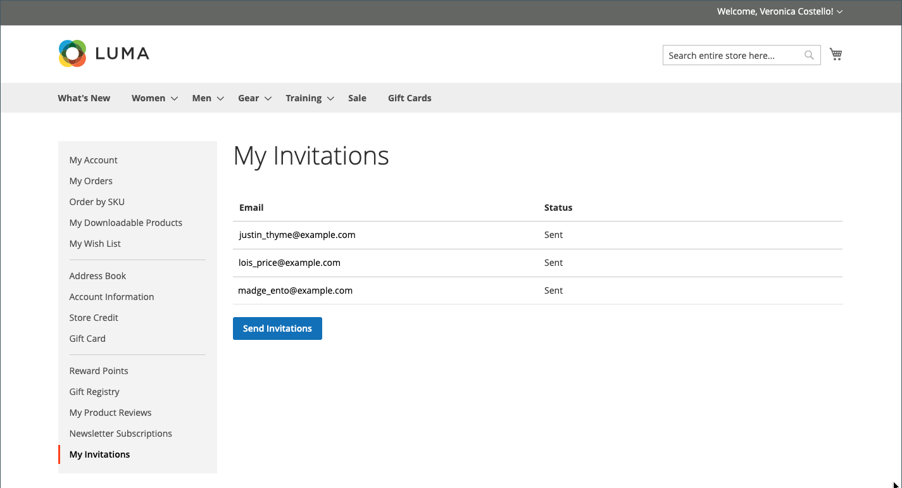

# Event invitations

{{ee-feature}}

When invitations are enabled, customers can send and view invitations from the dashboard of their customer accounts. The invitation email includes a link to your store's customer login page.

## My Invitations

The _[!UICONTROL My Invitations]_ section of the customer account lists all invitations sent by the customer. Customers can send invitations to friends and family for store events, gift registries, wish lists, and so on.

<!-- zoom -->

### Invitation workflow

1. **Customer prepares invitations**: From the account dashboard, the customer prepares the list of recipients and completes the invitation. A custom message can be included, depending on the configuration.
1. **Customer sends invitations**: When ready, the customer clicks the _[!UICONTROL Send Invitations]_ button.
1. **System manages transmission**: The system sends invitations in batches, according to the number set in the configuration.
1. **Customer monitors response**: The customer monitors the status of each invitation from the account dashboard, as `Sent`, `Accepted`, or `Canceled`.

### Send an invitation

1. In the sidebar of their account on the storefront, the customer chooses **[!UICONTROL My Invitations]**.

1. On the _My Invitation_ page, clicks **[!UICONTROL Send Invitation]**.

1. Defines the new invitation item:

   - Completes the email information.

   - (Optional) Creates a multi-address invitation by clicking **+** and adding another email address.

      A single invitation has a five email address limit.

   - (Optional) Enters an accompanying message.

1. When complete, clicks **[!UICONTROL Send Invitation]**.

An invitation notification is sent to the email address of the invited user with instructions link to set the account.

>[!NOTE]
>
>A user can send only one invitation to a specific email address. Trying to resend an invitation to the same email address results in a displayed error message and the invitation is not sent.

## Enable invitations for your store

The invitation configuration enables invitations for the store and determines how they are sent.

1. On the _Admin_ sidebar, go to **[!UICONTROL Stores]** > _[!UICONTROL Settings]_ > **[!UICONTROL Configuration]**.

1. In the left panel, expand **[!UICONTROL Customers]** and choose **[!UICONTROL Invitations]**.

1. Expand  the **[!UICONTROL General]** section.

   <!-- zoom -->

1. Set **[!UICONTROL Enable Invitations Functionality]** to `Yes`.

1. To allow customers to manage invitations from the storefront, set **Enable Invitations on Storefront** to `Yes`.

1. Set **[!UICONTROL Referred Customer Group]** to one of the following:

   - `Same as Inviter`
   - `Default Customer Group from Configuration`

1. Set **[!UICONTROL New Accounts Registration]** to one of the following:

   - `By Invitation Only`
   - `Available to All`

1. To **[!UICONTROL Allow Customers to Add Custom Message to Invitation Email]**, select `Yes`.

1. To limit the number of invitations that can be sent at one time, enter the number in the **[!UICONTROL Max Invitations Allowed to be Sent at One Time]** field.

1. Expand  the **[!UICONTROL Email]** section and do the following:

   <!-- zoom -->

   - Select the store identity to be used as the **[!UICONTROL Customer Invitation Email Sender]**.

   - Select the **[!UICONTROL Customer Invitation Email Template]** used for invitations sent.

1. When complete, click **[!UICONTROL Save Config]**.

## Send and manage invitations in the Admin

In the [Private Sales Reports](../getting-started/private-sales-reports.md) section, you can see the number of invitations sent during a specified period, or customers to whom you have sent invitations.

### Create an invitation in the Admin

1. On the _Admin_ sidebar, go to **[!UICONTROL Marketing]** > _[!UICONTROL Private Sales]_ > **[!UICONTROL Invitations]**.

1. In the upper-right corner, click **[!UICONTROL Add Invitations]**.

1. On the next screen, enter email addresses to invite new customers, add a custom message, choose a sender, and select an invitee group.

   If you have multiple store views, use the **[!UICONTROL Send From]** option to specify the store view from which an invitation is sent.

   <!-- zoom -->

1. When complete, click **[!UICONTROL Save]**.

### Discard invitations for single entity

1. On the _Admin_ sidebar, go to **[!UICONTROL Marketing]** > _[!UICONTROL Private Sales]_ > **[!UICONTROL Invitations]**.

1. Find the needed invitation using filters and open it in edit mode.

1. In the upper-right corner, click **[!UICONTROL Discard Invitation]**.

1. To confirm the action, click **[!UICONTROL OK]**.

### Discard invitations for multiple entities

1. On the _Admin_ sidebar, go to **[!UICONTROL Marketing]** > _[!UICONTROL Private Sales]_ > **[!UICONTROL Invitations]**.

1. Find and select the invitations to be discarded.

1. At the top-left, use the **[!UICONTROL Actions]** menu to choose **[!UICONTROL Discard Selected]** and click **[!UICONTROL Submit]**.

1. To confirm the action, click **[!UICONTROL OK]**.

### Field descriptions

|Field|Description|
|--- |--- |
|[!UICONTROL Select]|Select the checkbox to select the invitations to be subject to an action, or use the selection control in the column header. Options: `Select All` /` Deselect All` / `Select Visible` / `Unselect Visible` |
|[!UICONTROL ID]|The internal ID number of an invitation|
|[!UICONTROL Email]|A corresponding customer email address|
|[!UICONTROL Invitee]|Invited user email|
|[!UICONTROL Sent]|Time and date an invitation was sent|
|[!UICONTROL Registered]|Time and data when a customer was registered|
|[!UICONTROL Status]|Invitation status. Options: `Sent` / `Not Sent` / `Accepted` / `Discarded`|
|[!UICONTROL Valid Website]|The corresponding website|
|[!UICONTROL Invitee Group]|A customer group of an invitee|

{style="table-layout:auto"}
