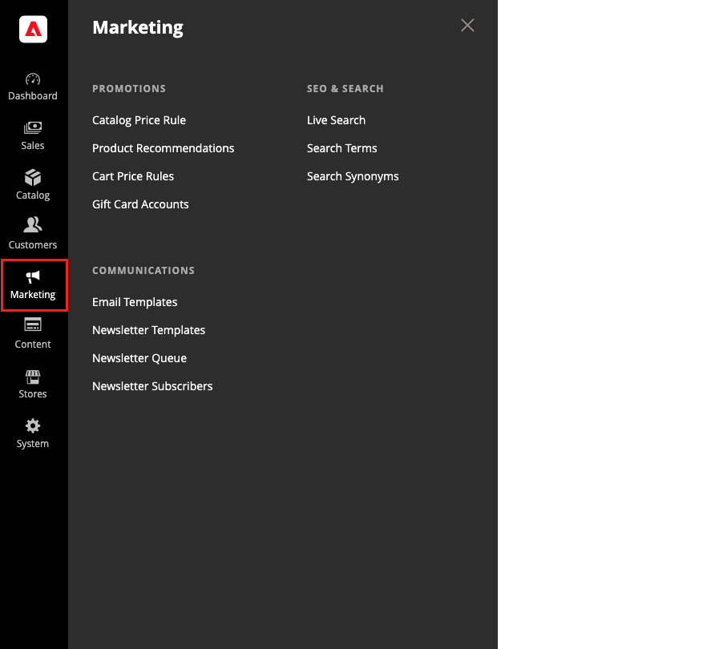

# [!UICONTROL Marketing] menu

The [!UICONTROL Marketing] menu provides access tools for managing promotions, communications, SEO, and user-generated content.

>[!BEGINTABS]

>[!TAB Adobe Commerce]

[!BADGE PaaS only]{type=Informative url="https://experienceleague.adobe.com/en/docs/commerce/user-guides/product-solutions" tooltip="Applies to Adobe Commerce on Cloud projects (Adobe-managed PaaS infrastructure) and on-premises projects only."}

{width="600" zoomable="yes"}

>[!TAB Adobe Commerce as a Cloud Service]

[!BADGE SaaS only]{type=Positive url="https://experienceleague.adobe.com/en/docs/commerce/user-guides/product-solutions" tooltip="Applies to Adobe Commerce as a Cloud Service and Adobe Commerce Optimizer projects only (Adobe-managed SaaS infrastructure)."}

{width="600" zoomable="yes"}

>[!ENDTABS]

## Display the [!UICONTROL Marketing] menu

On the _Admin_ sidebar, click **[!UICONTROL Marketing]**.

## Main sections

### [!UICONTROL Promotions]

Create [catalog](price-rules-catalog.md) and [cart](price-rules-cart.md) price rules that trigger discounts based on various conditions. Set up [promotions](introduction.md#promotions) that spring into action when the required conditions are met.

 (Adobe Commerce only) Create [related product rules](product-related-rules.md) and manage [gift card accounts](../stores-purchase/product-gift-card-accounts.md).

### [!UICONTROL Private Sales]

[!BADGE PaaS only]{type=Informative url="https://experienceleague.adobe.com/en/docs/commerce/user-guides/product-solutions" tooltip="Applies to Adobe Commerce on Cloud projects (Adobe-managed PaaS infrastructure) and on-premises projects only."}

{{ee-feature}}

Private sales and other catalog events are a great way to use your existing customer base to generate buzz and new leads with exclusive access for members only, or by invitation.

### [!UICONTROL Communications]

Customize all notifications sent from your store. Create [newsletters](newsletters.md) and publish [RSS](social-rss.md#rss-feeds) feeds.

 (Adobe Commerce only) Set up rules that send [email reminders](email-reminder-rules.md) to customers whenever the conditions are met.

### [!UICONTROL SEO & Search]

Analyze [search terms](../catalog/search-terms.md) and [synonyms](../catalog/search-terms.md#search-synonyms) to help customers find products in the store, manage [meta data](meta-data.md), and create a [site map](sitemap-xml.md). Use [redirects](url-rewrite.md) to manage URL changes and avoid broken links.

### [!UICONTROL User Content]

[!BADGE PaaS only]{type=Informative url="https://experienceleague.adobe.com/en/docs/commerce/user-guides/product-solutions" tooltip="Applies to Adobe Commerce on Cloud projects (Adobe-managed PaaS infrastructure) and on-premises projects only."}

Incorporate user-generated [product reviews](product-reviews.md) to create a sense of community and increase sales.
