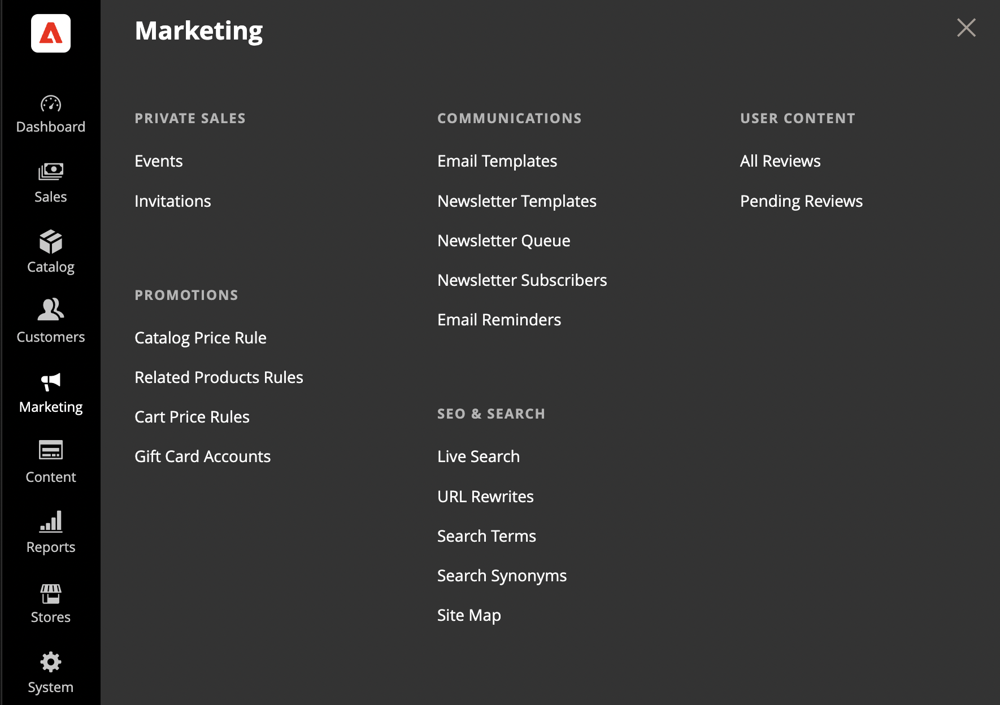

# [!UICONTROL Marketing] menu

The [!UICONTROL Marketing] menu provides access tools for managing promotions, communications, SEO, and user-generated content.

<!-- zoom -->

## Display the [!UICONTROL Marketing] menu

On the _Admin_ sidebar, click **[!UICONTROL Marketing]**.

## Main sections

### [!UICONTROL Promotions]

Create [catalog](price-rules-catalog.md) and [cart](price-rules-cart.md) price rules that trigger discounts based on various conditions. Set up [promotions](introduction.md#promotions) that spring into action when the required conditions are met.

 (Adobe Commerce only) Create [related product rules](product-related-rules.md) and manage [gift card accounts](https://docs.magento.com/user-guide/catalog/product-gift-card-accounts.html).

### [!UICONTROL Private Sales]

{{ee-feature}}

Private sales and other catalog events are a great way to use your existing customer base to generate buzz and new leads with exclusive access for members only, or by invitation.

### [!UICONTROL Channels]

Increase revenue by expanding sales to additional webstores with [Amazon Marketplace integration](https://experienceleague.adobe.com/docs/commerce-channels/amazon/overview.html). The Channels sub-menu only appears when Amazon Sales Channel is configured.

>[!TIP]
>
>Channel Manager helps merchants increase sales, reach new customers, streamline sales operations, and save time by integrating an Adobe Commerce or Magento Open Source product catalog with the Walmart Marketplace. See the [_Channel Manager Guide_](https://experienceleague.adobe.com/docs/commerce-channels/channel-manager/intro-to-channel-manager/overview.html) for more information about Channel Manager installation, onboarding, configuration, and management. 

### [!UICONTROL Communications]

Customize all notifications sent from your store. Create [newsletters](newsletters.md) and publish [RSS](social-rss.md#rss-feeds) feeds.

 (Adobe Commerce only) Set up rules that send [email reminders](email-reminder-rules.md) to customers whenever the conditions are met.

### [!UICONTROL SEO & Search]

Analyze [search terms](../catalog/search-terms.md) and [synonyms](../catalog/search-terms.md#search-synonyms) to help customers find products in the store, manage [meta data](meta-data.md), and create a [site map](sitemap-xml.md). Use [redirects](url-rewrite.md) to manage URL changes and avoid broken links.

### [!UICONTROL User Content]

Incorporate user-generated [product reviews](product-reviews.md) to create a sense of community and increase sales.
