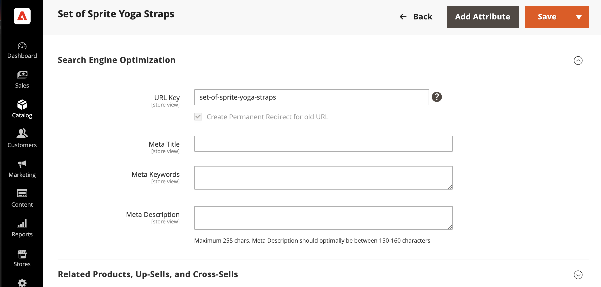
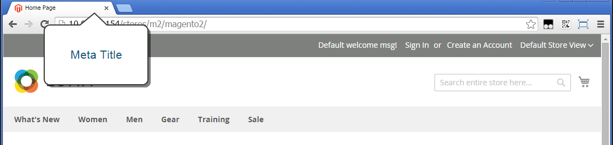
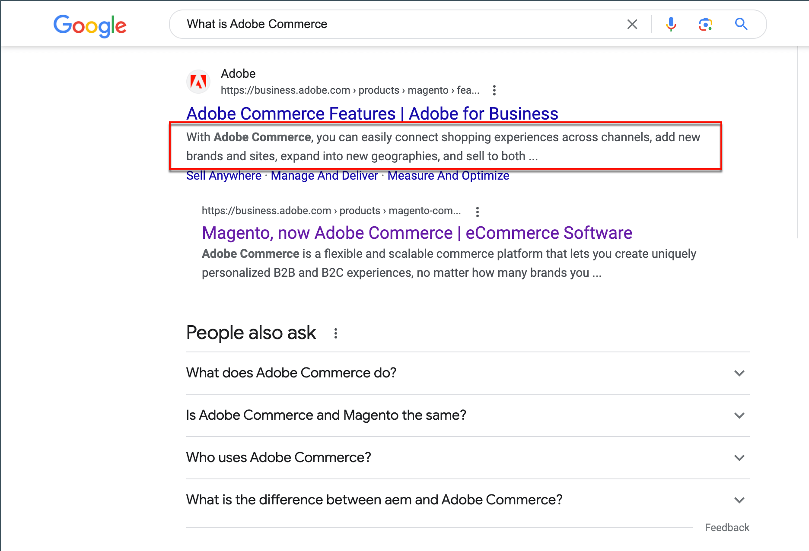

# Meta data

Your store is loaded with places where you can enter keyword-rich meta data to improve the way search engines index your site. While setting up your store, you might enter preliminary meta data, with the intention of finishing it later. Over time, you can fine-tune the meta data to target the buying patterns and preferences of your customers.

{width="700" zoomable="yes"}

## Meta title

The meta title appears in the title bar and tab of your browser and search results listings. The meta title should be unique to the page, and fewer than 70 characters in length.

{width="600"}

## Meta keywords

Although some search engines ignore meta keywords, others continue to use them. The current best practice is to incorporate high-value keywords in the meta title and meta description.

{width="500"}

## Meta description

Meta descriptions provide a brief overview of the page for search results listings. Ideally, a meta description should be between 150-160 characters in length, although the field accepts up to 255 characters.

## Rich snippets

Rich snippets provide detailed information for search results listings and other applications. By default, structured data markup that is based on the [schema.org][1] standard is added to your store's product template. As a result, more information is available for search engines to include as _rich snippets_ in product listings.

## Canonical meta tag

Some search engines penalize websites that have multiple URLs that point to the same content. The canonical meta tag tells search engines which page to index when multiple URLs have identical or similar content. Using the canonical meta tag can improve your site ranking and aggregate page views. The canonical meta tag is placed in the `<head>` block of a product or category page. It provides a link to your preferred URL, so search engines give it greater weight.

### Example 1: Category path creates duplicate URLs

For example, if your catalog is configured to include the category path in product URLs, your store generates multiple URLs that point to the same product page.

    http://mystore.com/gear/bags/driven-backpack.html
    http://mystore.com/driven-backpack.html

### Example 2: Category page full URL

When canonical meta tags for categories are enabled, the category page of your store includes a canonical URL to the full category URL:

    http://mystore.com/gear/bags/

### Example 3: Product page full URL

When canonical meta tags for products are enabled, the product page includes a canonical URL to the domain-name/product-url-key because product URL keys are globally unique.

    http://mystore.com/driven-backpack.html

If you also include the category path in product URLs, the canonical URL remains domain-name/product-url-key. However, the product can also be accessed using its full URL, which includes the category. For example, if the product URL key is `driven-backpack` and is assigned to the Gear > Bags category, the product can be accessed using either URL.

You can avoid being penalized by search engines by omitting the category from the URL, or by using the canonical meta tag to direct search engines to index either by product or category. As a best practice, it is recommended that you enable canonical meta tags for both categories and products.

### Enable the canonical meta tag

1. On the _Admin_ sidebar, go to **[!UICONTROL Stores]** > _[!UICONTROL Settings]_ > **[!UICONTROL Configuration]**.

1. In the left panel, expand **[!UICONTROL Catalog]** and choose **[!UICONTROL Catalog]** underneath.

1. Expand  the **Search Engine Optimization** section.

    To change any field values, you must first clear the **Use system value** checkbox after each field.

    {width="600" zoomable="yes"}

1. If you want search engines to index only category pages using the full category path, do the following:

    - Set **Use Canonical Link Meta Tag for Categories** to `Yes`.

    - Set **Use Canonical Link Meta Tag for Products** to `No`.

1. If you want search engines to index product pages only using the domain-name/product-url-key format, do the following:

    - Set **Use Canonical Link Meta Tag for Products** to `Yes`.

    - Set **Use Canonical Link Meta Tag for Categories** to `No`.

1. When complete, click **[!UICONTROL Save Config]**.

## Meta data demo

Watch this video to learn about managing SEO meta data:

>[!VIDEO](https://video.tv.adobe.com/v/343750?quality=12)

[1]: https://schema.org/
