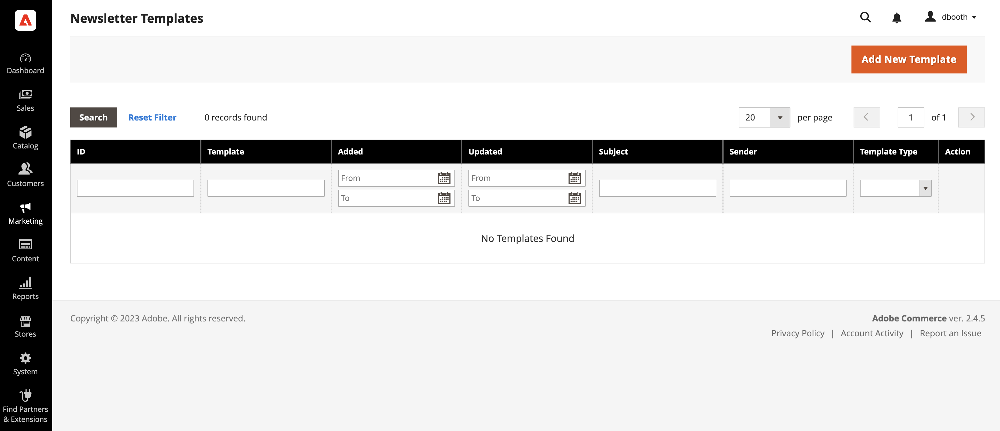
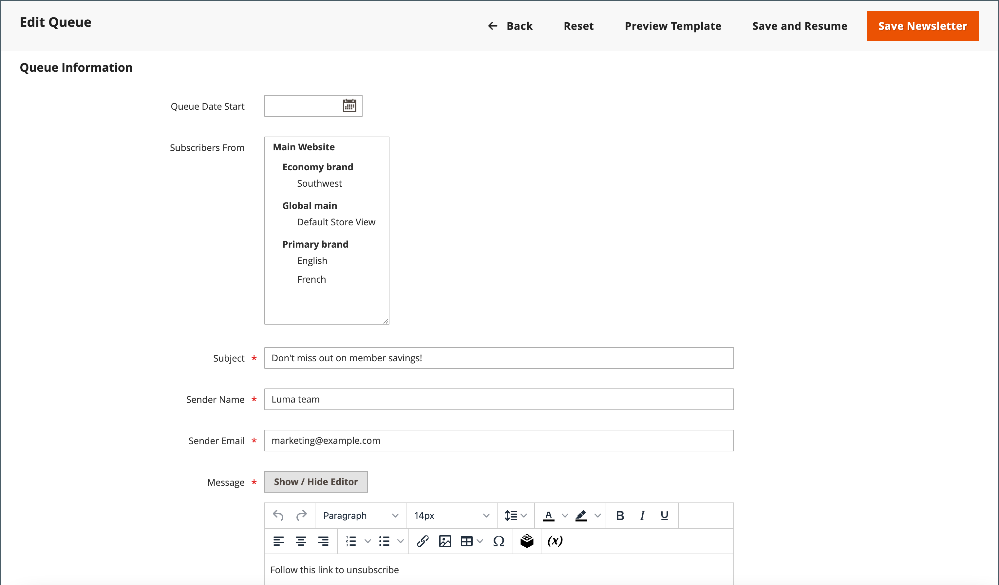

# Newsletter queues

To manage the load on the server, newsletters with many subscribers are sent in a queue of multiple batches. You can check the newsletter queue periodically to check the status, and see how many have been processed. Any problems that occur during transmission appear on the _Newsletter Problem_ report.

<!-- zoom -->

## Send a newsletter

1. On the _Admin_ menu, go to **[!UICONTROL Marketing]** > _[!UICONTROL Communications]_ > **[!UICONTROL Newsletter Template]**.

1. In the grid, find the template for the newsletter that is to be sent and set the **[!UICONTROL Action]** column to `Queue Newsletter`.

1. For **[!UICONTROL Queue Date Start]**, select the date that the transmission is to begin from the calendar ().

1. For **[!UICONTROL Subscribers From]**, select each store view that is to be included in the email blast.

1. Complete the email header information:

    - Enter a brief description of the newsletter for the **[!UICONTROL Subject]** line of the email header.

    - Enter the **[!UICONTROL Sender Name]**.

    - For **[!UICONTROL Sender Email]**, enter the email address of the sender.

      The default name and email address of the sender is specified in the configuration.

      <!-- zoom -->

1. If applicable, enter a note in the **[!UICONTROL Message]** box above the instructions to unsubscribe.

   >[!NOTE]
   >
   >Do not remove the instructions, which are required by law in many jurisdictions.

1. To apply custom styles to a newsletter, add them into the **[!UICONTROL Newsletter Styles]** field.

1. When complete, click **[!UICONTROL Save and Resume]**.

    The newsletter appears in the queue waiting to be processed.

## Check for problems

On the _Admin_ menu, go to **[!UICONTROL Reports]** > _[!UICONTROL Marketing]_ > **[!UICONTROL Newsletter Problem Reports]**.

## Button bar

|Button|Description|
|--- |--- |
|**[!UICONTROL Back]**|Returns to the Newsletter Templates page without saving changes.|
|**[!UICONTROL Reset]**|Resets any unsaved changes in the queue information form to their previous values.|
|**[!UICONTROL Preview Template]**|Opens a preview page in a separate tab.|
|**[!UICONTROL Save and Resume]**|Saves all made changes. Puts the newsletter to queue.|
|**[!UICONTROL Save Newsletter]**|Saves all made changes. Puts the newsletter to queue.|

{style="table-layout:auto"}

## Columns

|Column|Description|
|--- |--- |
|[!UICONTROL ID]|A unique numeric identifier that is assigned to each newsletter template.|
|[!UICONTROL Queue Start]|The date when the newsletter was sent out.|
|[!UICONTROL Queue End]|The date when the newsletter finished sending.|
|[!UICONTROL Subject]|Subject of newsletter template.|
|[!UICONTROL Status]|Indicates a status of the newsletter mailing. Possible values: `Sent`, `Canceled`, `Not Sent`, `Sending`, or `Paused`.|
|[!UICONTROL Processed]|Indicates how many newsletters were sent.|
|[!UICONTROL Recipients]|Indicates how many newsletters were received by subscribers.|
|[!UICONTROL Actions]|**[!UICONTROL Preview]**: opens a separate window to preview the template.|

{style="table-layout:auto"}
